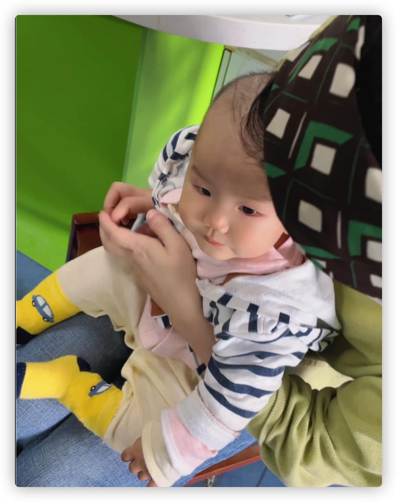

# 2022年05月06日

## 今日天气

晴 万里无云 17-32°C

## 今日状态

困倦疲乏 昨晚4点才睡，早上6点醒来，晚上有点择床，加上蚊虫“叨扰”。宝宝现在晚上睡觉不安生，喜欢翻滚，转圈圈。所以把大床让给宝宝和妈妈。我一个人打地铺。昨晚忘记关窗户了。屋里蚊子多的很。电蚊拍晚上噼里啪啦。还是有蚊子不上当的。专找我。也是早上起来才发现窗户没关。蚊帐里也钻进去了蚊子，早上起来宝宝的脸蛋也被蚊子叮了一个红印。

## 今日可爱

早上起来去给宝宝打了流脑疫苗，今天她眉头都没有皱一下。



## 今日句子

此生多寒凉，此生越重洋。--朴树《清白之年》

## 今日食谱

- 绿茶
- 酸奶 韭菜盒子
- 炒包菜 米饭 折耳根 粉丝 杏鲍菇
- 排骨
- 卤肉饭 可乐

## 今日学习

非常实用的为公司和个人项目分别设置 Git User 的方案
[includeIf](https://baijunyao.com/articles/223)

`WebSocket` 区分客户端，广播方式

```js
expressWs.getWss().clients.forEach((client) => {
  client.send(JSON.stringify(loggingEvent.data[0]))
})
```

我打算将博客内容和博客代码分开，内容作为子模块。
[温顾git子模块](https://git-scm.com/book/zh/v2/Git-%E5%B7%A5%E5%85%B7-%E5%AD%90%E6%A8%A1%E5%9D%97)

## 今日歌曲

[妹想郎来郎想妹](https://c.y.qq.com/base/fcgi-bin/u?__=nJKYMHSfOMfV)
[平凡之路](https://music.163.com/song?id=500665346&userid=93993967)
[清白之年](https://music.163.com/song?id=553544167&userid=93993967)

## 今日工作

- 测试弹幕服务，发现多个客户端链接时始终只能保持一条链接正常，所以服务端改成广播模式以解决问题。
- 实现Unity端火柴人拾取武器功能。

## 今日活动

- 更新博客首页动画和分页
- 帮老婆解决数位板驱动安装问题

## 今日购物

unity火柴人武器道具 9元

链接: <https://pan.baidu.com/s/1qfEQCPtCso2aRVmFSqAxug?pwd=8ejv> 提取码: 8ejv 复制这段内容后打开百度网盘手机App，操作更方便哦
--来自百度网盘超级会员v1的分享

购买谷维素+维生素B1 用于改善睡眠 15元

## 今日药物

购买谷维素+维生素B1
