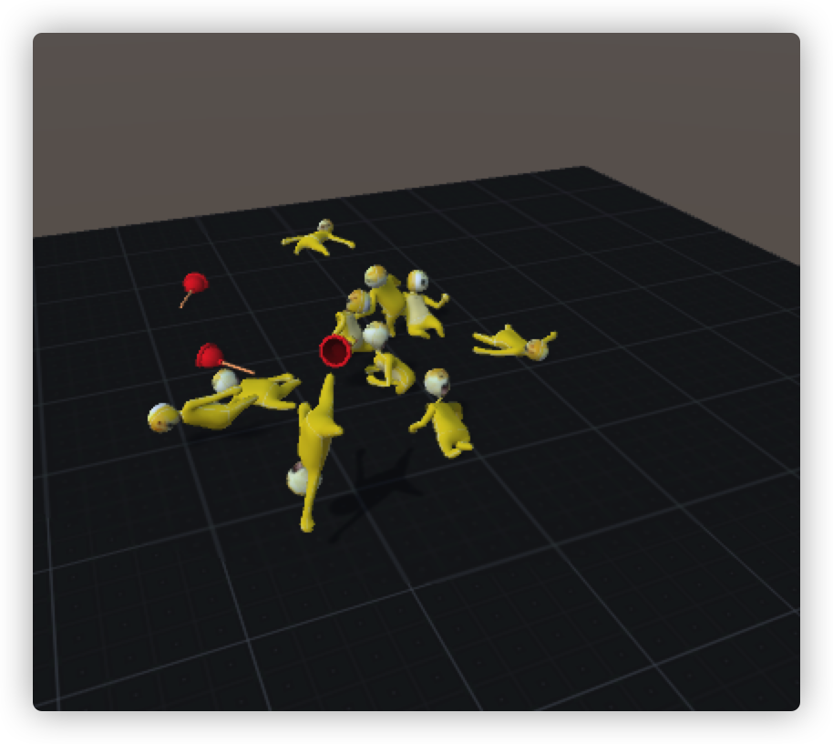

## 今日状态

- 多虑-> 焦虑

## 今日词句

- 人的烦恼就是记性太好，如果可以把所有事都忘掉，以后每一日都是个新开始.你说多好。——《东邪西毒》
- 信息茧房

## 今日食谱

- 绿茶
- 茄子 鸡翅
- 梨子 葡萄
- 糍粑鱼 丝瓜鸡蛋

## 今日事迹

- 做辅食
- 妈要我给她买票，她要回去挣几天钱，说这几天能挣1000块。我不想和她争执，随她吧。
- 晚上回家发现宝宝有点发烧，给他弄了点布洛芬和退热贴，喝的倒是被她都吐出来了。
- 
- 给博客日迹添加ci自动获取当日天气

## 今日歌曲

[Always Remember Us This Way](https://music.163.com/song?id=1870969804&userid=93993967)
[孤勇者](https://music.163.com/song?id=1901371647&userid=93993967)
[My All](https://music.163.com/song?id=22737627&userid=93993967)

## 今日可爱

## 今日感想

ta变了吗？每个人的心态都会发生变化，人的烦恼就是记性太好。如果可以把所有事都忘掉，以后每一日都是个新的开始。继续把ta当做你当初喜欢并害怕失去的那个人。不计回报的爱，才算人生的一份意义。

## 今日推荐

- gray-matter 方便读取md中的yaml为json
- js-yaml    将json转换为yaml
