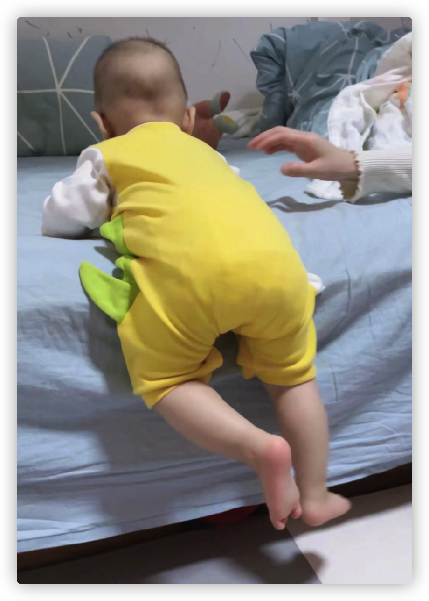
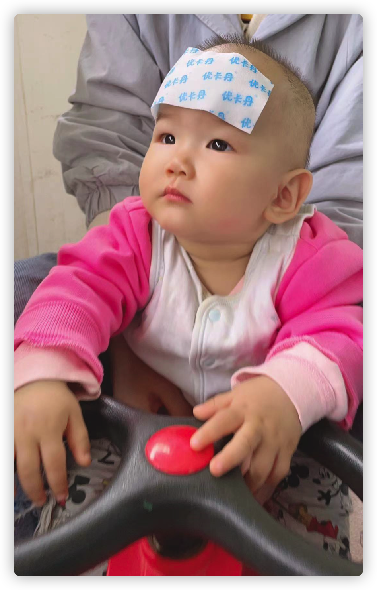

## 今日词句

## 今日状态

- 担心 担心

## 今日食谱

- 小布丁雪糕
- 绿茶 酸奶
- 糍粑鱼 青椒炒肉
- 青椒炒肉 番茄鸡蛋

## 今日事迹

- 早上宝宝继续高烧，耳温38.3。体温计38.9，挂号打算去医院。又给他弄了点布洛芬和退热贴。梨子打汁吃了一个。体温下降了些，就没有去医院。
- 体重秤放地毯上会导致体重变轻。
- 公司活动中奖一个钥匙扣。参与奖？
- 下午带宝宝去医院，病毒感染俗称着凉。

## 今日歌曲

## 今日可爱

## 今日感想

## 今日药物

## 今日计划

## 今日购物

## 今日快递

## 今日厨艺

## 今日推荐

## 今日消费

- 检查 105
- 药物 155.72
- 电费 100.00
