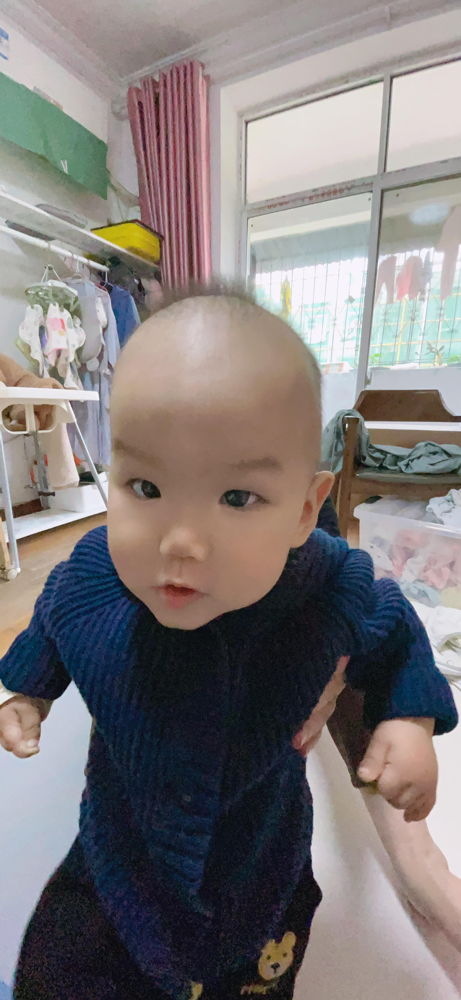
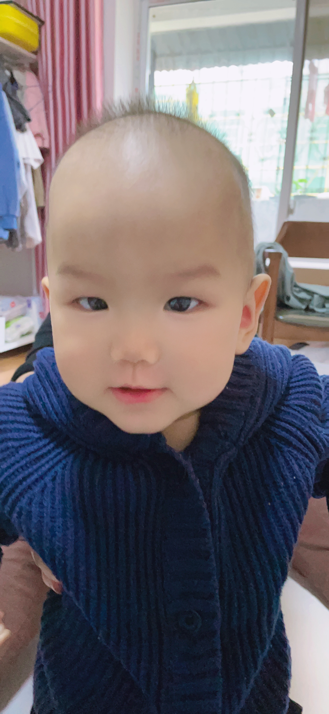

## 今日词句

## 今日状态

## 今日食谱

- 绿茶
- 麻辣粉
- 鸭肉 黄瓜
- 烤串
- 羊排抓饭

## 今日事迹

## 今日歌曲

## 今日可爱

## 今日感想

## 今日药物

## 今日计划

## 今日购物

## 今日快递

## 今日厨艺

## 今日推荐

今日和往常一样下班，今天稍晚了些。因为小云在关谷逛街，打算让我顺道去接她回家。

回到小区的后门，小云要去做核酸，因为好几天没有做了，再不做就变成灰码了。好在小区后门有一家检测点，从早上七点到晚上九点。到了小区后门我把我的小电驴往路边停的汽车的间隙挪了挪。就在这等她做完一起回去吃饭。

我骑在车上，刷着抖音。突然听到有人叫我的名字。抬头一看原来是覃训。他也这个时候才回来。我顺嘴问了一句，你也这个时候才下班？他说是啊。然后他停好摩拜单车向我走来。走进时对我说了一句你怎么发际线越来越高了。我记得这好像不是他第一次这么说了。不过我的发际线倒也不是因为干了程序员才变高的。我打小发际线就高于常人。上辈子肯定是个贝勒爷。不过人到中年了发际线后移一点也是正常的。到也不是因为变强了也变秃了。不过我跟他解释到，我最近正在试行现在流行的说法，就是不用洗发水，可以让头发恢复粗壮和茂密，不过我才试行半个月。现在头皮痒并且我把洗头次数从之前的每天一洗，改成了隔天一洗。可能是头油了头发都贴在头上才让他发出这样的感叹。
