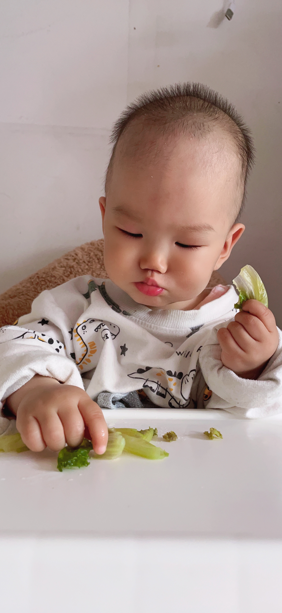
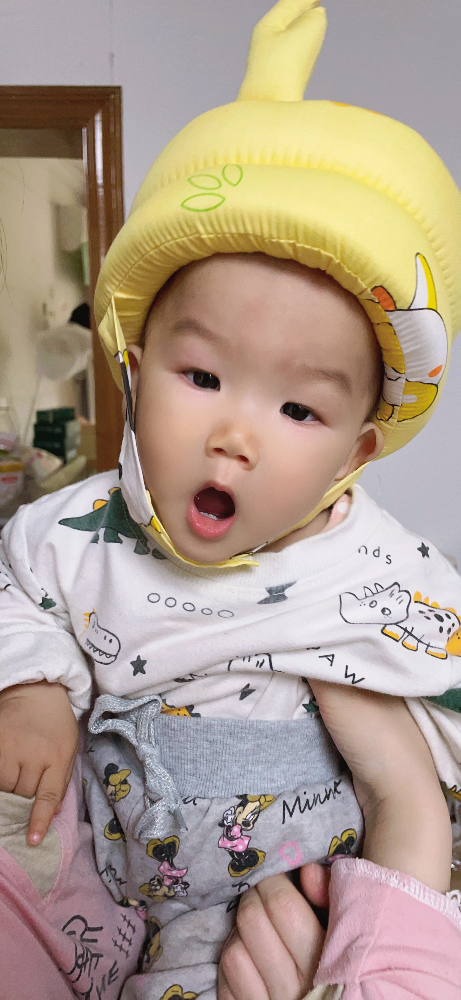

## 今日词句

## 今日状态

## 今日食谱

## 今日事迹

- 扫地 拖地
- 做辅食，喂宝宝，洗衣服。做饭

## 今日歌曲

## 今日可爱

## 今日感想

## 今日药物

## 今日计划

## 今日购物

## 今日快递

## 今日厨艺

- 炝生菜
- 青椒茄子
- 面条

早上像往常一样难以醒来，早早的宝宝就醒了，咿咿呀呀的呼唤着我们起床，我担心小云又耐不住早早的起来给宝宝冲奶。因为她总是很少有耐心，会着急事情没有人去做，然后自己就会忿忿不平的做这些事情，然后对我心生怨念。好在今天她也困的不想动。然后我艰难的从地上爬了起来。
给孩子冲好了奶粉。来到床边，拉起蚊帐的拉链，爬进去将宝宝放在枕头上，小宝已经迫不及待的迅速的吮吸起来。不过很快他就不吸了，她一直都是这样，吸30ml就不吃了。她很有自己的主见，说不吃你怎么弄她都是不会吃的。然后我折好被子，报出宝宝，给宝宝把衣服穿好。电饭煲里是奶奶早上给宝宝顿的婴儿粥。

今天是小云实习的第二天，今天是晚班。1点去上班，晚上要10点才下班。她总是处于道义，向他的朋友处于援手，这次实习也是处于去帮助她的朋友。她的朋友总会在找不到人的时候，就会来找她，似乎很好使。她总能对朋友出手慷慨，哪怕自己很窘迫。

我看了一眼冰箱里面还有很多的菜。我拿出一些青椒，茄子和生菜。我心想着，今天我得好好的做个饭菜让她吃饱了再去上班。我在厨房切切洗洗。因为我们没有吃早饭的原因，我打算早点做中饭，让她吃了还可以休息一下。于是我很快就把菜给炒了起来。我让小云叫妈回来吃饭，她: 132 7792 8570说电话没有打通。我想着那就少煮点面，免得面坨了就不好吃了。当面煮了一般的时候，我听到妈回来了。于是我鬼使神差的网锅里赶紧的又加了一把面。心想着妈回来了，肯定要一起吃。可是这个时候有的面煮过了，有的还没熟。但是我并没有多在意。

我叫小云吃饭，叫第一声我没有听到她的应答，然后我加大声音又叫了一声，她应答了，我悬着的心舒坦了些。当她走到饭桌前。边道出她不喜欢吃这样的面。然后她又一眼看出面没有煮熟的问题。然后我告诉了她缘由。她给了我一个白眼。从此就在也没有说过一句话。她把生的面条丢在碗边。我知道她在生我的气。吃完饭后，我说你又要因为一碗面而不开心一天吗？你要没吃饱就再泡个面吃。她没有回答什么。此时我也心情复杂。我有点搞不懂她的古怪性情。她的各种表情总是流露出对我的各种不满意并夹杂着不耐烦。这样的压抑情绪自然又是让我煎熬的一天。

午休时妈带着宝宝在睡觉，于是我可以放松一下，我在不知不觉中睡了一个饱饱的午休，直到听到宝宝的声音，然后准备辅食，喂辅食，然后我支开妈和宝宝，让他带宝宝去玩耍。
当我坐在电脑前开始写代码的时候，我发现自己下体有些不舒服，短短一会儿我去了厕所好几次，然后并没有尿。然后我发现我的身体可能有点问题了。我迅速的干了一杯水。

## 今日推荐
