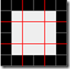

---
tag:
  - css
author: Artiely
date: 2017-6-6
cover: /2022-05-14-21-19-43.png
tinyCover: /cover/2022-05-14-21-19-43.png
coverWidth: 736
coverHeight: 1038
coverPrimary: 85a6a0
coverSecondary: 7a595f

---

# 移动端1px解决方案
## 1.用小数来写px值

IOS8以上已经支持带小数的px值, media query对应devicePixelRatio有个查询值-webkit-min-device-pixel-ratio, css可以写成这样

```css
.border { border: 1px solid #999 }
@media screen and (-webkit-min-device-pixel-ratio: 2) {
    .border { border: 0.5px solid #999 }
}
@media screen and (-webkit-min-device-pixel-ratio: 3) {
    .border { border: 0.333333px solid #999 }
}
```

如果使用less/sass的话只是加了1句mixin

> 缺点: 安卓与低版本IOS不适用, 这个或许是未来的标准写法, 现在不做指望

## 2.border-image


这样的1张6X6的图片, 9宫格等分填充border-image, 这样元素的4个边框宽度都只有1px

```css
@media screen and (-webkit-min-device-pixel-ratio: 2){ 
    .border{ 
        border: 1px solid transparent;
        border-image: url(border.gif) 2 repeat;
    }
}
```

图片可以用gif, png, base64多种格式, 以上是上下左右四条边框的写法, 需要单一边框只要定义单一边框的border, 代码比较直观.

> 缺点: 对于圆角样式, 将图片放大修改成圆角也能满足需求, 但这样无形中增加了border的宽度存在多种边框颜色或者更改的时候麻烦

## 3. background渐变

背景渐变, 渐变在透明色和边框色中间分割, frozenUI用的就是这种方法, 借用它的上边框写法:

```css
@media screen and (-webkit-min-device-pixel-ratio: 2){
    .ui-border-t {
        background-position: left top;
        background-image: -webkit-gradient(linear,left bottom,left top,color-stop(0.5,transparent),color-stop(0.5,#e0e0e0),to(#e0e0e0));
    }
}
```

这样更改颜色比border-image方便, 兼容性

> 缺点: 代码量大, 而且需要针对不同边框结构, frozenUI就定义9种基本样式而且这只是背景, 这样做出来的边框实际是在原本的border空间内部的, 如果元素背景色有变化的样式, 边框线也会消失.最后不能适应圆角样式

## 4. :before, :after与transform

之前说的frozenUI的圆角边框就是采用这种方式, 构建1个伪元素, 将它的长宽放大到2倍, 边框宽度设置为1px, 再以transform缩放到50%.

```css
.radius-border{
    position: relative;
}
@media screen and (-webkit-min-device-pixel-ratio: 2){
    .radius-border:before{
        content: "";
        pointer-events: none; /* 防止点击触发 */
        box-sizing: border-box;
        position: absolute;
        width: 200%;
        height: 200%;
        left: 0;
        top: 0;
        border-radius: 8px;
        border:1px solid #999;
        -webkit-transform(scale(0.5));
        -webkit-transform-origin: 0 0;
        transform(scale(0.5));
        transform-origin: 0 0;
    }
}
```

需要注意`<input type="button">`是没有:before, :after伪元素的

优点: 其实不止是圆角, 其他的边框也可以这样做出来

> 缺点: 代码量也很大, 占据了伪元素, 容易引起冲突

## 5. flexible.js

这是淘宝移动端采取的方案, github的地址:<https://github.com/amfe/lib-flexible>. 前面已经说过1px变粗的原因就在于一刀切的设置viewport宽度, 如果能把viewport宽度设置为实际的设备物理宽度, css里的1px不就等于实际1px长了么. flexible.js就是这样干的.

`<meta name=”viewport”>`里面的scale值指的是对ideal viewport的缩放, flexible.js检测到IOS机型, 会算出scale = 1/devicePixelRatio, 然后设置viewport

```js
metaEl = doc.createElement('meta')
metaEl.setAttribute('name', 'viewport')
metaEl.setAttribute('content', `initial-scale=${scale}, maximum-scale=${scale}, minimum-scale=${scale}, user-scalable=no`)
```

devicePixelRatio=2时输出meta如下, 这样viewport与ideal viewport的比是0.5, 也就与设备物理像素一致

```html
<meta name="viewport" content="initial-scale=0.5, maximum-scale=0.5, minimum-scale=0.5, user-scalable=no">
```

另外html元素上的font-size会被设置为屏幕宽的1/10, 这样css可以以rem为基础长度单位进行改写, 比如rem是28px, 原先的7px就是0.25rem. border的宽度能直接写1px.

```js
function refreshRem() {
  let width = docEl.getBoundingClientRect().width
  if (width / dpr > 540) { // 大于540px可以不认为是手机屏
    width = 540 * dpr
  }
  const rem = width / 10
  docEl.style.fontSize = `${rem}px`
  flexible.rem = win.rem = rem
}
```

px和rem相互转换的计算方法会暴露在window.lib.flexible中. 这样可以为less/sass编写宏方法. 具体的css改写方法参照大漠的文章<http://www.w3cplus.com/mobile/lib-flexible-for-html5-layout.html>

项目中特别指出了为了防止字体模糊, 出现奇数字号的字体, 字体的实际单位还是要以px为单位.

> 缺点: 不适用安卓, flexible内部做了检测 非iOS机型还是采用传统的scale=1.0, 原因在于安卓手机不一定有devicePixelRatio属性, 就算有也不一定能响应scale小于1的viewport缩放设置, 例如我的手机设置了scale=0.33333333, 显示的结果也与scale=1无异.

## 主观

个人比较偏爱 FrozenUI 的解决方案