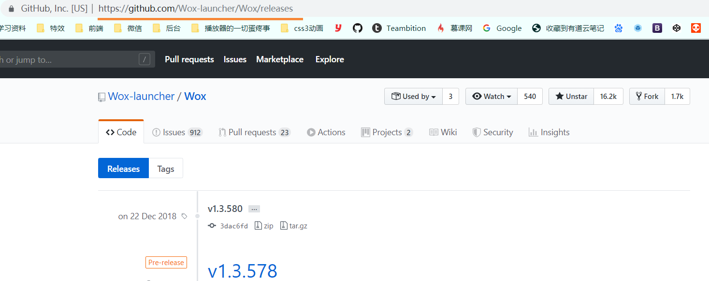
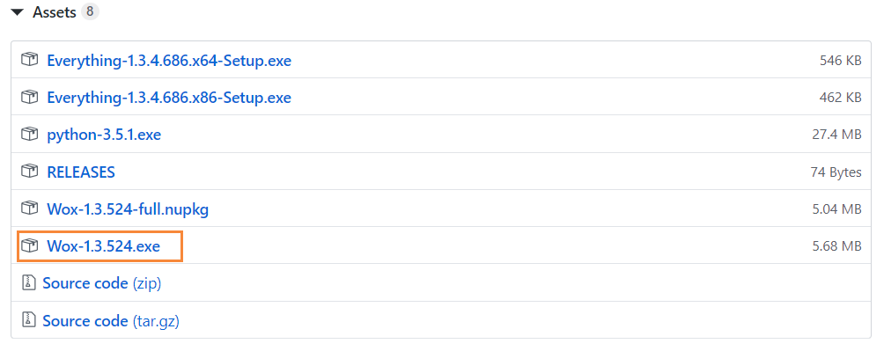
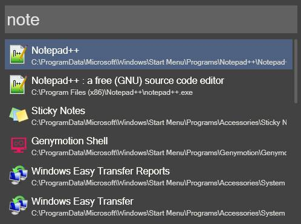
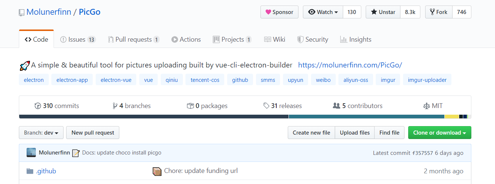
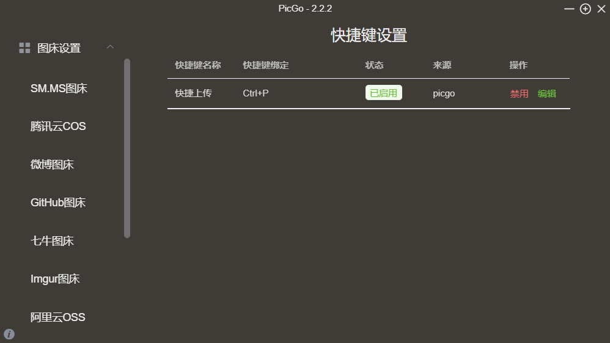
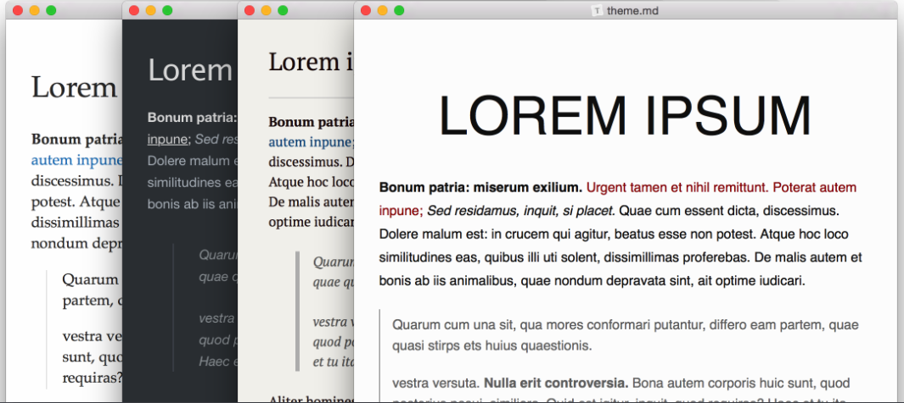

## wox

应用管理新体验。
`ctrl+space(空格)`
[官网](http://www.wox.one/)

## picgo

图片管理新体验
[官网](https://molunerfinn.com/PicGo/)

## typora

markdown书写新体验
[官网](https://www.typora.io/)

并且typora可以和picgo配合使用，让md的图片更好的管理。

待续.
