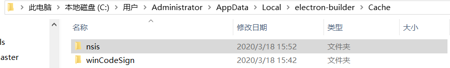
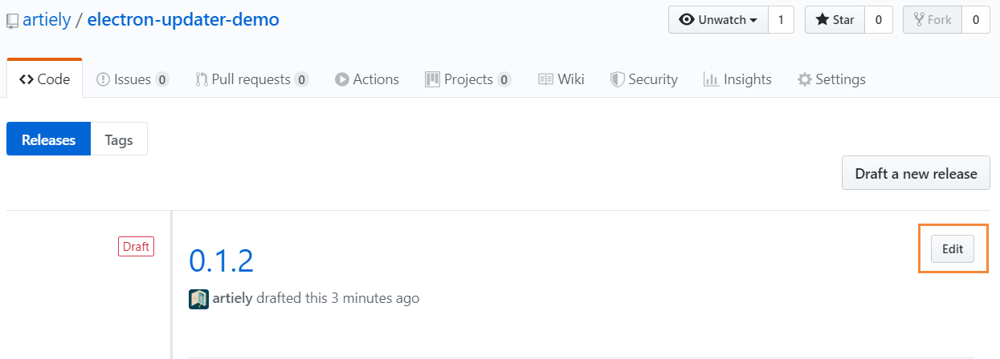
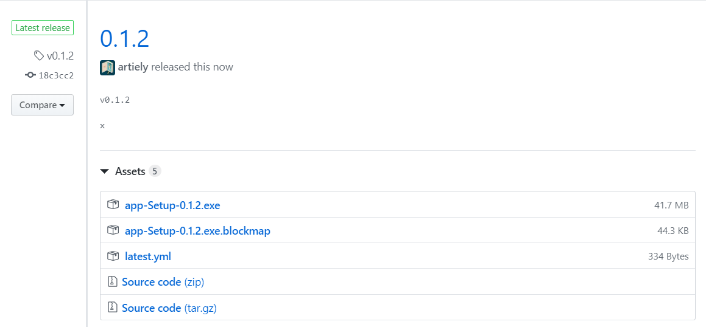
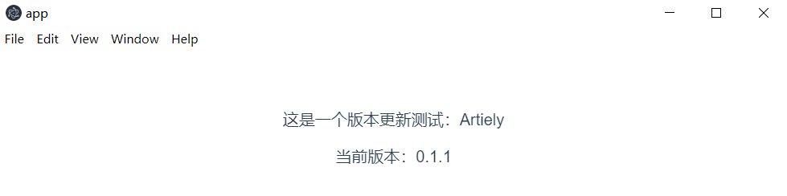
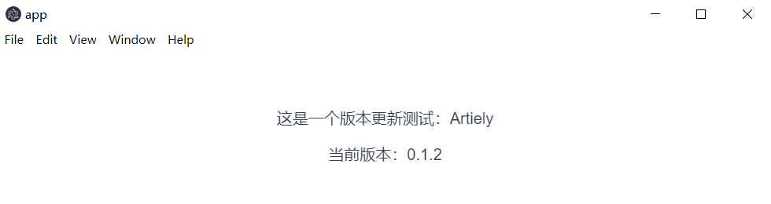

## 从0实现一个electron自动更新的最小demo

本实例基于vue，不使用vue也大同小异，目的只是在后期更加的方便使用组件库，有差异的地方我会指出。

## 初始化一个vue项目

```shell
# 初始化项目，前面的vue脚手架环境安装忽略
vue create electron-updater-demo
# 中间的流程略
cd electron-updater-demo
npm i
# 安装 electron-builder 插件

vue add electron-builder

# 如果你不是使用的vue 可以直接`npm i electron-builder`安装 

# 运行
npm run electron:serve
```

## 项目结构

```shell
├──public
│ ├──favicon.ico
│ └──index.html
├──src
│ ├──assets
│ │ └──logo.png
│ ├──components
│ │ └──HelloWorld.vue
│ ├──App.vue
│ ├──background.js
│ └──main.js
├──.browserslistrc
├──.gitignore
├──babel.config.js
├──package-lock.json
├──package.json
├──README.md
└──vue.config.js
```

> 输出结构的工具推荐 `npm i treeplus` [使用方法](https://github.com/artiely/treeplus)

### 修改`app.vue`

这里的目的是清晰的暂时当前版本号。

```html {4,9,15}
<template>
  <div id="app">
    这是一个版本更新测试：Artiely
    <p>当前版本：{{ version }}</p>
  </div>
</template>

<script>
const { version } = require('../package.json')
console.log('version', version)
export default {
  name: 'App',
  data() {
    return {
      version,
    }
  },
}
</script>
```

### 安装依赖并修改`background.js`

```shell
npm i electron-updater
```

`background.js`

```diff
+ import { autoUpdater } from "electron-updater"

  if (process.env.WEBPACK_DEV_SERVER_URL) {
    // Load the url of the dev server if in development mode
    win.loadURL(process.env.WEBPACK_DEV_SERVER_URL)
    if (!process.env.IS_TEST) win.webContents.openDevTools()
  } else {
    createProtocol('app')
    // Load the index.html when not in development
    win.loadURL('app://./index.html')
+   autoUpdater.checkForUpdatesAndNotify()
  }

```

## 通过github实现包的发布

### GitHub的个人访问令牌

此步骤需要一个GitHub个人访问令牌。要获取一个，请访问`https://github.com/settings/tokens`并单击`Generate new token`。

为了使Electron Builder将发行版本上传到GitHub，您需要通过将`GH_TOKEN`env变量设置为令牌来使令牌可用：

在Linux / MacOS上：

```shell
export GH_TOKEN=TOKEN-GOES-HERE
```

在Windows上：

```shell
[Environment]::SetEnvironmentVariable("GH_TOKEN","<YOUR_TOKEN_HERE>","User")

# 例如 [Environment]::SetEnvironmentVariable("GH_TOKEN","587f5a354934f73b8336d81d0168423075f37833","User")
```

:::tip
注意设置完环境变量后一定要重启你的编辑器或者powershell以便让环境变量生效
:::

## 配置vue.config.js

```js
module.exports = {
  pluginOptions: {
    electronBuilder: {
      builderOptions: {
        publish: [
          {
            provider: 'github',
            owner: 'artiely',
            repo: 'electron-updater-demo',
            // token: '587f5a354934f73b8336d81d0168423075f37833'
          },
        ],
      },
    },
  },
}
```

:::tip
如果不是vue项目可以直接再`package.json`文件中加入如下内容，参数基本一致

```json
build:{
  publish:[]
}
```

:::

### build参数讲解

```js
{
  publish:[
  // giuhub
    { // 供应商
      provider: 'github',
      // 项目名
      repo: 'electron-updater-demo',
      // 拥有者
      owner: 'artiely',
    // 此处也可以填写token但是不建议使用，你的token会有泄漏的风险，推荐使用上面环境变量的方式。
    // token: '587f5a354934f73b8336d81d0168423075f37833'
    },
    // 普通服务商
    {
      provider: 'generic',
      url: 'https://bucket_name.s3.amazonaws.com',
    },
  ]
}
```

供应商支持多种上面示例了最常见两种，本实例以github为例

### 发布版本到github

```shell
npm run electron:build -- -p always
```

### 发布打包时很慢的解决办法

在发布的时候可能会遇到一直 dwonloading 一些资源下载不下来的问题。
在downloading后面会有一个链接，点击链接将内容下载到本地

windows系统进入到`C:\Users\Administrator\AppData\Local\electron-builder\Cache`资源管理目录
新建文件夹

将下载的名称相匹配的放入对应的文件解压

再次执行

```shell
npm run electron:build -- -p always
```

另一个新的资源下载也很慢，同样的方法，把他们都加入缓存，下次打包就直接走缓存了，会非常的快。

### 发布

发布github成功后会在release多一个草稿，点击edit并发布，他将会会变成最后的稳定版



## 下载



### 修改版本号再次发布

修改`package.json`的版本号再次重复上面的步骤。
再次打开下载的app，会通知你有更新，并且在你下次打开时更新。


## 后续

我们会发现这个更新很简陋，后面我们会自定义优化的提示信息，下载进度等。
