## 介绍

 这是本人开源的一个基于vue和ant-design-vue的中后台管理平台，里面有一些技巧和思路希望能给你们带来灵感和帮助，可供学习和参考。

 此项目从2019五月开源，期间间歇性更新，每有好的思路和想法都会慢慢地收集进来。可以持续关注。
 github地址：[https://github.com/artiely/vue-admin](https://github.com/artiely/vue-admin)

## 效果预览

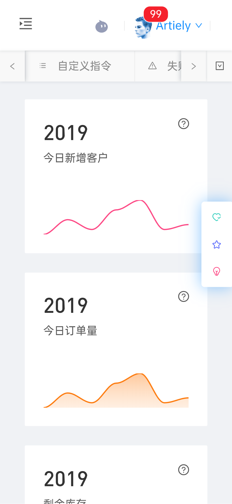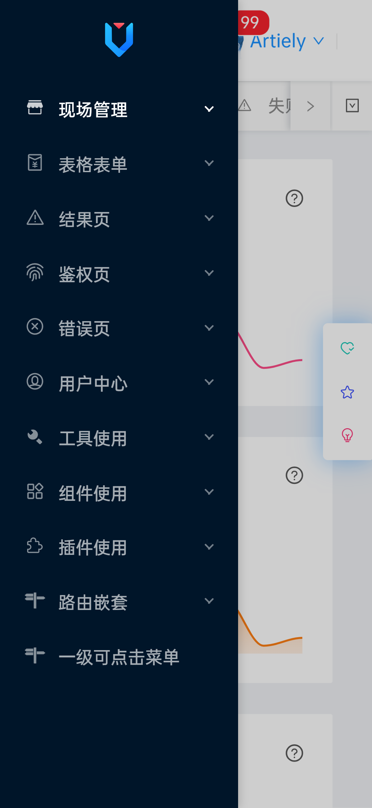

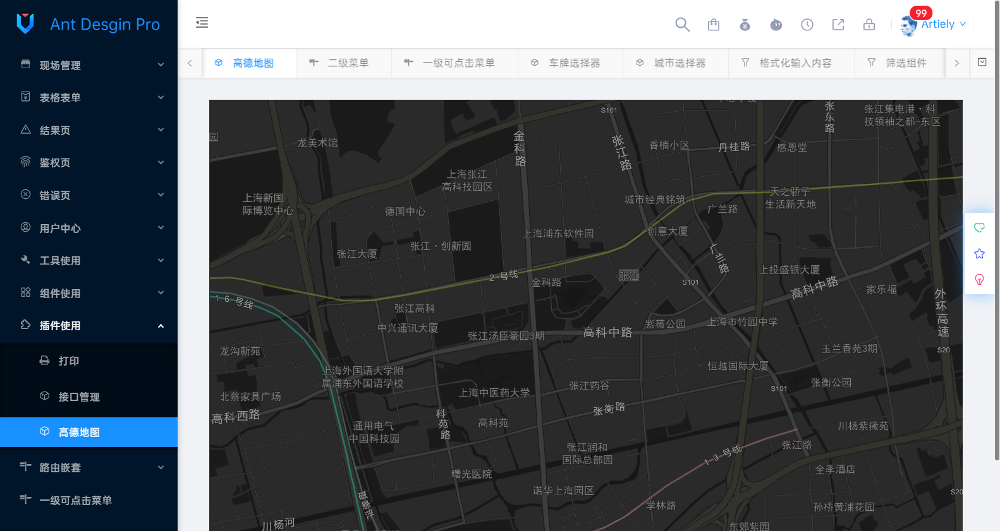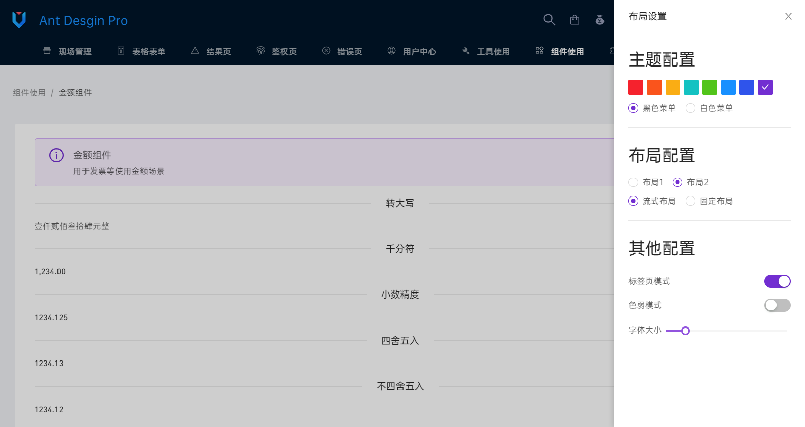
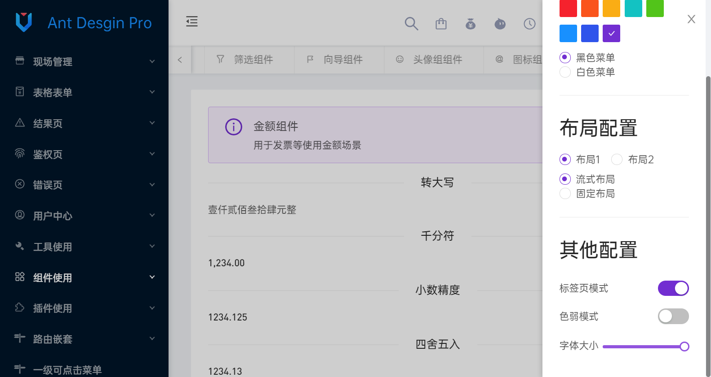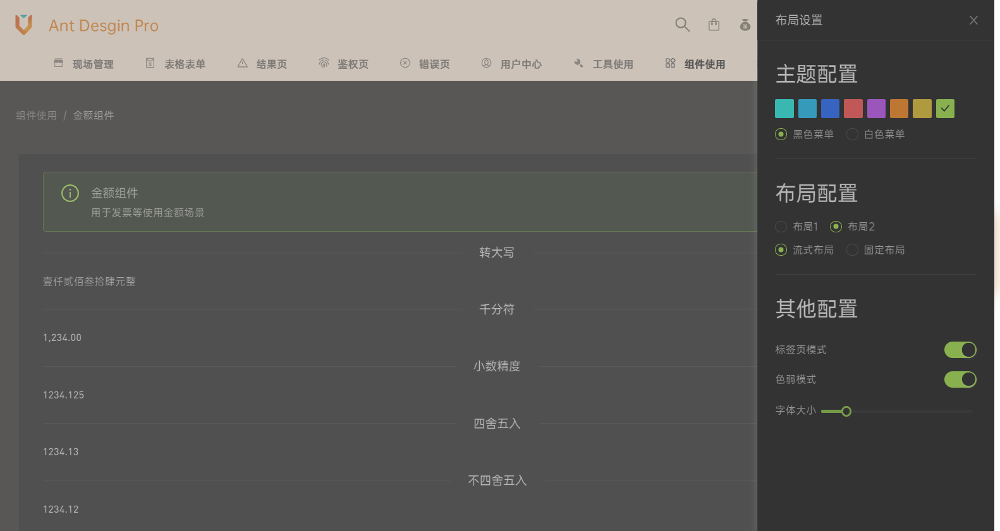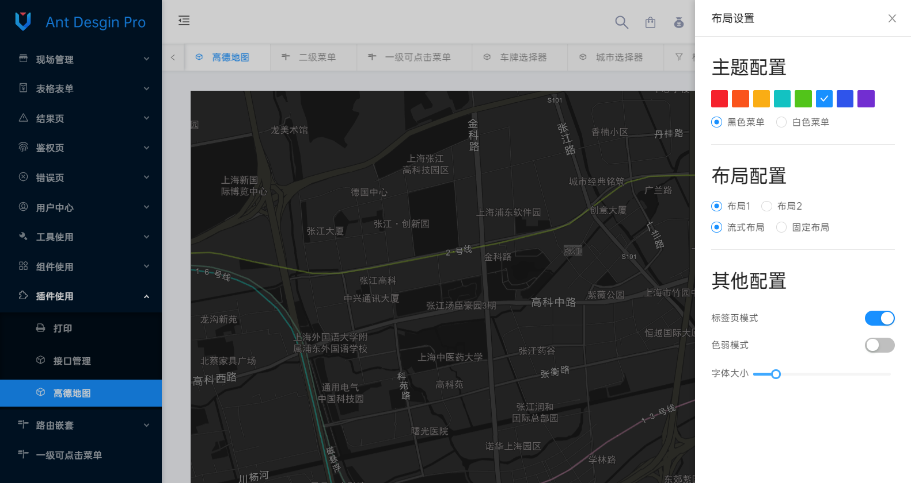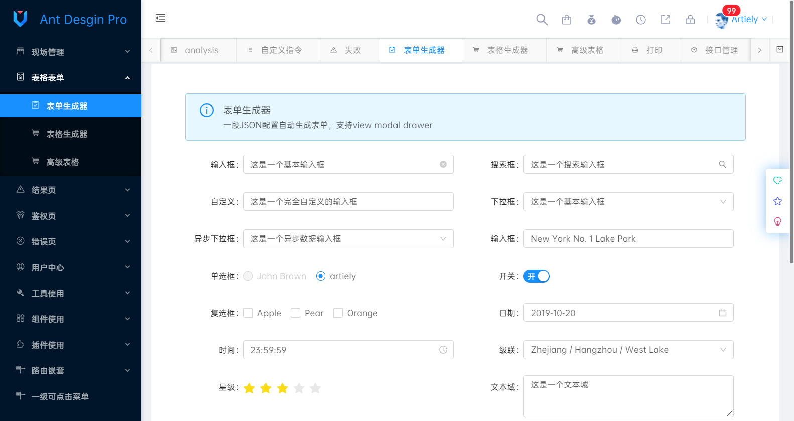

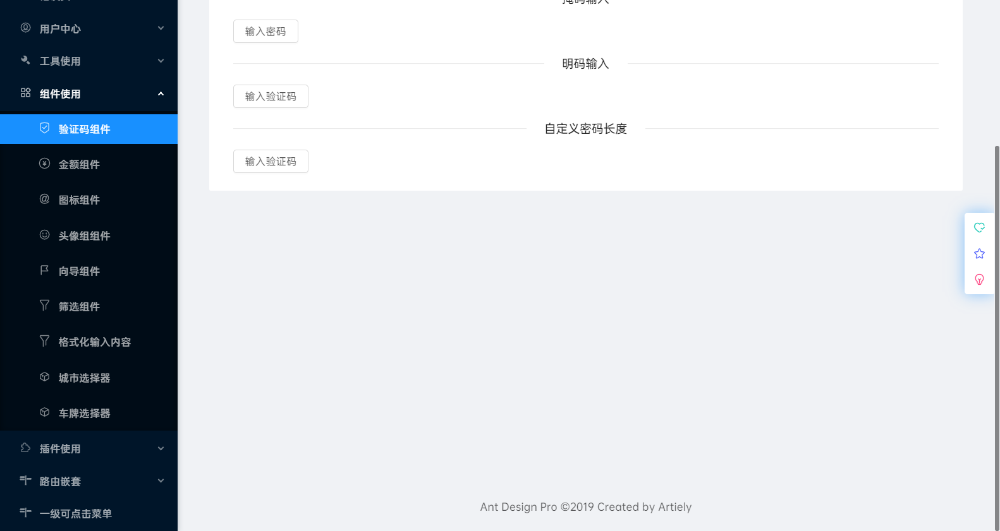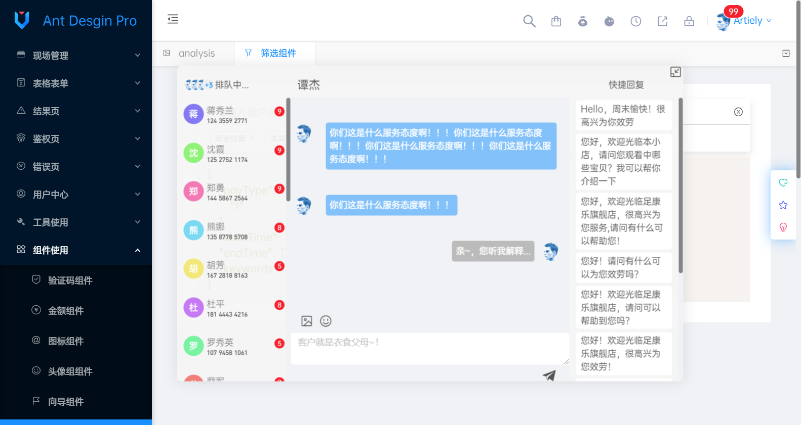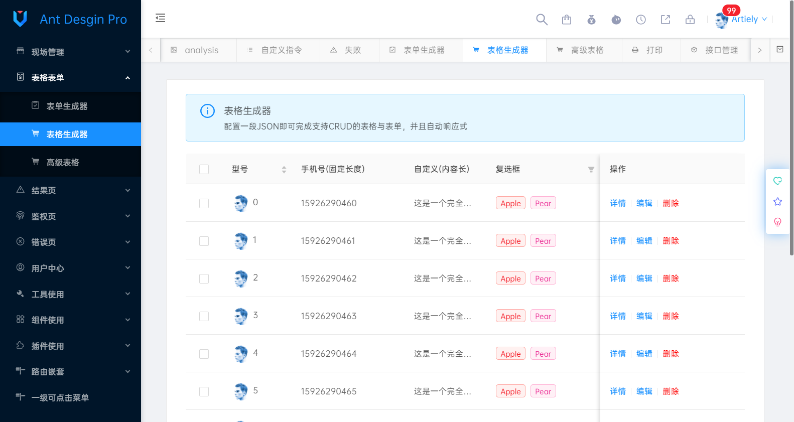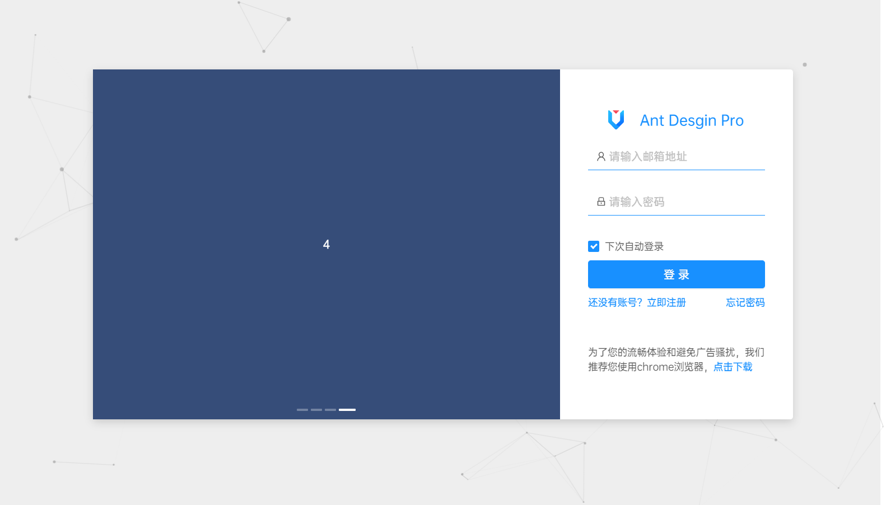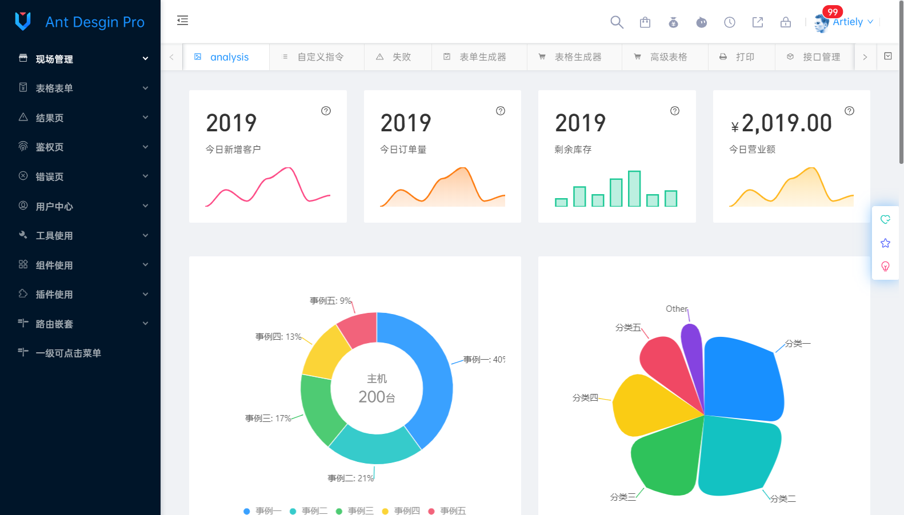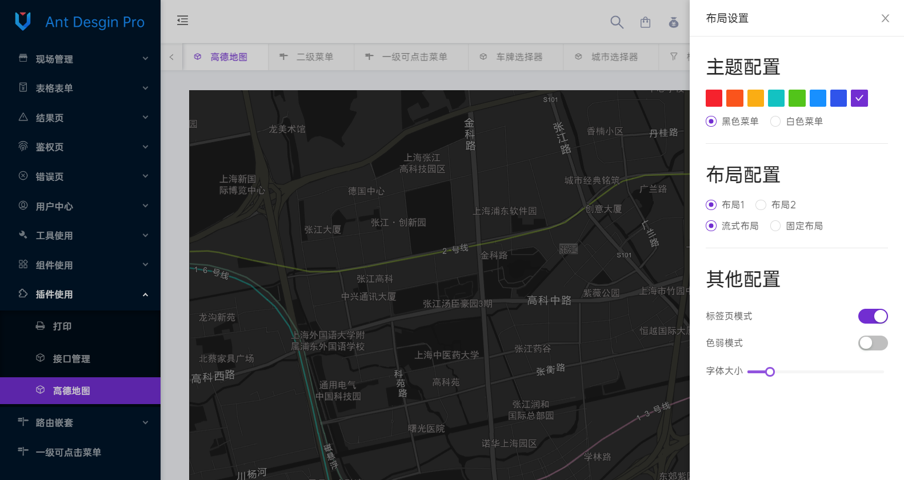

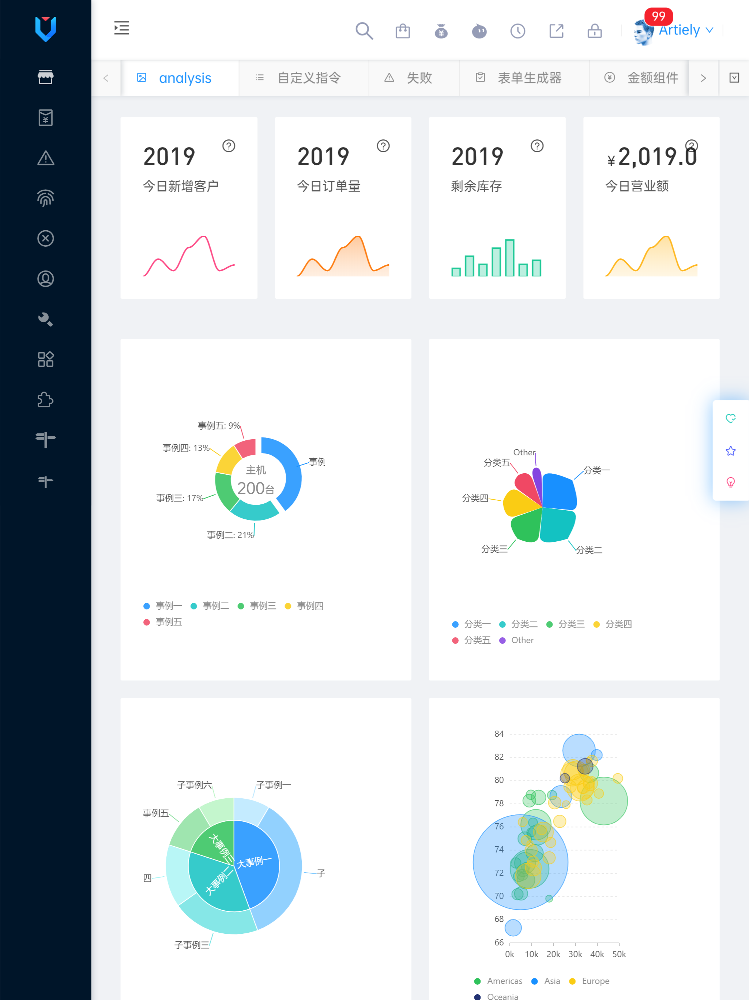

## 预览地址

<https://artiely.gitee.io/antd-admin>

## 快速构建

```bash
# 更新依赖
npm i

# 启动本地开发环境
npm run dev

# 启动本地测试环境
npm run build-staging

# 启动线上测试环境
npm run build

# 发布上线
npm run build-release
# pm2
pm2 deploy deploy.yml production setup
pm2 deploy deploy.yml production
```

## 快速新建页面

```bash
npm run new
# 请在指定的文件夹下新建页面 如： about/userInfo
# 请尽量用2个以上的单词描述页面组件, 准确表达组件含义避免过于宽泛。
# 页面组件与路由的path和name必须一一对应，名称一致，利于快速搜索和定位
# 页面组件驼峰名userInfo会被转换为user-info
# 自动生成的会包含一些必要信息，避免重复书写，尽量使用快捷新建页面
# 与业务相关的组件全部是中划线命名，与业务无关的遵循vue官方组件命名规则
```

## 你将了解到

- [x] axios封装并支持重连、取消

- [x] 响应式断点支持pc、pad及手机

- [x] 多布局切换

- [x] 可自定义主题

- [x] 标签页模式及对应功能实现

- [x] 色弱模式

- [x] 自定义字体大小

- [x] 自定义组件及物料

- [x] 丰富的过滤器及指令

- [x] 骨架屏

- [x] Sentry等第三方插件的集成

- [x] 多场景菜单

- [x] pm2一键发布

- [ ] 国际化

...

## 项目结构

```shell
├─doc                   // 文档目录
│      
├─public                // 静态资源目录
├─script                // 脚本
│      
├─node_modules
│  
├─src                   // 项目源文件
│  │  main.js           // 入口文件
│  ├─api                // 请求接口
│  │      
│  ├─assets             // 组件静态资源
│  │              
│  ├─common             // 公共文件
│  │  ├─directive       // 指令
│  │  ├─filter          // 过滤器
│  │  └─utils           // 工具
│  │  
│  ├─i18n               // 国际化
│  │  
│  ├─config             // 业务配置文件
│  ├─core               // 非业务抽离文件
│  ├─layouts            // 布局组件
│  ├─packages           // 非业务组件
│  ├─plugins            // 第三方插件
│  ├─views              // 业务组件
│  ├─router             // 路由管理
│  └─store              // 状态管理
│              
├─test                  // 测试
└─theme                 // 主体管理
...
```

## 浏览器支持

IE 9+
Firefox（最新）
Chrome（最新）
Safari（最新）

## 环境

```shell
win10
node v10.15.1
vuecli v3.7.0
```

## 依赖

```shell
"vue": "^2.6.10",
"vue-router": "^3.0.3",
"vuex": "^3.0.1",
"vuepress": "^1.0.0-alpha.48"
```
