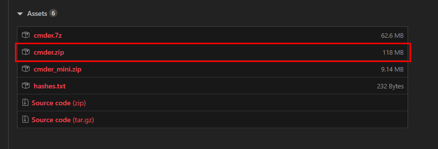
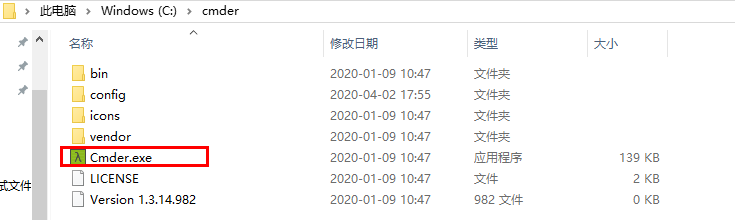
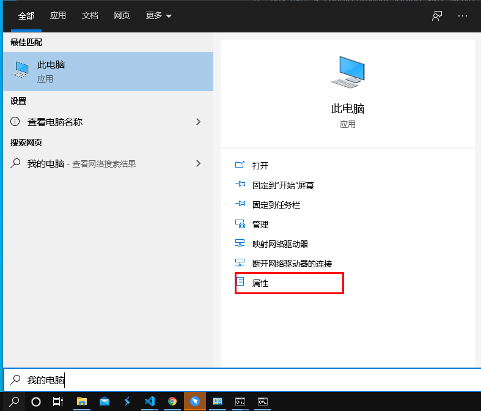
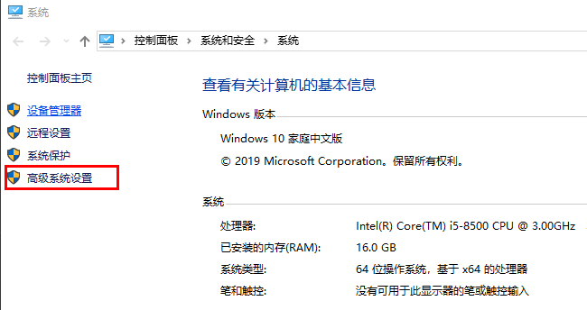
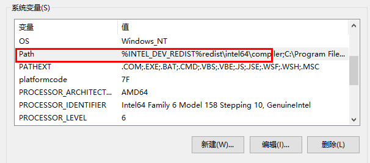
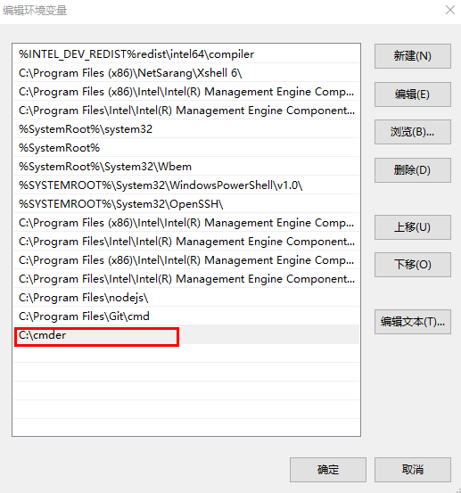

---
tag:
  - cmder
cover: /2022-05-13-12-13-15.png
date: 2020-4-2
base64: ffffff
title: cmder的安装和运行
tinyCover: /cover/2022-05-13-12-13-15.png
coverWidth: 564
coverHeight: 705
coverPrimary: 3c2e69
coverSecondary: c3d196

---

## 官网

[下载地址](https://cmder.net/)

## 下载

解压后可直接运行

## 加入环境变量

## 加入右键快捷

环境变量添加后，在任意文件夹中即可打开Cmder，上一步的把 Cmder 加到环境变量就是为此服务的, 在管理员权限的cmd下输入以下语句即可:
`Cmder.exe /REGISTER ALL`
