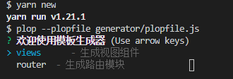
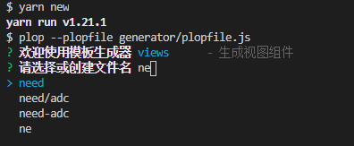

## 官网

[https://plopjs.com/documentation/#installation](https://plopjs.com/documentation/#installation)

## 安装

```shell
// 全局安装
npm i -g plop

// 本地安装
npm i --save-dev plop
```

## 配置

```js
// 更目录创建文件 plopfile.js  plop将已该文件作为执行入口

// 导出执行函数
module.exports = function (plop) {
  plop.getGenerator('模板名称', {
    description: '操作描述',
    prompts: [], // 交互提示
    actions: [], // 执行操作
  })
}
```

## 基础使用

```js
// plopfile.js

module.exports = function(plop){

   plop.getGenerator("vue基础模板", {
       description: '创建vue文件',
       prompts: [
            {
               type: 'input',
               name: 'path',
               message: '请输入文件创建目录'
           }
           {
               type: 'input',  // 交互类型
               name: 'name',   // 参数名称
               message:'请输入文件名称' // 交互提示
           },
       ],
       actions: [
           {
               type: 'add', // 动作类型
               path: '{{ path }}/{{ name }}.vue', // '{{  }}' 双大括号内设置动态参数
               templateFile: 'plop-templates/views/vue.hbs' // 模板文件地址， 使用hbs文件
           }
       ]

   })
}
```

```html
// plop-templates/views/vue.hbs
<template>
  <div class="{{ name }}" />
</template>
<script>
export default {
  name: '{{ name }}',
}
</script>
<style>
</style>
```

## 执行

```shell
plop
# plop --plopfile generator/index.js
# --plopfile 可以指定自定义的plopfile文件
```

# 进阶

## 注册inquirer插件

```js {2,3,4}
module.exports = function (plop) {
  plop.setWelcomeMessage('欢迎使用模板生成器')
  plop.setPrompt('autocomplete', require('inquirer-autocomplete-prompt'))
  plop.setPrompt('fuzzypath', require('inquirer-fuzzy-path'))
  plop.setGenerator('views     ', viewsGenerator)
  plop.setGenerator('router ', routerGenerator)
}
```

2修改全局欢迎提示语

3引入自动完成插件

4引入路径查询插件

## 实践

```js
const fs = require('fs')
const path = require('path')
const util = require('util')
const fuzzy = require('fuzzy')
const _ = require('lodash')
module.exports = {
  description: '生成视图组件',
  prompts: [
    {
      type: 'autocomplete',
      name: 'dir',
      message: '请选择或创建文件名',
      source: searchFolderPath,
    },
    {
      type: 'input',
      name: 'name',
      choices: ['nihao', 'hello'],
      message: '请输入页面名称',
    },
  ],
  actions: (data) => {
    const name = '{{name}}'
    const dir = '{{dir}}'
    const dirArr = dir
      .split('/')
      .map((v) => {
        return v
      })
      .join('/')
    const actions = [
      {
        type: 'add',
        path: `../src/views/${dirArr}/{{properCase  name}}.vue`,
        templateFile: 'plop-templates/views/index.hbs',
        data: {
          name,
        },
      },
    ]
    return actions
  },
}

let viewsFolderPath = []

// 读取当前目录下的第一层文件夹

function searchFolderPath(answers, input) {
  input = input || ''
  return new Promise((resolve) => {
    setTimeout(() => {
      const fuzzyResult = fuzzy.filter(input, viewsFolderPath)
      resolve(
        fuzzyResult
          .map((el) => {
            return el.original
          })
          .concat(input),
      )
    }, 0)
  })
}

const readdir = util.promisify(fs.readdir)

async function listNodes(nodePath, level) {
  try {
    const nodes = await readdir(nodePath)
    const currentNode = [nodePath]
    if (nodes.length > 0 && (undefined === 5 || level >= 0)) {
      const nodesWithPath = nodes.map(nodeName =>
        listNodes(path.join(nodePath, nodeName), 5 ? level - 1 : undefined),
      )
      const subNodes = await Promise.all(nodesWithPath)
      return subNodes.reduce((acc, val) => acc.concat(val), currentNode)
    }
    return currentNode
  }
  catch (err) {
    return []
  }
}

function readFolderPath(dirPath) {
  return new Promise((resolve, reject) => {
    listNodes(dirPath, 5).then((v) => {
      const res = v
        .map((item) => {
          return path
            .resolve(item)
            .split(path.resolve(dirPath))[1]
            .replace(/\\/, '')
            .replace(/\\/g, '/')
        })
        .filter(m => m)
      foods = res
      resolve(res)
    })
  })
}
readFolderPath('./src/views/').then((res) => {
  viewsFolderPath = res
})
```

以上代码我们实现了一个输入时自动查询与输入相匹配的路径成列再下方可以直接箭头选择，没有联想的结果证明文件夹不存在回车即创建





## 相关

[inquirer](https://github.com/SBoudrias/Inquirer.js/)

[handlebars](https://handlebarsjs.com/)
