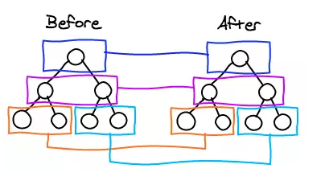
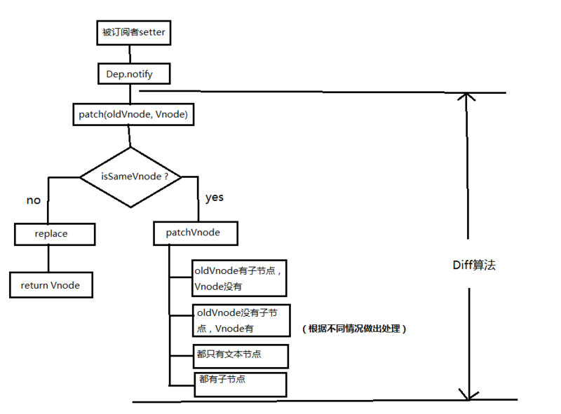

## 生命周期函数面试题

### 1.什么是 vue 生命周期？有什么作用？

答：每个 Vue 实例在被创建时都要经过一系列的初始化过程——例如，需要设置数据监听、编译模板、将实例挂载到 DOM 并在数据变化时更新 DOM 等。同时在这个过程中也会运行一些叫做 生命周期钩子 的函数，这给了用户在不同阶段添加自己的代码的机会。（ps：生命周期钩子就是生命周期函数）例如，如果要通过某些插件操作DOM节点，如想在页面渲染完后弹出广告窗， 那我们最早可在mounted 中进行。

### 2.第一次页面加载会触发哪几个钩子？

答：beforeCreate， created， beforeMount， mounted

### 3.简述每个周期具体适合哪些场景

答：beforeCreate：在new一个vue实例后，只有一些默认的生命周期钩子和默认事件，其他的东西都还没创建。在beforeCreate生命周期执行的时候，data和methods中的数据都还没有初始化。不能在这个阶段使用data中的数据和methods中的方法
create：data 和 methods都已经被初始化好了，如果要调用 methods 中的方法，或者操作 data 中的数据，最早可以在这个阶段中操作
beforeMount：执行到这个钩子的时候，在内存中已经编译好了模板了，但是还没有挂载到页面中，此时，页面还是旧的
mounted：执行到这个钩子的时候，就表示Vue实例已经初始化完成了。此时组件脱离了创建阶段，进入到了运行阶段。 如果我们想要通过插件操作页面上的DOM节点，最早可以在和这个阶段中进行
beforeUpdate： 当执行这个钩子时，页面中的显示的数据还是旧的，data中的数据是更新后的， 页面还没有和最新的数据保持同步
updated：页面显示的数据和data中的数据已经保持同步了，都是最新的
beforeDestory：Vue实例从运行阶段进入到了销毁阶段，这个时候上所有的 data 和 methods ， 指令， 过滤器 ……都是处于可用状态。还没有真正被销毁
destroyed： 这个时候上所有的 data 和 methods ， 指令， 过滤器 ……都是处于不可用状态。组件已经被销毁了。

### 4.created和mounted的区别

答：created:在模板渲染成html前调用，即通常初始化某些属性值，然后再渲染成视图。
mounted:在模板渲染成html后调用，通常是初始化页面完成后，再对html的dom节点进行一些需要的操作。

### 5.vue获取数据在哪个周期函数

答：一般 created/beforeMount/mounted 皆可.
比如如果你要操作 DOM , 那肯定 mounted 时候才能操作.

### 6.请详细说下你对vue生命周期的理解？

答：总共分为8个阶段创建前/后，载入前/后，更新前/后，销毁前/后。
创建前/后： 在beforeCreated阶段，vue实例的挂载元素$el和**数据对象**data都为undefined，还未初始化。在created阶段，vue实例的数据对象data有了，$el还没有。
载入前/后：在beforeMount阶段，vue实例的$el和data都初始化了，但还是挂载之前为虚拟的dom节点，data.message还未替换。在mounted阶段，vue实例挂载完成，data.message成功渲染。
更新前/后：当data变化时，会触发beforeUpdate和updated方法。
销毁前/后：在执行destroy方法后，对data的改变不会再触发周期函数，说明此时vue实例已经解除了事件监听以及和dom的绑定，但是dom结构依然存在。

## vue路由面试题

### 1.mvvm 框架是什么？

答：vue是实现了双向数据绑定的mvvm框架，当视图改变更新模型层，当模型层改变更新视图层。在vue中，使用了双向绑定技术，就是View的变化能实时让Model发生变化，而Model的变化也能实时更新到View。

### 2.vue-router 是什么?它有哪些组件

答：vue用来写路由一个插件。router-link、router-view

### 3.active-class 是哪个组件的属性？

答：vue-router模块的router-link组件。children数组来定义子路由

### 4.怎么定义 vue-router 的动态路由? 怎么获取传过来的值？

答：在router目录下的index.js文件中，对path属性加上/:id。 使用router对象的params.id。

### 5.vue-router 有哪几种导航钩子?

答：三种，
第一种：是全局导航钩子：router.beforeEach(to,from,next)，作用：跳转前进行判断拦截。
第二种：组件内的钩子
第三种：单独路由独享组件

### 6.$route 和 $router 的区别

答：$router是VueRouter的实例，在script标签中想要导航到不同的URL,使用$router.push方法。返回上一个历史history用$router.to(-1)
$route为当前router跳转对象。里面可以获取当前路由的name,path,query,parmas等。

### 7.vue-router的两种模式

答:hash模式：即地址栏 URL 中的 # 符号；
history模式：window.history对象打印出来可以看到里边提供的方法和记录长度。利用了 HTML5 History Interface 中新增的 pushState() 和 replaceState() 方法。（需要特定浏览器支持）。

### 8.vue-router实现路由懒加载（ 动态加载路由 ）

答:三种方式
第一种：vue异步组件技术 ==== 异步加载，vue-router配置路由 , 使用vue的异步组件技术 , 可以实现按需加载 .但是,这种情况下一个组件生成一个js文件。
第二种：路由懒加载(使用import)。
第三种：webpack提供的require.ensure()，vue-router配置路由，使用webpack的require.ensure技术，也可以实现按需加载。这种情况下，多个路由指定相同的chunkName，会合并打包成一个js文件。

## vuex常见面试题

### 1.vuex是什么？怎么使用？哪种功能场景使用它？

答：vue框架中状态管理。在main.js引入store，注入。
新建了一个目录store.js，….. export 。
场景有：单页应用中，组件之间的状态。音乐播放、登录状态、加入购物车

### 2.vuex有哪几种属性？

答：有五种，分别是 State、 Getter、Mutation 、Action、 Module
state => 基本数据(数据源存放地)
getters => 从基本数据派生出来的数据
mutations => 提交更改数据的方法，同步！
actions => 像一个装饰器，包裹mutations，使之可以异步。
modules => 模块化Vuex

### 3.Vue.js中ajax请求代码应该写在组件的methods中还是vuex的actions中？

答：如果请求来的数据是不是要被其他组件公用，仅仅在请求的组件内使用，就不需要放入vuex 的state里。

### nextTick原理

```javascript
<template>
  <div>
    <div>{{number}}</div>
    <div @click="handleClick">click</div>
  </div>
</template>
export default {
    data () {
        return {
            number: 0
        };
    },
    methods: {
        handleClick () {
            for(let i = 0; i < 1000; i++) {
                this.number++;
            }
        }
    }
}
```

当我们按下 click 按钮的时候，number 会被循环增加1000次。

那么按照之前的理解，每次 number 被 +1 的时候，都会触发 number 的 setter 方法，从而根据上面的流程一直跑下来最后修改真实 DOM。那么在这个过程中，DOM 会被更新 1000 次！那怎么办？

Vue.js中的 nextTick 函数，会传入一个 cb ，这个 cb 会被存储到一个队列中，在下一个 tick 时触发队列中的所有 cb 事件。

Vue.js 肯定不会以如此低效的方法来处理。Vue.js在默认情况下，每次触发某个数据的 setter 方法后，对应的 Watcher 对象其实会被 push 进一个队列 queue 中，在下一个 tick 的时候将这个队列 queue 全部拿出来 run（ Watcher 对象的一个方法，用来触发 patch 操作） 一遍。

因为目前浏览器平台并没有实现 nextTick 方法，所以 Vue.js 源码中分别用 Promise、setTimeout、setImmediate 等方式在 microtask（或是task）中创建一个事件，目的是在当前调用栈执行完毕以后（不一定立即）才会去执行这个事件。

```javascript
export function nextTick (cb?: Function, ctx?: Object) {
  let _resolve
  callbacks.push(() => {
    if (cb) {
      try {
        cb.call(ctx)
      } catch (e) {
        handleError(e, ctx, 'nextTick')
      }
    } else if (_resolve) {
      _resolve(ctx)
    }
  })
  if (!pending) {
    pending = true
    timerFunc()
  }
  // $flow-disable-line
  if (!cb && typeof Promise !== 'undefined') {
    return new Promise(resolve => {
      _resolve = resolve
    })
  }
}
```

首先定义一个 callbacks 数组用来存储 nextTick，在下一个 tick 处理这些回调函数之前，所有的 cb 都会被存在这个 callbacks 数组中。pending 是一个标记位，代表一个等待的状态。 这里用setTimeout做描述（真实源码里更复杂）： setTimeout 会在 task 中创建一个事件 flushCallbacks ，flushCallbacks 则会在执行时将 callbacks 中的所有 cb 依次执行。

## watcher

上面例子中，当我们将 number 增加 1000 次时，先将对应的 Watcher 对象给 push 进一个队列 queue 中去，等下一个 tick 的时候再去执行，这样做是对的。但是有没有发现，另一个问题出现了？

因为 number 执行 ++ 操作以后对应的 Watcher 对象都是同一个，我们并不需要在下一个 tick 的时候执行 1000 个同样的 Watcher 对象去修改界面，而是只需要执行一个 Watcher 对象，使其将界面上的 0 变成 1000 即可。

那么，我们就需要执行一个过滤的操作，同一个的 Watcher 在同一个 tick 的时候应该只被执行一次，也就是说队列 queue 中不应该出现重复的 Watcher 对象。

那么我们可以用 id 来标记每一个 Watcher 对象，让他们看起来不太一样。

我们再回过头聊一下第一个例子， number 会被不停地进行 ++ 操作，不断地触发它对应的 Dep 中的 Watcher 对象的 update 方法。然后最终 queue 中因为对相同 id 的 Watcher 对象进行了筛选，从而 queue 中实际上只会存在一个 number 对应的 Watcher 对象。在下一个 tick 的时候（此时 number 已经变成了 1000），触发 Watcher 对象的 run 方法来更新视图，将视图上的 number 从 0 直接变成 1000。

### 首先分析原因

VUE首页加载过慢，其原因是因为它是一个单页应用，需要将所有需要的资源都下载到浏览器端并解析。

### 考虑解决办法

- 1.使用首屏SSR + 跳转SPA方式来优化
- 2.改单页应用为多页应用，需要修改webpack的entry
- 3.CDN资源还是很重要的，最好分开，也能减少一些不必要的资源损耗
- 4.骨架屏这种的用户体验的东西一定要上
- 5.合理使用缓存

### react-router 里的 routerLink标签和a 标签有什么区别

先看Link点击事件handleClick部分源码

```javascript
      if (_this.props.onClick) _this.props.onClick(event);

      if (!event.defaultPrevented && // onClick prevented default
      event.button === 0 && // ignore everything but left clicks
      !_this.props.target && // let browser handle "target=_blank" etc.
      !isModifiedEvent(event) // ignore clicks with modifier keys
      ) {
          event.preventDefault();

          var history = _this.context.router.history;
          var _this$props = _this.props,
              replace = _this$props.replace,
              to = _this$props.to;


          if (replace) {
            history.replace(to);
          } else {
            history.push(to);
          }
        }
```

Link做了3件事情：

1. 有onclick那就执行onclick
2. click的时候阻止a标签默认事件（这样子点击`[123]()`就不会跳转和刷新页面）
3. 再取得跳转href（即是to），用history（前端路由两种方式之一，history & hash）跳转，此时只是链接变了，并没有刷新页面

## 写 React / Vue 项目时为什么要在列表组件中写 key，其作用是什么

> 当 Vue 正在更新使用 v-for 渲染的元素列表时，它默认使用“就地更新”的策略。如果数据项的顺序被改变，Vue 将不会移动 DOM。 元素来匹配数据项的顺序，而是就地更新每个元素，并且确保它们在每个索引位置正确渲染。这个类似 Vue 1.x 的 track-by="$index"。

这个默认的模式是高效的，但是只适用于不依赖子组件状态或临时 DOM 状态 (例如：表单输入值) 的列表渲染输出。

- 避免对节点「就地复用」

需要修改的节点位置没有改变，是内容更新了，这虽然提高了复用性能，但是往往在复杂的表单会导致状态出现错位。也不会产生过度效果

- key相当于每个vnode 的唯一id，我们可以依靠`key`，更快更精确的知道oldVnode中对应的vnode节点。

带key就不会使用就定复用了，在sameNode函数`a.key===b.key`对比中可以避免就地复用的情况。

我们可以利用key的唯一性来更快获取到对应节点，比遍历更快。

## 什么是diff算法？

要渲染真实的DOM的开销很大，因为改变真实dom，会当值整个dom树的重绘和回流。我们需要渲染真实dom的时候往往会把生成一个`虚拟节点` virtual DOM，当virtual dom某个节点的数据改变后生成一个新的Vnode，然后将Vnode和oldVnode对比，当然有不同的地方教就直接修改在真实DOM上，然后是oldVnode=Vnode

- 真实DOM

```html
<div>
    <p>123</p>
</div>
```

- virtual DOM （虚拟DOM）

```js
const Vnode = {
  tag: 'div',
  children: [{
    tag: 'p', text: '123',
  }],

}
```

### diff的比较方式

在同层级进行，不会跨层级比较

oldDOM

```html
<div>
    <p>123</p>
</div>
```

newDOM

```html
<div>
    <span>2222</span>
</div>
```



- 先对比DIV，发现两个DIV不对等
- 查看DIV的子元素P、SPAN，发现不对等
- 查看P、SPAN没有子元素，则移除P，增加SPAN



现在我们来看看在进行替换

#### 对比节点函数

```js
function patch(oldVnode, vnode) {
  // 对比是否相等
  if (sameVnode(oldVnode, vnode)) {
    patchVnode(oldVnode, vnode)
  }
  else {
    const oEl = oldVnode.el // 当前oldVnode对应的真实元素节点
    const parentEle = api.parentNode(oEl) // 父元素

    createELe(vnode) // 为vnode生成新的元素

    if (parentEle !== null) {
      api.insertBefore(parentEle, vnode.el, api.nextSibling(oEl)) // 将新的元素添加到父元素中
      api.removeChild(parentEle, oldVnode.el) // 移除以前的元素
    }
  }

  return vnode
}
```

#### 判断两者是否相同函数

```js
function sameVnode(a, b) {
  return (
    a.key === b.key // 对比key
    && a.tag === b.tag // 对比标签名
    && a.isComment === b.isComment // 是否为注释节点
    && isDef(a.data) === isDef(b.data) // 是否定义了data，或者其他属性
    && sameInputType(a, b) // 判断是当<Input>时 是否type相同
  )
}
```
