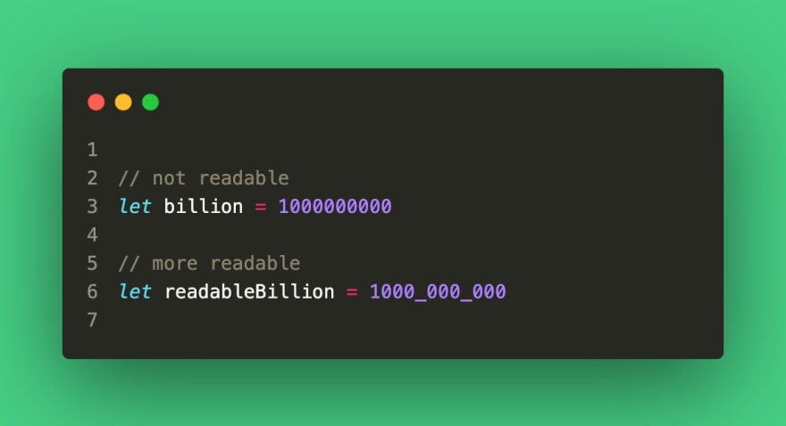

# 有用的javascript技巧

您可以使用 JavaScript 以不同的方式做同样的事情。随着每个新 ECMAScript 规范的发布，都添加了新的方法和运算符，以使代码更短且更具可读性。

]

## Object.entries

大多数开发人员使用**Object.keys**方法来迭代对象。此方法仅返回对象键数组，而不返回值。您可以使用**Object.entries**来获取键和值。  

```js
const person = {
  name: 'Nick',
  age: 27,
}
Object.keys(person) // ['name', 'age']
Object.entries(data) // [['name', 'Nick'], ['age', 27]]
```

要迭代一个对象，我们可以执行以下操作：  

```js
Object.keys(person).forEach((key) => {
  console.log(`${key} is ${person[key]}`)
})
// using records to get the key and value
Object.entries(person).forEach(([key, value]) => {
  console.log(`${key} is ${value}`)
})
// expected result:
// name is Nick
// age is 27
```

上述两种方法都返回相同的结果，但**Object.entries**可以轻松获取键值对。

## replaceAll方法

在 JavaScript 中，要将所有出现的字符串替换为另一个字符串，我们需要使用如下正则表达式：  

```js
const str = 'Red-Green-Blue'

// replaces only the first entry

str.replace('-', ' ') // Red Green-Blue

// use a regular expression to replace all entries
str.replace(/\-/g, ' ') // Red Green Blue
```

但是在 ES12 中，一个新的 replaceAll**方法被添加到 String.prototype 中**，它将所有出现的字符串替换为另一个字符串值：  

```js
str.replaceAll('-', ' ') // Red Green Blue
```

## 数字分隔符

您可以使用下划线“\_”作为数字分隔符来简化数字中零的计数。  

```js
// less readable
const billion = 1000000000
// more readable
const readableBillion = 1000_000_000
console.log(readableBillion) // returns 1000000000
```

分隔符也可以与 BigInt 数字一起使用，如下例所示：  

```js
const trillion = 1000_000_000_000n
console.log(trillion) // 1000000000000
```

这使数字更具可读性。

## document.designMode

链接到前端 JavaScript，**设计模式**允许您编辑页面上的任何内容。只需打开浏览器控制台并输入以下内容：  

```js
document.designMode = 'on'
```

这对设计人员很有用，因为他们不需要每次都更改代码中的某些内容以匹配屏幕上的更改。

## 逻辑赋值运算符

逻辑赋值运算符是逻辑运算符**\&\&、||、\?\?**的组合。和赋值运算符**\=**。  

```js
const a = 1
const b = 2
a &&= b
console.log(a) // returns 2
// the above statement is equivalent to a && (a = b);
// OR another way
if (a)
  a = b
```

在这里它检查**a**的值是否匹配 true，如果是，我们更新它的值。逻辑**OR //**运算符也可以做到这一点。  

```js
const a = null
const b = 3
a ||= b
console.log(a) // returns 3
// the above statement is equivalent to
a || (a = b)
```

还要在操作员的帮助下**？？**：  

```js
const a = null
const b = 3
a ??= b
console.log(a) // returns 3
// the above statement is equivalent to
if (a === null || a === undefined)
  a = b
```

请注意，自**ES 12/ES 2021**起添加了逻辑赋值运算符。

## 结论

这些技巧和功能可以加快开发人员的工作，它们的使用不仅是必要的，而且是有用的。继续探索语言的隐藏特征，学习各种技巧并提高技能。
