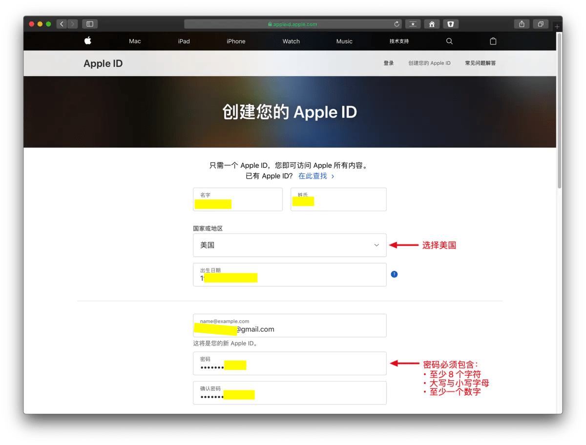
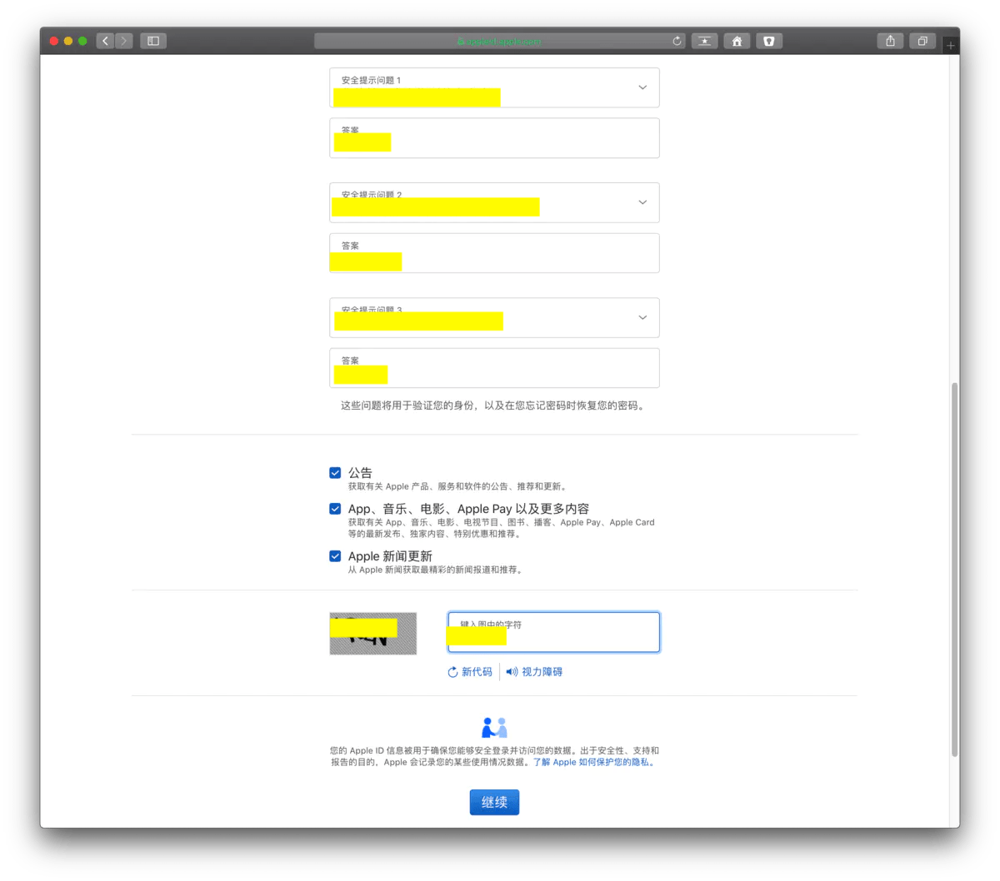
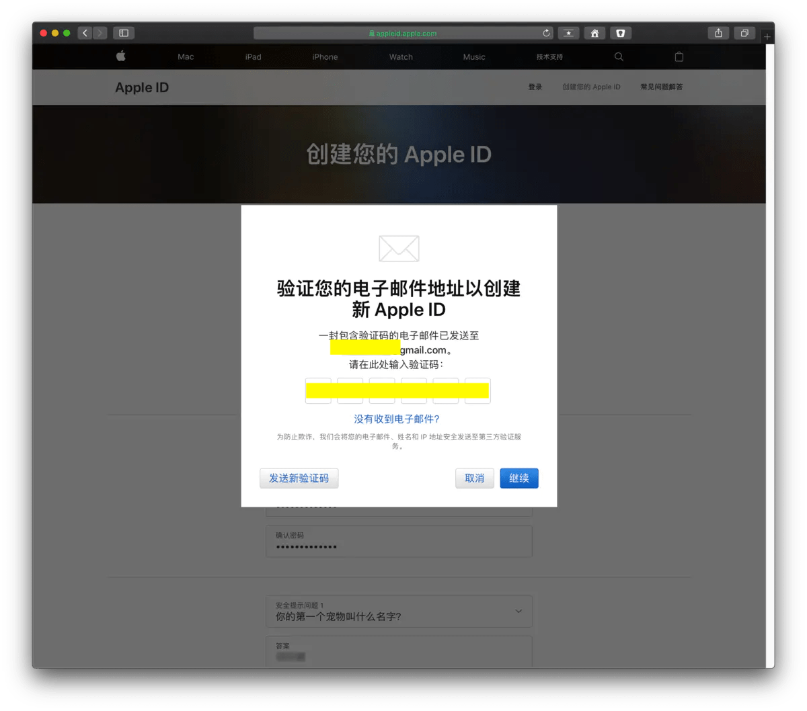
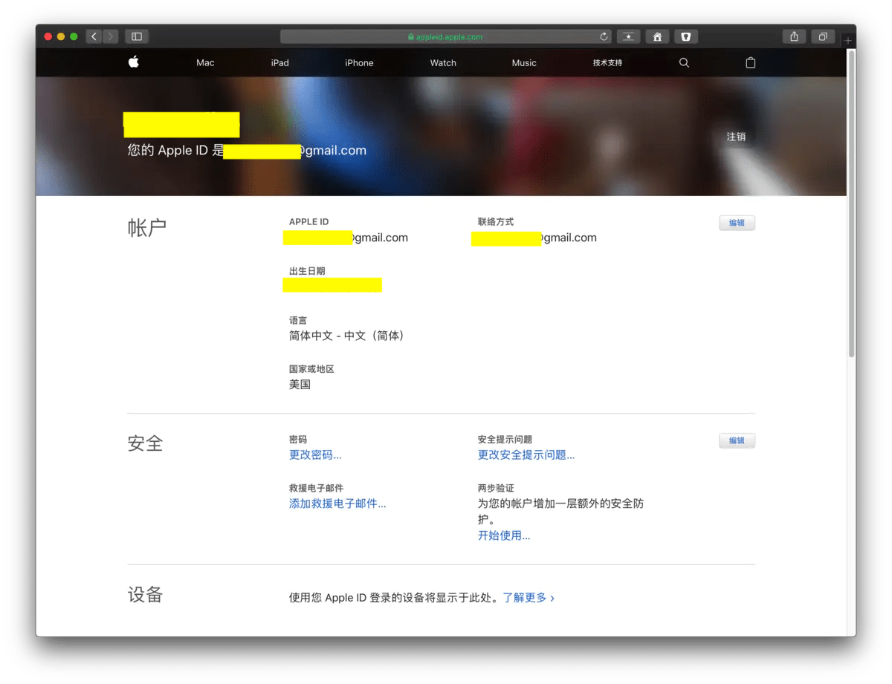
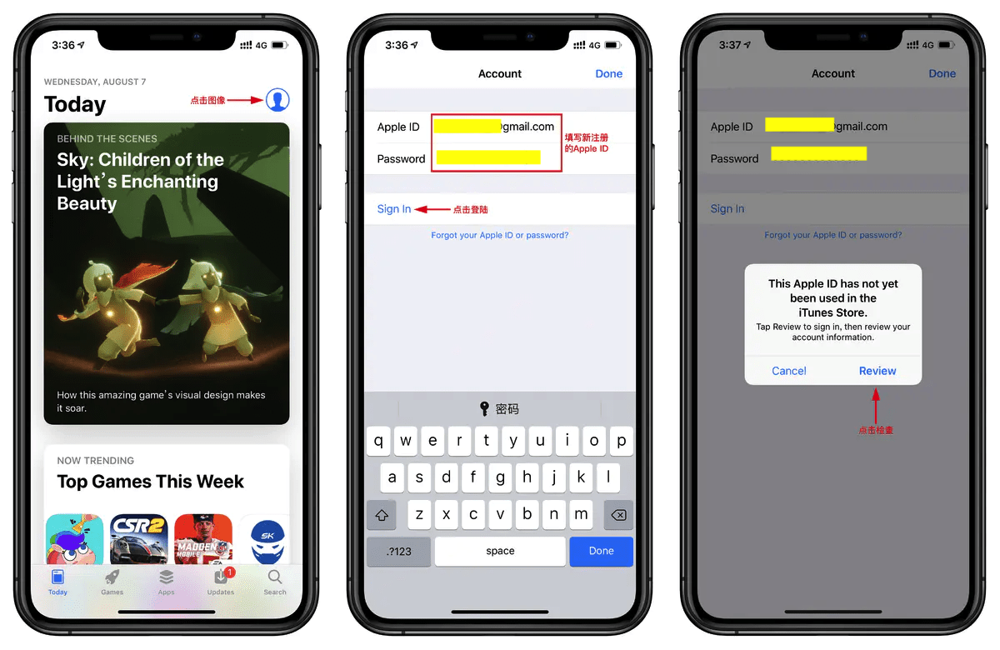

## 如何创建？

## 1.使用网页浏览器创建新的Apple ID

点击Apple ID创建链接 <https://appleid.apple.com/account#!&page=create> ，然后点击“创建您的 Apple ID”。（页面语言是中文英文都可以）

## 2.输入姓名、生日、电子邮件地址、密码、国家选择美国

## 3.选择安全提示问题，点击“继续”

## 4.网页版注册完成

# 手机登录新创建等Apple ID

## 1.打开Apple设备，进入 App Store -> 点击右上角你的Apple ID头像退出原来的账户

## 2.填写新创建等Apple ID -> 点击 “Sign in” 登录

## 3.此时会跳出验证信息点击 “Review”

## 4.确认国家是 “United States” 美国 -> 打开 “Agree to Terms and Conditions” 同意条款和条件 -> 点击 “Next” 继续

## 5.付款方式选择 “None”，点击 “Next” 继续

## 6.填写姓名，美国地址，如果您没有地址建议网上搜索美国个人信息生成，填写完点击 “Next” 继续

## 7.点击 “Continue” 继续，完成最终注册
