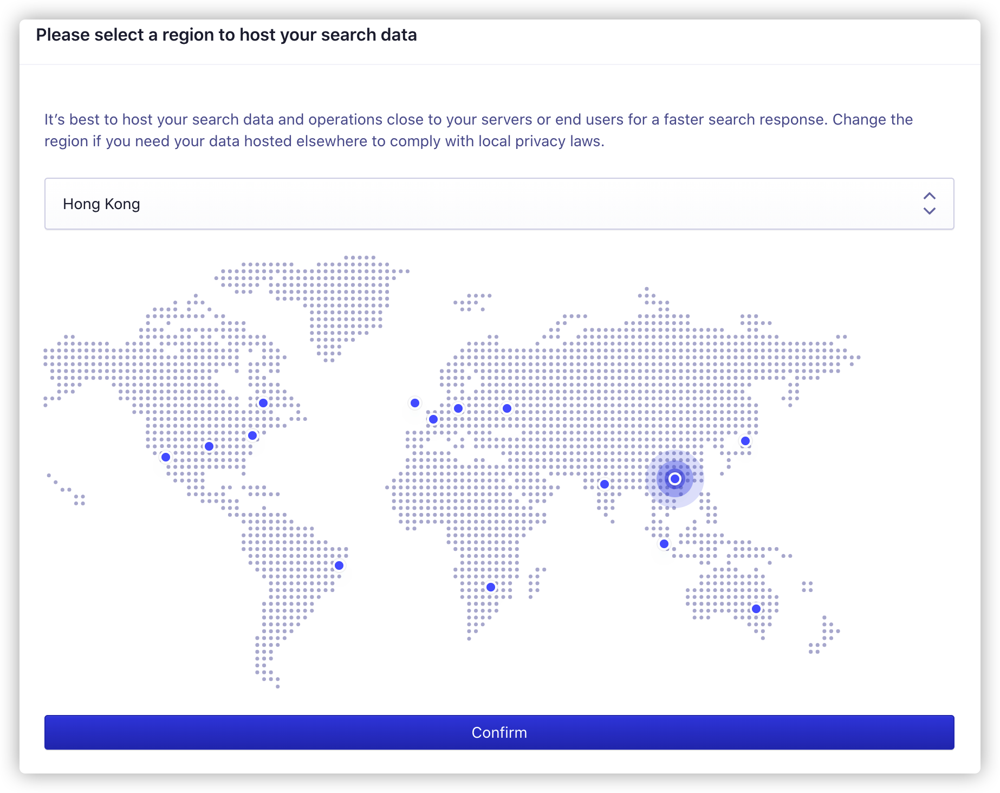
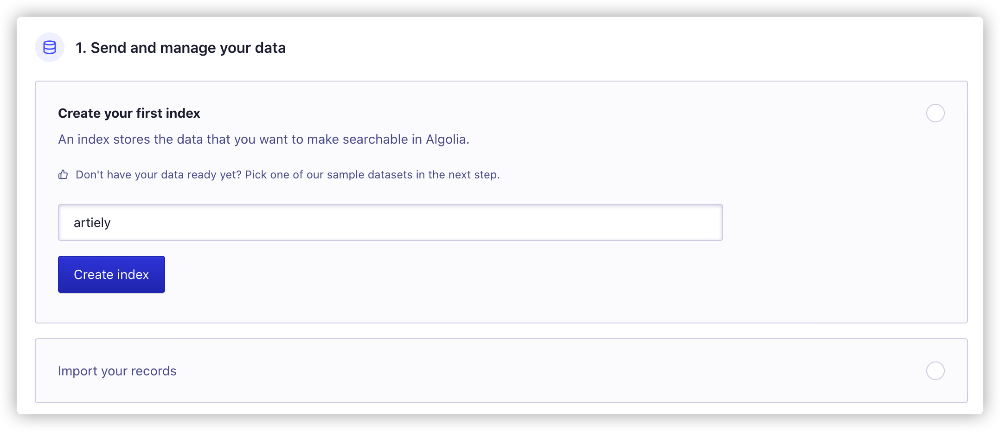

---
tag:
  - Algolia
  - Search
  - Node.js
  - Vue.js
  - Shell
  - Docker
  - Typescript
  - Scss
cover: /2022-05-10-14-26-40.png
tinyCover: /cover/2022-05-10-14-26-40.png
coverWidth: 563
coverHeight: 762

---


# 给你的网站添加 Algolia 搜索

[官网](https://www.algolia.com/)

[面向开发者官网](https://www.algolia.com/developers/)

## 实现一个组件基于vue3

```html
<script setup lang="ts">
import '@docsearch/css'
import docsearch from '@docsearch/js'
import { getCurrentInstance, onMounted, watch } from 'vue'
import type { DocSearchHit } from '@docsearch/react/dist/esm/types'

interface AlgoliaSearchOptions {
  appId?: string
  apiKey: string
  indexName: string
  placeholder?: string
  searchParameters?: any
  disableUserPersonalization?: boolean
  initialQuery?: string
}

const props = defineProps<{
  options: AlgoliaSearchOptions
  multilang?: boolean
}>()

const vm = getCurrentInstance()
const route = useRoute()
const router = useRouter()

watch(
  () => props.options,
  (value) => {
    update(value)
  },
)

onMounted(() => {
  initialize(props.options)
})

function isSpecialClick(event: MouseEvent) {
  return (
    event.button === 1
    || event.altKey
    || event.ctrlKey
    || event.metaKey
    || event.shiftKey
  )
}

function getRelativePath(absoluteUrl: string) {
  const { pathname, hash } = new URL(absoluteUrl)

  return pathname + hash
}

function update(options: any) {
  if (vm && vm.vnode.el) {
    vm.vnode.el.innerHTML
      = '<div class="algolia-search-box" id="docsearch"></div>'
    initialize(options)
  }
}

const lang = ref('ZH-CN')

// if the user has multiple locales, the search results should be filtered
// based on the language
const facetFilters: string[] = props.multilang ? [`lang:${lang.value}`] : []

if (props.options.searchParameters?.facetFilters)
  facetFilters.push(...props.options.searchParameters.facetFilters)

watch(lang, (newLang, oldLang) => {
  const index = facetFilters.findIndex(filter => filter === `lang:${oldLang}`)
  if (index > -1)
    facetFilters.splice(index, 1, `lang:${newLang}`)
})

function initialize(userOptions: any) {
  docsearch(
    Object.assign({}, userOptions, {
      container: '#docsearch',

      searchParameters: Object.assign({}, userOptions.searchParameters, {
        // pass a custom lang facetFilter to allow multiple language search
        // https://github.com/algolia/docsearch-configs/pull/3942
        facetFilters,
      }),

      navigator: {
        navigate: ({ itemUrl }: { itemUrl: string }) => {
          const { pathname: hitPathname } = new URL(
            window.location.origin + itemUrl,
          )

          // Router doesn't handle same-page navigation so we use the native
          // browser location API for anchor navigation
          if (route.path === hitPathname)
            window.location.assign(window.location.origin + itemUrl)

          else
            router.go(itemUrl)
        },
      },

      transformItems: (items: DocSearchHit[]) => {
        return items.map((item) => {
          return Object.assign({}, item, {
            url: getRelativePath(item.url),
          })
        })
      },

      hitComponent: ({
        hit,
        children,
      }: {
        hit: DocSearchHit
        children: any
      }) => {
        const relativeHit = hit.url.startsWith('http')
          ? getRelativePath(hit.url as string)
          : hit.url

        return {
          type: 'a',
          ref: undefined,
          constructor: undefined,
          key: undefined,
          props: {
            href: hit.url,
            onClick: (event: MouseEvent) => {
              if (isSpecialClick(event))
                return

              // we rely on the native link scrolling when user is already on
              // the right anchor because Router doesn't support duplicated
              // history entries
              if (route.path === relativeHit)
                return

              // if the hits goes to another page, we prevent the native link
              // behavior to leverage the Router loading feature
              if (route.path !== relativeHit)
                event.preventDefault()

              router.go(relativeHit)
            },
            children,
          },
          __v: null,
        }
      },
    }),
  )
}
</script>

<template>
  <div id="docsearch" class="algolia-search-box" />
</template>

<style lang="scss">
.algolia-search-box {
  padding-top: 1px;
}

@media (min-width: 720px) {
  .algolia-search-box {
    padding-left: 8px;
  }
}

@media (min-width: 751px) {
  .algolia-search-box {
    min-width: 176.3px;
    /* avoid layout shift */
  }

  .algolia-search-box .DocSearch-Button-Placeholder {
    padding-left: 8px;
    font-size: 0.9rem;
    font-weight: 500;
  }
}

.DocSearch {
  --docsearch-primary-color: var(--c-brand);
  --docsearch-highlight-color: var(--docsearch-primary-color);
  --docsearch-searchbox-shadow: inset 0 0 0 2px var(--docsearch-primary-color);
  --docsearch-text-color: var(--c-text-light);
  --docsearch-muted-color: var(--c-text-lighter);
  --docsearch-searchbox-background: #f2f2f2;
}
html.dark{
  .DocSearch {
    --docsearch-searchbox-focus-background: #1b1a1a;
    --docsearch-modal-background: var(--primary-bg);
    --docsearch-hit-background: var(--primary-bg);
    --docsearch-hit-shadow: 0 1px 3px 0 #1b1b1b;
    --docsearch-modal-shadow: inset 1px 1px 0 0 rgba(23, 18, 18, 0.5),0 3px 8px 0 #555a64;
    --docsearch-footer-background: ##1b1a1a;
    --docsearch-key-gradient: linear-gradient(-225deg,#252627,#5e5252);
    --docsearch-footer-shadow: 0 -1px 0 0 #202122,0 -3px 6px 0 rgba(69,98,155,0.12);
    --docsearch-hit-color: #767e8a;
    --docsearch-key-shadow: inset 0 -2px 0 0 #41414a,inset 0 0 1px 1px rgb(73, 69, 69),0 1px 2px 1px rgba(30,35,90,0.4);
  }
}
</style>
```

主要依赖

```bash
pnpm i @docsearch/css @docsearch/js
```

## 使用组件

```html
<script>
const options = {
  appId: 'xxx',
  apiKey: 'xxx',
  indexName: 'artiely',
}
</script>
<template>
  <AlgoliaSearchBox :options="options" />
</template>
```

## 上传数据

- 先登录后台<https://www.algolia.com/signup/dashboard_setup>
- 选择就近节点

- 创建你的第一个索引


- 导入你的记录（数据）

1. 配置你的索引级别 `.content` 为你页面的最外层class

```js
const searchConfig = {
  index_name: 'artiely', // 索引名称
  start_urls: [], // 开始页面
  selectors: { // 选择器
    lvl0: { // 第一层
      selector: '',
      global: true,
      default_value: 'Documentation',
    },
    lvl1: '.content h1', // 第一级标题
    lvl2: '.content h2', // 第二级标题
    lvl3: '.content h3',
    lvl4: '.content h4',
    lvl5: '.content h5',
    lvl6: '.content p, .content li', // 段落
    text: '.content [class^=language-]', // 文本
  },
  nb_hits: 100, // 每页显示数量
}
```

2. 在打包应用时写入 `start_urls` 并将配置写入到`config_algolia.json`的文件中

```js
try {
  const urls = files.map(v => `https://artiely.gitee.io${v.link}`)
  searchConfig.start_urls = [...searchConfig.start_urls, ...urls]
  fs.writeFile(
    path.join(path.dirname(__dirname), '../config_algolia.json'),
    JSON.stringify(searchConfig),
    (error) => {
      if (error) {
        console.log('写入失败')
      }
      else {
        // console.log("写入成功了");
      }
    },
  )
}
catch (error) {
  console.log('🚀 ~ file: config.js ~ error', error)
}
```

3. 使用Docker容器运行爬虫

新建一个shell脚本 ,`shell_algolia.sh`

```bash
docker run -it --env-file=.env -e "CONFIG=$(cat config_algolia.json | jq -r tostring)" algolia/docsearch-scraper
```

:::tip 注意
注意你的网站要先发布到域名上
:::
