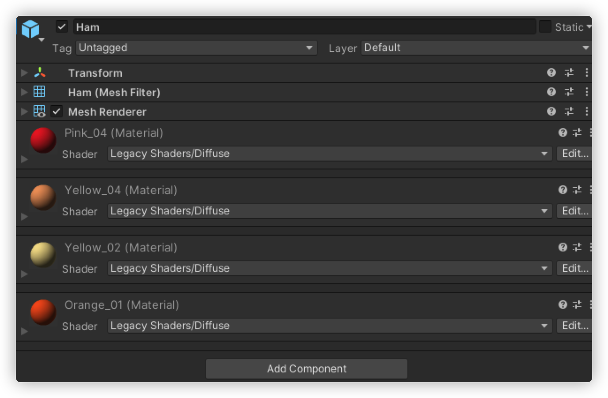
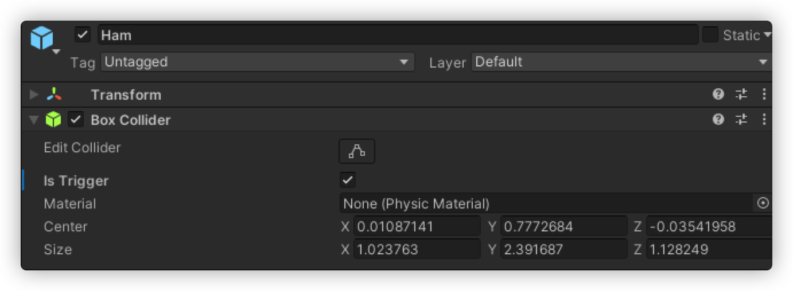
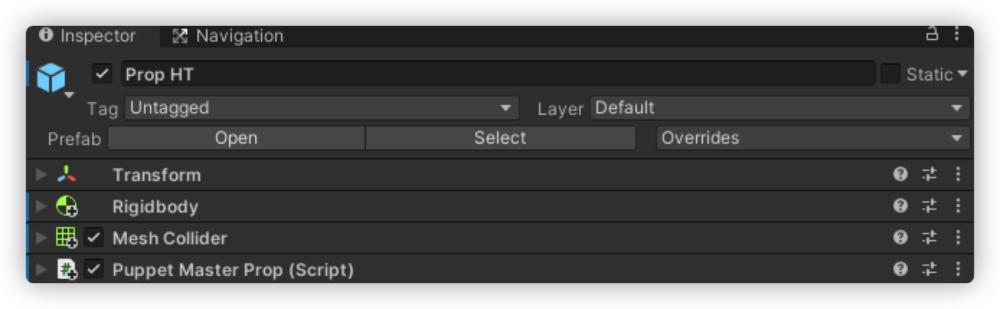
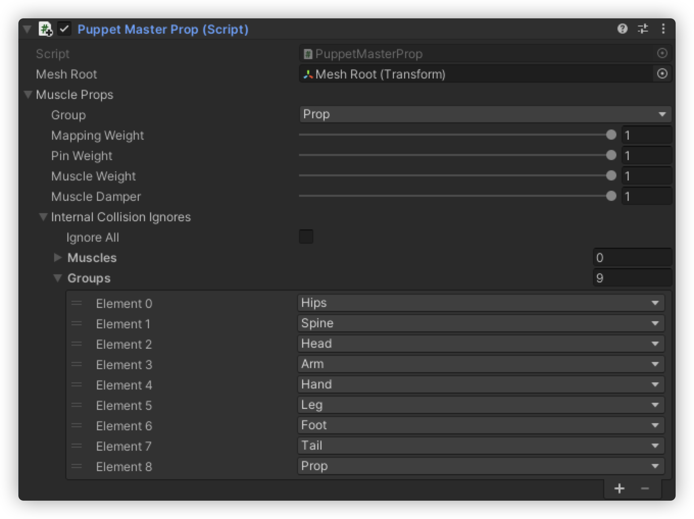
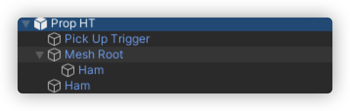
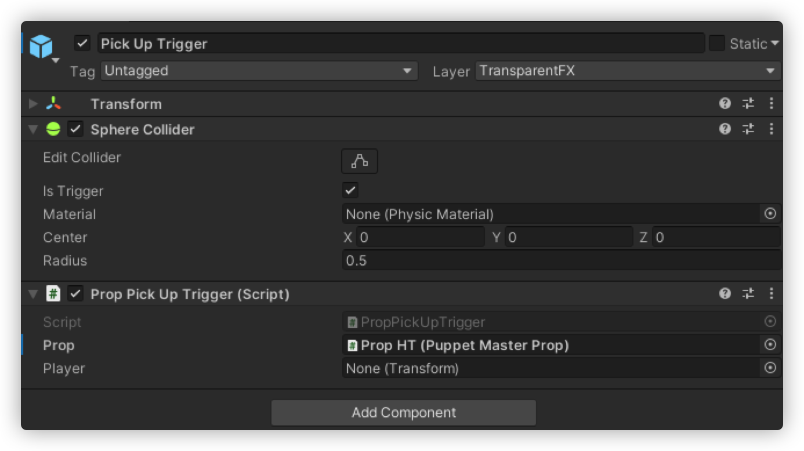
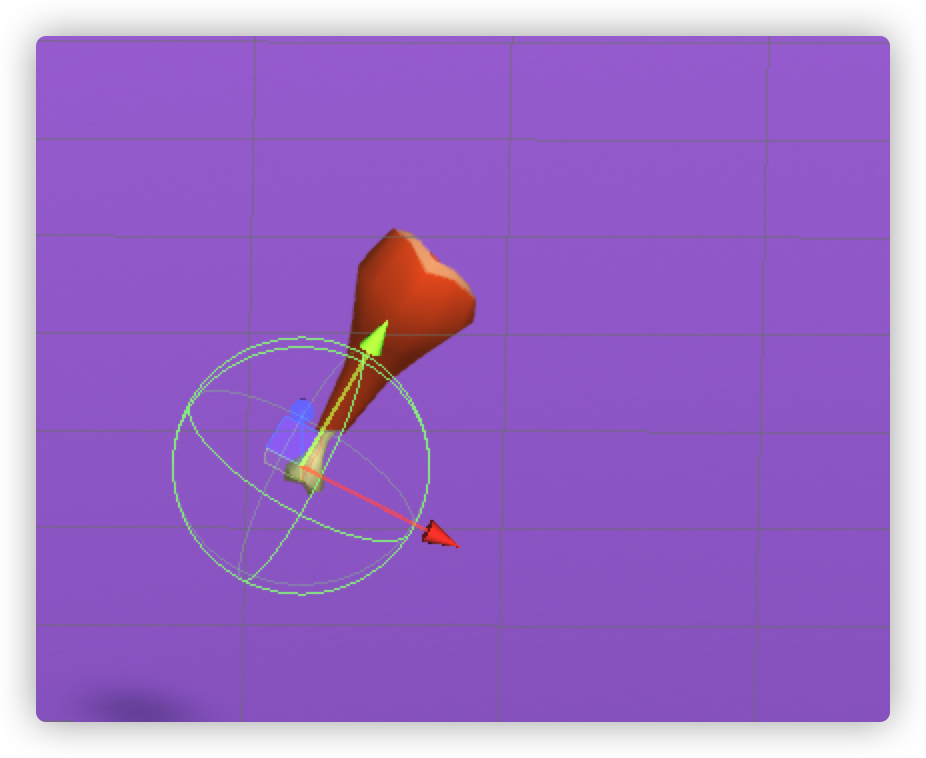

---
tag:
  - puppet-master
  - unity
cover: /2022-05-11-14-06-50.png
tinyCover: /cover/2022-05-11-14-06-50.png
coverWidth: 399
coverHeight: 600
coverPrimary: 4b4d4c
coverSecondary: b4b2b3

---


# puppet-master道具篇

先准备一批道具模型
链接: <https://pan.baidu.com/s/1mq9HYDEazUKsN0BP-lD7Bw?pwd=184i> 提取码: 184i

- 场景中新建空对象命名`Prop`->新建子对象命名`Mesh Root`
- 将道具预制体`Ham`拖入`Prop/`及`Prop/Mesh Root`
- 将`Prop/Mesh Root`下的`Ham`只保留`Mesh`组件如下



- 将`Prop`下的`Ham`只保留`Collider`组件如下


- 在`Prop`上添加如下组件


1. `Rigidbody`默认值
2. `Collider`这里我选择的`Mesh Collider` ,Mesh属性选择`Ham`的`Mesh`，`Convex`选择`true`
3. `Puppet Master Prop`的 `Mesh Root`选择`Prop`下的·`Mesh Root` 如下


- 对象结构如下


## 如何拾取道具

如上结构添加一个`Pick Up Trigger`



脚本的逻辑

```cs
using UnityEngine;
using System.Collections;
using RootMotion.Dynamics;


    public class PropPickUpTrigger : MonoBehaviour {
        // 用户的道具
        public PuppetMasterProp prop;
        // 左手
        private PropMuscle propMuscleRight;
        private bool isPickUp;
        public Transform Player;
        /**
         * 判断拿武器的人是否死亡
         */
        private void Update()
        {

            if (Player)
            {
                Redirector redirector = Player.GetComponent<Redirector>();
                if(redirector.hitController.IsDead)
                {
                    if (connectTo&&connectTo.currentProp)
                    {
                        connectTo.currentProp = null;
                    }
                    
                    Player = null;
                    isPickUp = false;
                    redirector.isProp = false;
                };
            }
            else
            {
                Player = null;
                isPickUp = false;
            }
        }
        void OnTriggerEnter(Collider collider)
        {
            Debug.Log("有碰到武器"+isPickUp);
            if (isPickUp) return;
            // 如果是人
            Transform player = collider.transform.root;
            Transform puppetMaster = player.Find("PuppetMaster");
            if (puppetMaster)
            {
                Redirector redirector = player.GetComponent<Redirector>();
                if(redirector.hitController.IsDead)return;
                if (redirector.isProp) return;
                Player = player;
                propMuscleRight = puppetMaster
                    .Find("Prop Muscle RightForearm_end")
                    .GetComponent<PropMuscle>();
                connectTo.currentProp = prop;
                redirector.isProp = true;
                isPickUp = true;
            }
        }
        private PropMuscle connectTo {
            get {
                return  propMuscleRight;
            }
        }
    }

```

## 拾取核心逻辑是

```cs
// 判断是不是与人发生碰撞
// 判断道具状态 (如是否已被拾取)。。。
// 判断人物状态 (是否死亡，是否已有武器) 。。。
// 获取人物的`Prop Muscle`插槽
// 设置`Prop Muscle`插槽的`currentProp`属性
// 设置人物和道具的状态
```
