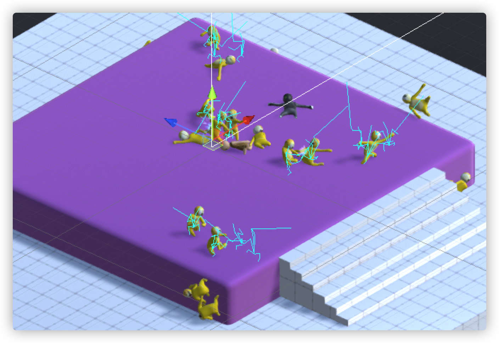
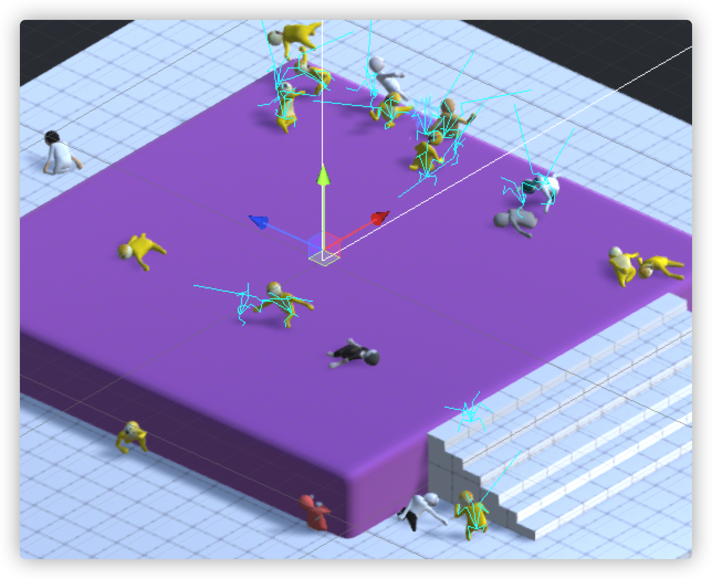
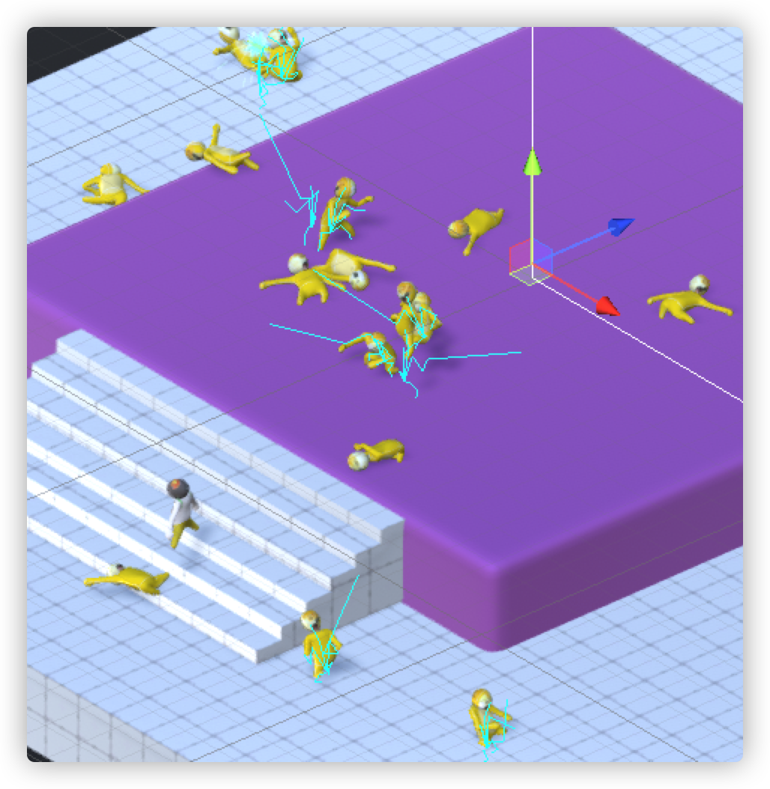

---
tag:
  - unity
cover: /2022-05-27-17-28-58.png
tinyCover: /cover/2022-05-27-17-28-58.png
coverWidth: 564
coverHeight: 845
coverPrimary: 2d1419
coverSecondary: d2ebe6

---


# 导航搞丢了

近日做了一个小人儿互殴的游戏，角色取自于人类一败涂地，角色甚是可爱，魔性。用于火热的直播平台上直播，bilibili抑或抖音，深受观众老爷们的喜爱。无不夸赞称奇。纷纷加入粉丝团，或豪掷礼物，每每开播，都会来增添一份热度。
也会有粉丝提及些许改进已经，本人也有着改之，虽然从不缺乏想象的力度，但是亏在技能的不足，无法达到预期的效果。也只能加紧学习，继续努力。

今天打算在之前的擂台上新增一个平台。于是便发现一个神奇的bug。



当小人被击飞到擂台以下后，无法按照原定的导航路线回到平台之上。一个个都飞将而上，或瞬移而上，或攀附而上。或连滚带爬或卡住原地踏步。要不是有些奇怪的表现，大多倒也觉得更显可爱。



但是就是由于那些怪异的行为，使我不得不去改进她。

在我经过一番苦苦调试之后，我才发现问题所在。

当一个小人被另一个小人一拳击飞之后。虽然骨骼都已飞到平台以下。但是身上的导航系统却丢在了平台上。想着也合理。人是死了才飞出去的。死的时候，就不知道导航了。等复活过来便处于本能的去找导航了。等我知道这个问题后，于是我便很快的解决了这个bug。
归根结底也就两行代码。

```csharp
transform.GetComponent<NavMeshAgent>().enabled = true;
```

死的时候将值至于false,复活过来后将值至于true。


