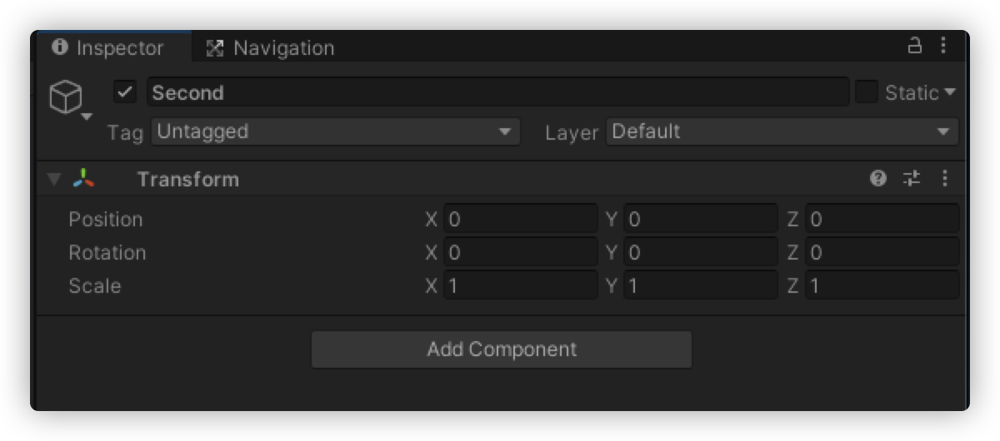

---
tag:
  - unity
cover: /2022-06-02-15-47-20.png
tinyCover: /cover/2022-06-02-15-47-20.png
coverWidth: 564
coverHeight: 1002
coverPrimary: 7b0d0d
coverSecondary: 84f2f2

---


# Unity Transform的一些发现

本人作为业余的unity玩家对 [Unity Transform]的 一些发现



```cs
void update(){
  transform.Rotate(TurnX * Time.deltaTime,TurnY * Time.deltaTime,TurnZ * Time.deltaTime, Space.World);
  transform.Translate(MoveX * Time.deltaTime, MoveY * Time.deltaTime, MoveZ * Time.deltaTime, Space.World);
}
```

```cs
void update(){
  // 通过上下键控制旋转
   if (Input.GetKeyDown(KeyCode.UpArrow))
    {
        var x = second.localRotation.x;
        x += 1;
        second.Rotate(x, 0, 0);
    }

    if (Input.GetKeyDown(KeyCode.DownArrow))
    {
        var x = second.localRotation.x;
        x -= 1;
        second.Rotate(x, 0, 0);
    }
    // 通过shift+上下控制移动
    if(Input.GetKey(KeyCode.LeftShift)&&Input.GetKeyDown(KeyCode.UpArrow))
    {
      var y = second.localPosition.y;
      y -= 1;
      second.position=new Vector3(0, y, 0);
    }
    if(Input.GetKey(KeyCode.LeftShift)&&Input.GetKeyDown(KeyCode.DownArrow))
    {
        var y = second.localPosition.y;
        y += 1;
        second.position=new Vector3(0, y, 0);
    }
    // 重置
    if (Input.GetKey(KeyCode.LeftShift) && Input.GetKeyDown(KeyCode.I))
    {
        second.localPosition=new Vector3(0, 0, 0);
        second.localEulerAngles=new Vector3(0, 0, 0);
    }
}
```

已debug的方式查看 TRANSFORM的属性


如果你想直接改变TRANSFORM的属性，那么你可以通过下面的方式

```cs
transform.localPosition = new Vector3(0, 0, 0);
transform.localEulerAngles = new Vector3(0, 0, 0);
transform.localScale = new Vector3(1, 1, 1);
```

如果你修改的时候不带local，那么你可以通过下面的方式

```cs
transform.position = new Vector3(0, 0, 0);
transform.eulerAngles = new Vector3(0, 0, 0);
transform.localScale = new Vector3(1, 1, 1);
```

某些时候可以达到相同的效果，有些时候可以达到不同的效果

如果我把上面的重置代码修改一下，就可以达到不同的效果

```cs
// 重置
    if (Input.GetKey(KeyCode.LeftShift) && Input.GetKeyDown(KeyCode.I))
    {
        second.position=new Vector3(0, 0, 0);
        second.eulerAngles=new Vector3(0, 0, 0);
    }
```

启动前

启动后修改一些参数


没改前的重置 带local

改变后的重置 不带local


会发现带local是我的预期，但是不带local他会通过计算使物体回到初始位置并给local赋值