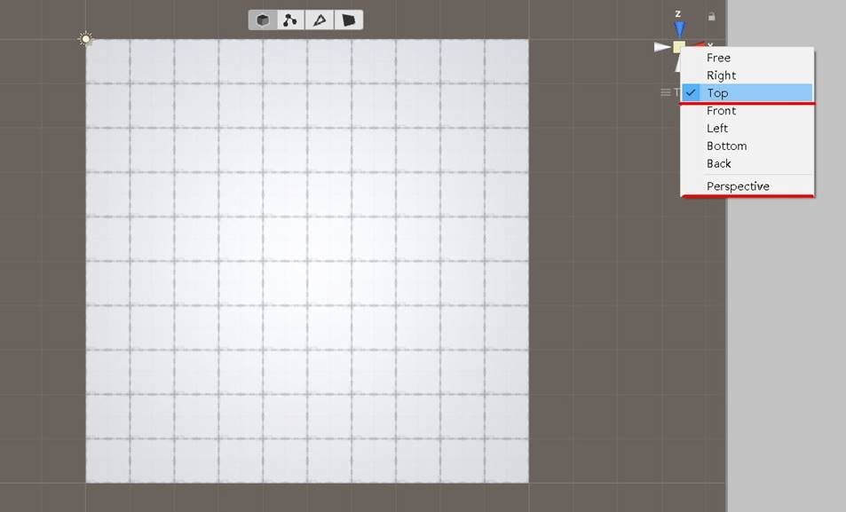
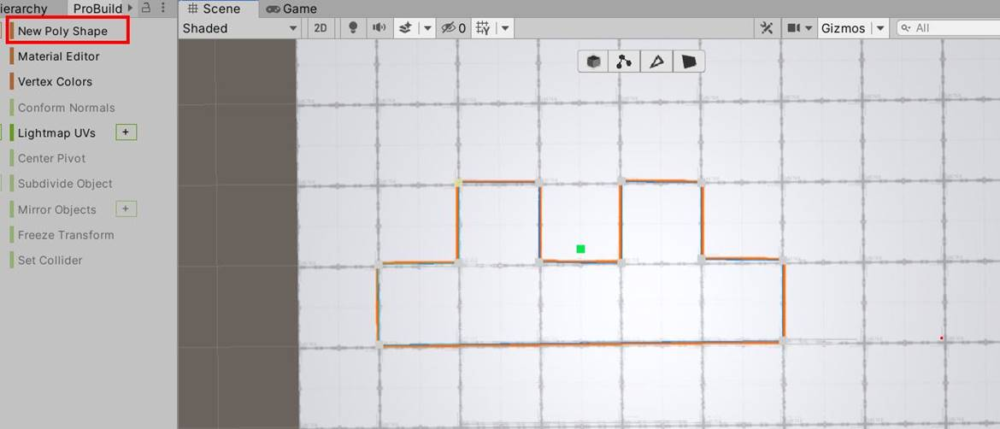
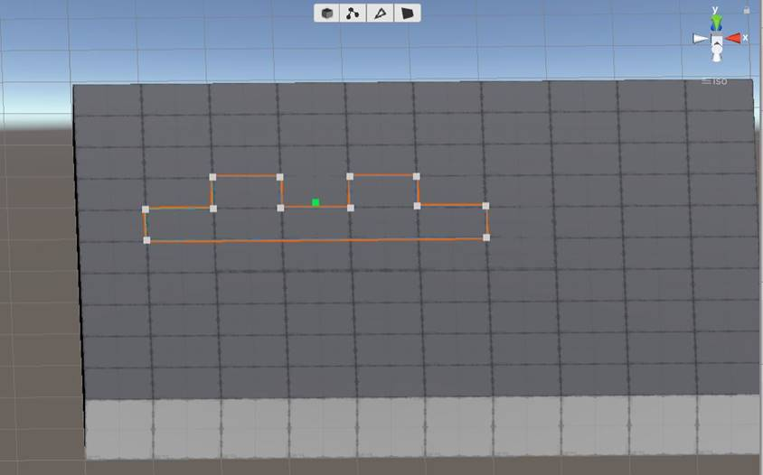
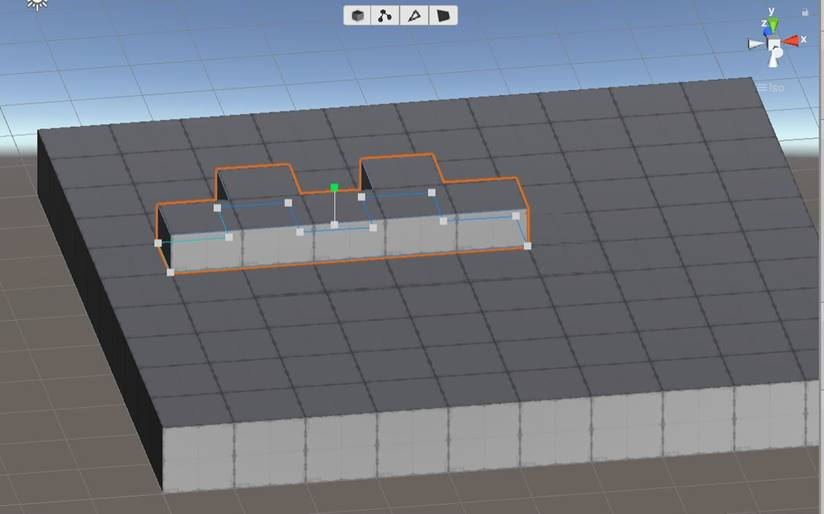
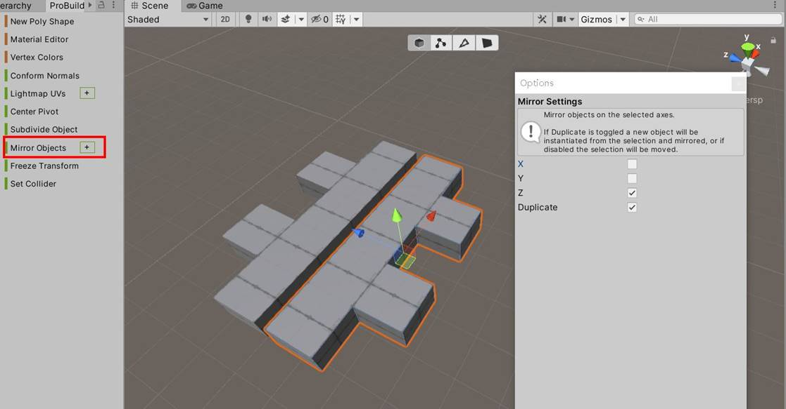
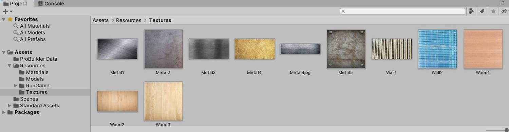
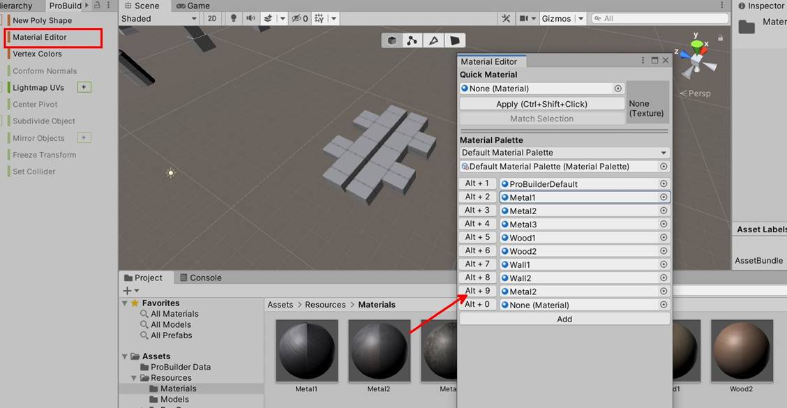
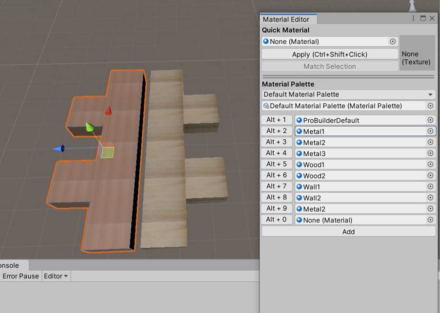
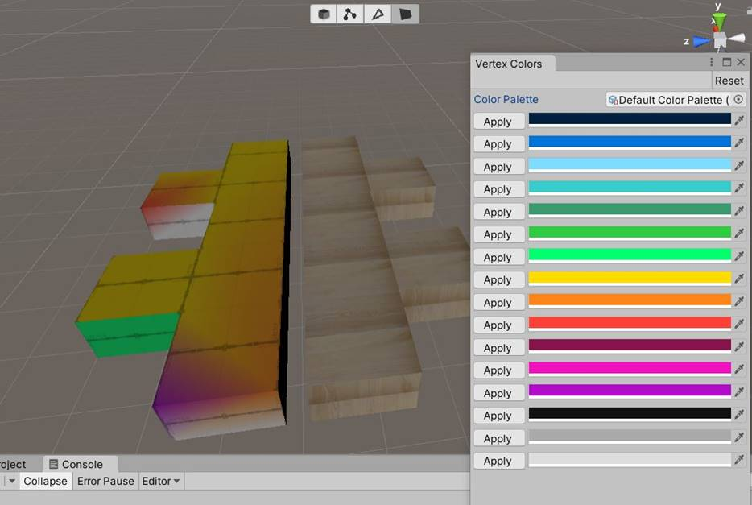

---
tag:
  - unity
cover: /2022-06-20-18-53-24.png
tinyCover: /cover/2022-06-20-18-53-24.png
coverWidth: 564
coverHeight: 1030
coverPrimary: efcd30
coverSecondary: 1032cf

---

# ProBuilder快速原型开发技术 ---不规则模型与材质

ProBuilder开发模型的强大之处，还在于可以按照要求精确定制不规则模型、克隆镜像模型、给模型着色以及添加材质等，下面笔者就这几方面进行讲解。

**一：定制不规则模型**

PB有一个专门定制不规则模型的功能“New Poly Shape”，可以按照设计师的想法，定义任意图案的模型，或者更加确切的说是“画出”我们想要的模型，制作步骤如下：

第1步：为了开发一个精确的模型，首先需要有一个参照网格图。笔者采用10\*10 的一个Plane或者Cube对象（既： 长10米\*宽10米），具体参照下图。

第2步：设置Scens视图中的“世界坐标系”为“正交视图”，且为 Top方式，详见上图。

第3步：选择PB操作面板上的“New Poly Shape” 菜单项，绘制图形，如下图所示。

第4步： 此时按住 Alt键，倾斜视图角度，如下图效果。

第5步： 点击绿色点，上提后形成立方体，下图笔者绘制了一个“长城”墙模型体。

**二：克隆镜像模型**

对于已经开发好的模型，有时候我们还常常需要这个模型的“镜像模型”，此种方式就像镜面倒影一样。 这样我们在某些情况下，可以采用镜像的方式，来组合出一些意想不到的复杂建筑或者模型道具等。

具体操作方式很简单，我们选择好一定模型，然后点击PB操作菜单“Mirror object”的“+”号，在弹出的小菜单中选择 X, Y, Z 轴向对称，在下面的“Duplicate”则选择是否要复制该模型，否则就只是进行指定轴向的模型旋转。见下图所示

**三： 模型材质**

我们从3Dmax三维建模工具中，得到的往往都是添加了贴图材质后的模型。所以说我们使用PB开发的新模型体，应该也可以直接添加贴图材质等。现在就介绍此功能实现方式，步骤如下所示：

第1步：导入贴图资源

笔者直接网络百度出一些简单木材、金属的贴图，然后导入Unity中如下图。

第2步：建立材质球

Unity中Project视图中，右击鼠标在弹出菜单中点击” Create”-->”Materials”，创建材质球。然后把前面的贴图附加到材质球上。

第3步：给材质编辑器添加材质球

点击PB面板的”Material Editor” 功能。 在弹出的PB材质球编辑器中，把材质球依次添加到材质球编辑中，供后续步骤使用。详细见下图。

第4步：给模型附加材质

最后，笔者选定上面开发的“长城墙”模型，使用材质球给模型附加材质，效果如下图所示。

**四： 模型着色**

   如果我们定义的模型，不需要材质，只需要添加着色即可。则可以选择“Vertex Colors”功能，给模型指定面添加指定颜色即可。这个功能相对简单，直接见下图所示。

 关于模型着色，我们可以选择“面视图”、“边沿视图”、“点视图”，分别就一个模型面、模型边沿线、模型一个顶点进行着色处理，可以达到不同的着色效果，见下图。

今天关于ProBuilder的功能就介绍到这，下一篇笔者继续讲解ProBuilder的更多功能，敬请期待。

大家有什么学习上的问题，可以留言，欢迎一起讨论，共同进步！
