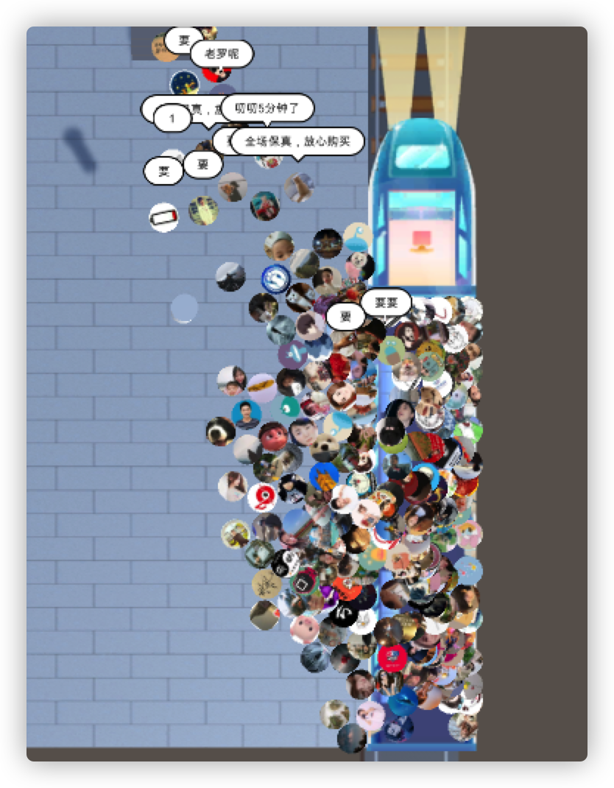
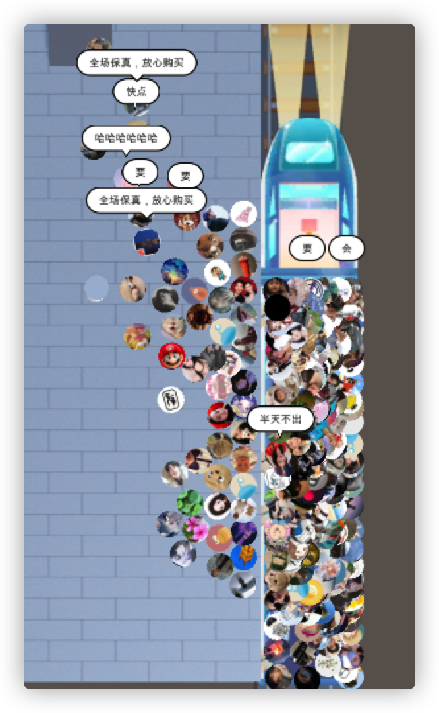
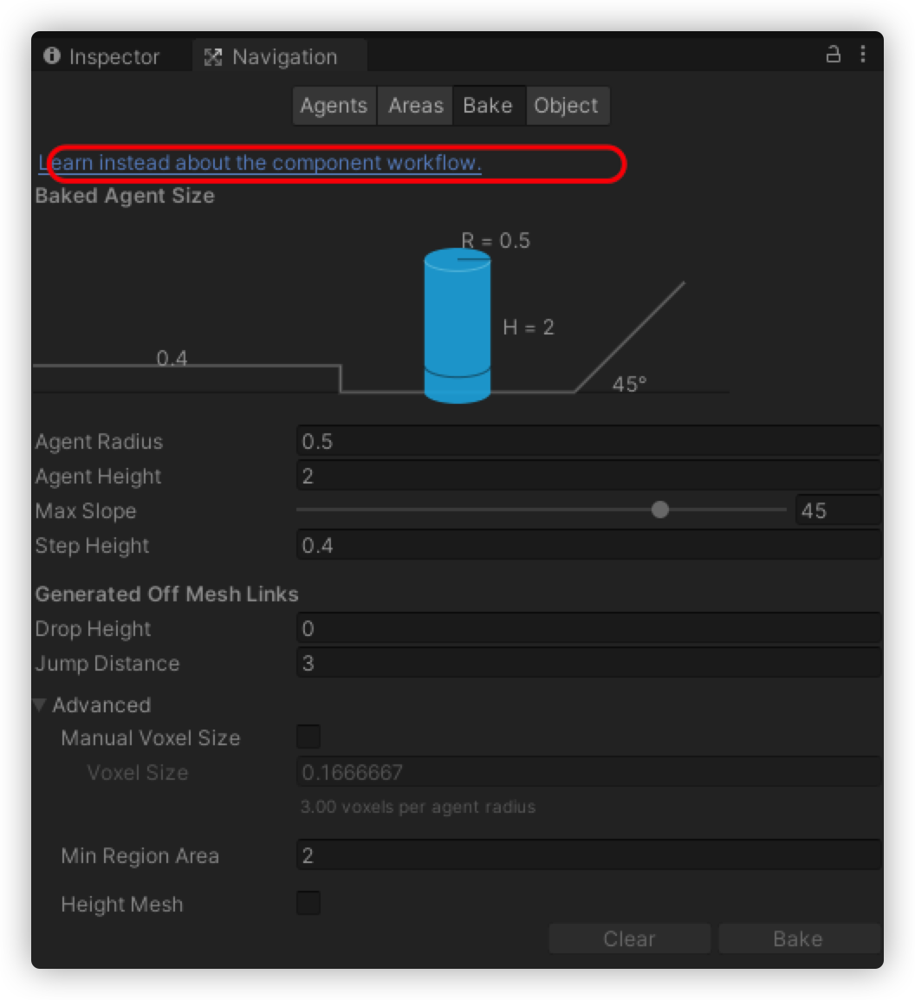
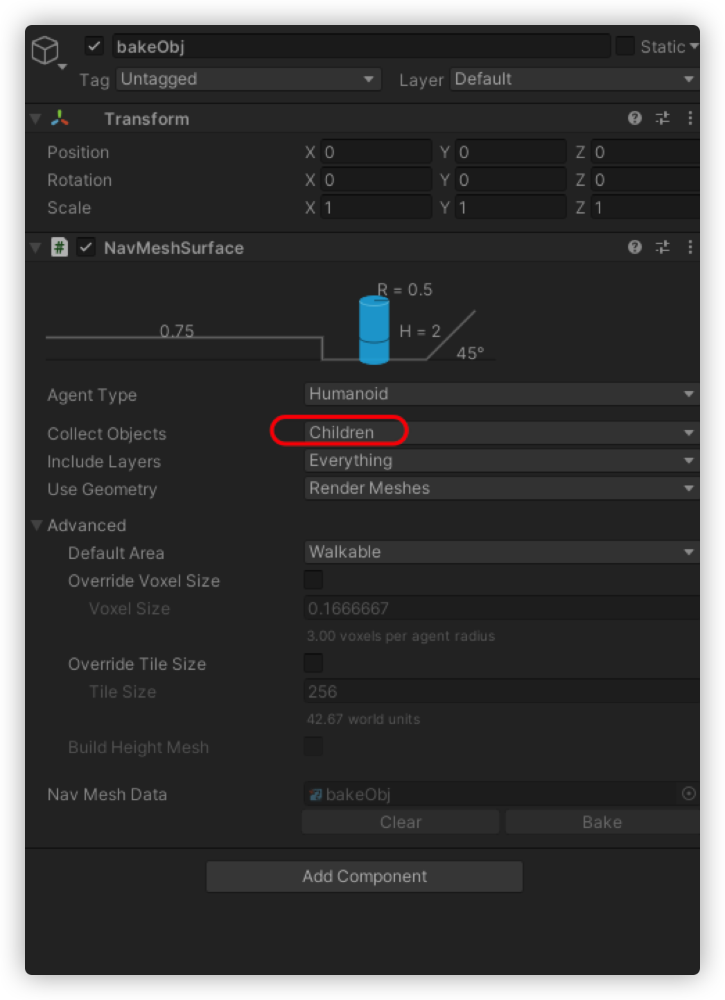

---
tag:
  - unity
cover: /2022-06-20-18-54-31.png
tinyCover: /cover/2022-06-20-18-54-31.png
coverWidth: 980
coverHeight: 1502
coverPrimary: 4d4654
coverSecondary: b2b9ab

---


# 动态导航实现互动挤地铁




## 下载组件



[地址](https://github.com/Unity-Technologies/NavMeshComponents)

这里因为地铁是一个移动的物体，人物要从站台上移动到地铁上，可以使用导航，但是地铁动起来后，需要动态烘焙。

新建一个空物体，将需要烘焙的物体作为它的子物体



## 烘焙

```cs
public NavMeshSurface navMeshSurface;
//...
navMeshSurface.BuildNavMesh();

```

在动画中添加事件函数，在地铁进站后重新烘焙，然后给每个角色重新指定地铁上的地点,然后在动画启动时添加一个透明隔离墙再次重新烘焙。

```cs
allPlayers[i].GetComponent<NavMeshAgent>().SetDestination(new Vector3(Random.Range(13f,14f),0,Random.Range(-3f,2f))); 
```

地铁音频来自<https://www.aigei.com/s?q=%E5%9C%B0%E9%93%81&type=sound>

音频剪辑软件<https://audacity.onl/?from=thosefree.com>
