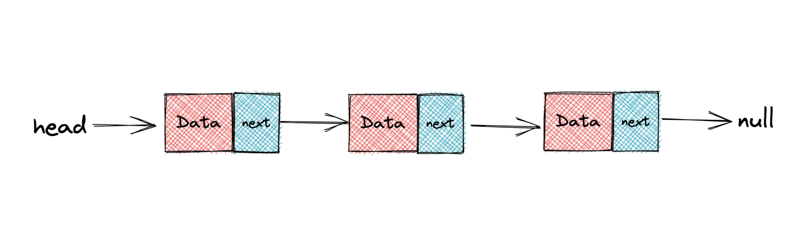
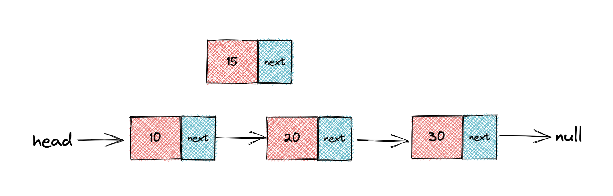
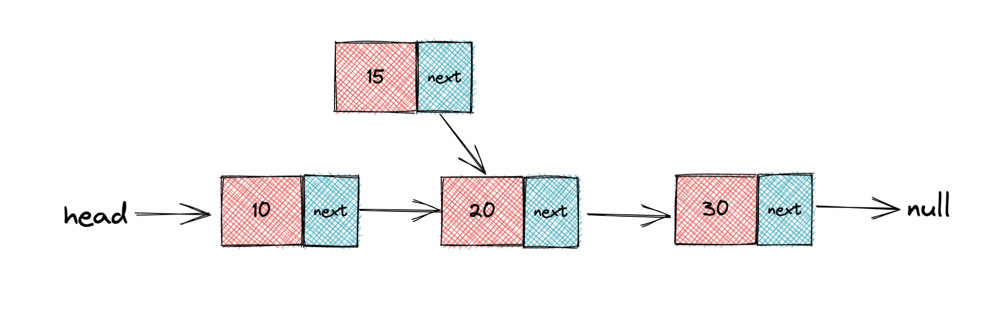
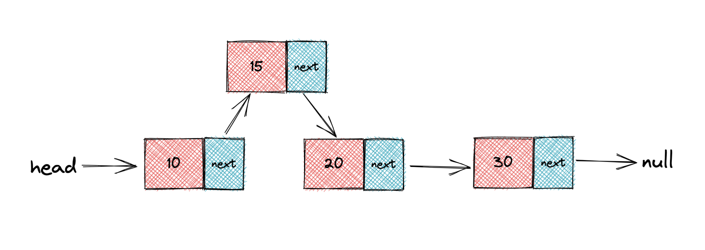
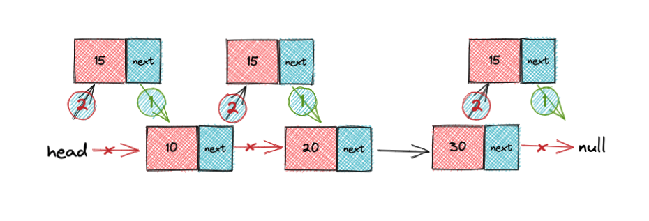

---
tag:
  - js
cover: /2022-05-11-09-15-37.png
tinyCover: /cover/2022-05-11-09-15-37.png
coverWidth: 564
coverHeight: 796
coverPrimary: 0d1318
coverSecondary: f2ece7

---


# 链表

如果您正在学习数据结构，那么链表是您应该知道的一种数据结构。如果你不是很了解它或者它是如何在 JavaScript 中实现的，这篇文章可以帮助你。

在本文中，我们将讨论链表是什么，它与数组有何不同，以及如何在 JavaScript 中实现它。让我们开始吧。

## 什么是链表？

链表是一种类似于数组的线性数据结构。但是，与数组不同，元素不存储在特定的内存位置或索引中。相反，每个元素都是一个单独的对象，其中包含指向该列表中下一个对象的指针或链接。
数组是需要一块连续的内存空间来存储，对内存的要求比较高。 而链表却相反，它并不需要一块连续的内存空间。链表是通过指针将一组零散的内存块串联在一起。

相比数组，链表是一种稍微复杂一点的数据结构。

数组可以快速的查找某个元素，但是在插入和删除时就要移动大量元素。原因就在于相邻元素的存储位置也具有邻居关系。他们的编号是 0，1，2，3，4，...，n，它们在内存中的位置也是紧挨着的，中间没有空隙，所以就无法快速添加元素。而当删除后，当中就会留出空隙，自然需要弥补。

所以我们需要这样一种数据结构： 我们反正也是要让相邻元素间留有足够余地，那干脆所有的元素都不要考虑相邻位置了，哪有空位就到哪里，只是让每个元素知道它下一个元素的位置在哪里。我们可以在第一个元素时，就知道第二个元素的位置在哪；在第二个元素时，再找到第三个元素的位置。这样，所有的元素都可以遍历而找到。

因此，为了表示每个数据元素 n 和后继元素 n+1 之间的逻辑关系，对数据元素 n 来说，除了存储本身的信息之外，还需要存储一个指示其后继的信息。我们把存储元素的域称之为 数据域，把存储直接后继位置的域称之为 指针域。指针域中存储的信息称做 指针或链。这两部分信息组成数据元素 n 的存储映像，称为 结点。

而由 n 个结点链结成一个链表，称之为 链式存储结构。

每个元素（通常称为节点）包含两项：存储的数据和到下一个节点的链接。数据可以是任何有效的数据类型。您可以在下图中看到这一点。



如上图，就是一个简单的单链表示意图。其中有两个结点是比较特殊的。他们分别是第一个结点和最后一个节点。我们习惯性地把第一个结点叫做头结点，把最后一个结点叫做尾结点。头结点是用来记录链表的基地址。有了它，我们就可以遍历得到整条链表。而尾结点特殊地方它的指针不是指向下一个地方，而是指向一个空地址 NULL，表示这是链表上最后一个结点。如果列表为空，则头部为空引用。

我们可以判断当前结点的 next 是否为空，就知道循环是否结束。

就像一家三口并排的手牵手去逛街，爸爸牵着妈妈，妈妈牵着孩子。此时的爸爸就可以当做头结点，而孩子就是尾结点。

与数组一样，链表也支持数据的增删改查。 对比插入和删除操作，为了保持内存数据的连续性，数据需要进行大量的数据搬移工作，所以时间复杂度为 O(n)。而在链表中插入和删除数据，并不需要担心此事，因为链表的存储空间本身就不是连续的。所以，在链表中插入和删除一个数据是非常快速的。

链表和数组的性能对比

时间复杂度对比

| ---      | 数组 | 链表 |
| -------- | ---- | ---- |
| 插入删除 | O(n) | O(1) |
| 随机访问 | O(1) | O(n) |

在 JavaScript 中，链表如下所示：

```js
const list = {
  head: {
    value: 6,
    next: {
      value: 10,
      next: {
        value: 12,
        next: {
          value: 3,
          next: null,
        },
      },
    },
  },
}
```

## 链表的优势

* 可以轻松地从链表中删除或添加节点，而无需重新组织整个数据结构。这是它相对于数组的优势之一。

## 链表的缺点

* 链表中的搜索操作很慢。与数组不同，数据元素的随机访问是不允许的。从第一个节点开始顺序访问节点。
* 由于指针的存储，它比数组使用更多的内存。

## 链表的类型

链表分为三种类型：

* **单链表**：每个节点只包含一个指向下一个节点的指针。
* **双链表**：每个节点包含两个指针，一个指向下一个节点的指针和一个指向前一个节点的指针。
* **循环链表**：循环链表是链表的一种变体，其中最后一个节点指向第一个节点或它之前的任何其他节点，从而形成一个循环。
* **双向循环链表**：结合了前两者。

## 在 JavaScript 中实现列表节点

如前所述，列表节点包含两项：数据和指向下一个节点的指针。我们可以在 JavaScript 中实现一个列表节点，如下所示：

```js
class ListNode {
  constructor(data) {
    this.data = data
    this.next = null
  }
}
```

## 在 JavaScript 中实现链表

下面的代码显示了带有构造函数的链表类的实现。请注意，如果未传递头节点，则将头初始化为空。

```js
class LinkedList {
  constructor(head = null) {
    this.head = head
  }
}
```

## 把它们放在一起

让我们用刚刚创建的类创建一个链表。首先，我们创建了两个列表中的节点，`node1`并`node2`从节点1指向节点2。

```js
const node1 = new ListNode(2)
const node2 = new ListNode(5)
node1.next = node2
```

接下来，我们将使用`node1`.

```js
const list = new LinkedList(node1)
```

让我们尝试访问我们刚刚创建的列表中的节点。

```js
console.log(list.head.next.data) // returns 5
```

## 一些 LinkedList 方法

接下来，我们将为链表实现四个辅助方法。他们是

添加









<https://gist.github.com/artiely/7080c1ca1664b00dec500ab5358d9e76.js>
## 概括

在本文中，我们讨论了链表是什么以及如何在 JavaScript 中实现它。我们还讨论了不同类型的链表以及它们的总体优缺点。
