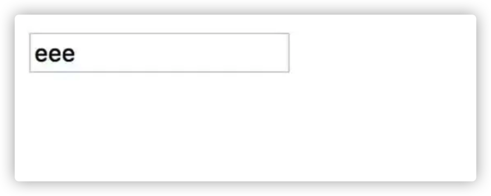
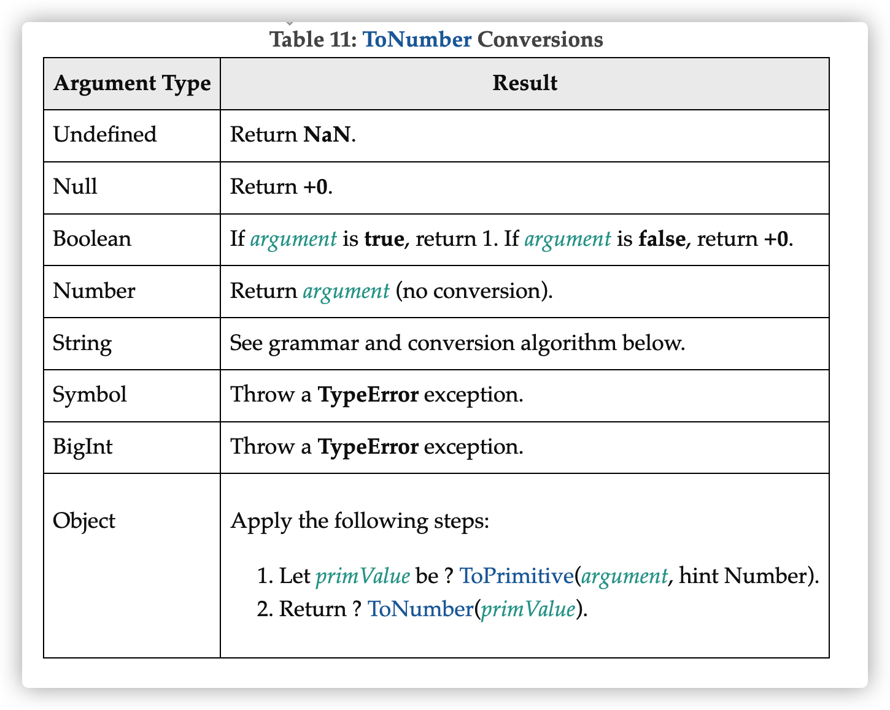

在网页中，我们从用户输入的内容中获取的值通常是字符串，但是有时候我们希望用户输入的内容一定要能转成数值：

```js
<input id="userInput">
userInput.addEventListener('change', (e) => {
  const value = e.target.value;
  console.log(typeof value); // string
  console.assert(isNumeric(value), `Not a numeric value: ${value}`);
});
```

即我们要实现一个isNumeric方法，判断用户输入的值是能转为**数值的字符串**。

我们讨论isNumeric实现前，先说一下限制用户输入的方式。

👉🏻 如果我们设置input的type为number，并不能保证输入的内容一定是数值，因为如果input的type是number，**它依然可以输入多个“+“、”-”、“.”、“e”** 。

```html
<input type="number" step="0.0000001" id="userInput">
```



_input\[type=number\]并不阻止输入多个e_

_**这是因为“+/-”（正负符号），“.”（小数点）和“e”（科学记数法）都是Number允许输入的字符。**_

不过如果在form提交的时候，浏览器会对`input[type=number]`内容再做一次检查：

```html
<form id="myForm">
  <input type="number">
  <input type="submit">
</form>
```


_**但是，不管怎样，用户还是可以通过修改页面上的元素，绕过这些检查，所以我们还是要用到 isNumeric 来判断用户输入的合法性。**_

我们先看一下 isNumeric 应该返回什么。

如果参考 input\[type=number\] 的规则，那么它应该支持所有合法的有穷数值写法：

```js
function isNumeric(str) {
  ...
}

console.assert(isNumeric('1000'));
console.assert(isNumeric('-100.'));
console.assert(isNumeric('.1'));
console.assert(isNumeric('-3.2'));
console.assert(isNumeric('001'));
console.assert(isNumeric('+4.5'));
console.assert(isNumeric('1e3'));
console.assert(isNumeric('1e-3'));
console.assert(isNumeric('-100e-3'));

console.assert(!isNumeric('++3'));
console.assert(!isNumeric('-100..'));
console.assert(!isNumeric('3abc'));
console.assert(!isNumeric('abc'));
console.assert(!isNumeric('-3e3.2'));
console.assert(!isNumeric('Infinity'));
console.assert(!isNumeric('-Infinity'));
console.assert(!isNumeric(''));
```

### 那么具体要怎么实现呢？

_**思考10秒钟再往下看——**_

## **parseFloat\?**

有同学想到用**parseFloat**，这个行不行呢？

```js
function isNumeric(str) {
  return !Number.isNaN(parseFloat(str))
}
```

这个显然是**不行的**，因为`parseFloat('123abc')`结果是123，因为 parseFloat 会尝试转部分数值，而忽略掉不能转数值的部分。

所以：

```js
console.assert(!isNumeric('-100..'))
console.assert(!isNumeric('3abc'))
console.assert(!isNumeric('-3e3.2'))
```

这三个 case 是过不去的，另外这里用了`Number.isNaN`处理 parseFloat 之后的结果，由于 ±Infinity 是数值，`Number.isNaN`会返回 false，所以：

```js
console.assert(!isNumeric('Infinity'))
console.assert(!isNumeric('-Infinity'))
```

也pass不了。

## **isNaN**

有同学说，那我们直接使用**isNaN**如何？

```js
function isNumeric(str) {
  return !isNaN(str)
}
```

这次结果好得多，但是最后三条规则过不了：

```js
console.assert(!isNumeric('Infinity'))
console.assert(!isNumeric('-Infinity'))
console.assert(!isNumeric(''))
```

±Infinity 和上面的原因一样，但是为什么`''`也 pass 不了呢？**这是因为 isNaN 会先尝试将参数转为 Number，而空字符串被转为了数值 0。**

```js
console.log(Number('')) // 0
```

这里面就不得不提一下**[ECMA-262](https://www.ecma-international.org/publications-and-standards/standards/ecma-262/)规范里面[ToNumber](https://262.ecma-international.org/11.0/#sec-tonumber) 的转换规则**了：



根据规则，Null、Boolean 都会转成 Number，Undefined 被转成 NaN，Undefined 会被转成 NaN，而 Symbol 直接抛 TypeError...

加上空字符串`''`被转成0，isNaN就 会有些怪异的行为了：

```js
console.log(isNaN(undefined)) // true
console.log(isNaN(null)) // false
console.log(isNaN(true)) // false
console.log(isNaN(false)) // false
console.log(isNaN('')) // false
```

其实字符串除了`''`还有一些：

```js
console.log(isNaN(' ')) // false
console.log(isNaN(' ')) // false
console.log(isNaN('\t')) // false
console.log(isNaN('\r')) // false
console.log(isNaN('\n')) // false
```

这就是为什么 ES2015 之后，又增加了**Number.isNaN** 方法。

> 👉🏻 冷知识：isNaN 方法对参数做`[[ToNumber]]`转换，会导致一些比较怪异的结果，所以ES2015 增加了 Number.isNaN，该方法不会对参数做类型转换，只要参数不是 NaN，不管是什么类型，Number.isNaN 一律返回 false。

```js
console.log(isNaN('abc')) // true
console.log(Number.isNaN('abc')) // false
console.log(isNaN('')) // false
console.log(Number.isNaN('')) // false
```

## **isFinite**

我们**把 isNaN 换成 isFinite** 看看：

这下`'±Infinity'`的问题解决了，因为 Number 中的 ±Infinite 和 NaN 的 isFinite 结果都返回 false。

不过与 isNaN 一样，isFinite 也一样会对参数进行类型转换，所以，这几个 case 问题还是存在：

```js
console.assert(!isNumeric(''))
console.assert(!isNumeric(' '))
console.assert(!isNumeric(' '))
console.assert(!isNumeric('\t'))
console.assert(!isNumeric('\r'))
console.assert(!isNumeric('\n'))
```

> 👉🏻 **冷知识**：isFinite 与 isNaN 一样，会对参数做`[[ToNumber]]`转换，因此对应的，ES2015 也提供了一个`Number.isFinite`，这是不转换参数类型的版本。如果参数不是 Number 类型，`Number.isFinite`一律返回 false。

```js
console.log(isFinite('123')) // true
console.log(Number.isFinite('123')) // false
console.log(isFinite('')) // true
console.log(Number.isFinite('')) // false
```

好了，那么讨论到这里，最后的解决方法已经呼之欲出了。

因为对于 isNumeric 用法，我们只需要处理字符串，非字符串的 case 我们可以不管；那么我们剩下的就是处理这一堆字符串 case：

```js
console.assert(!isNumeric(''))
console.assert(!isNumeric(' '))
console.assert(!isNumeric(' '))
console.assert(!isNumeric('\t'))
console.assert(!isNumeric('\r'))
console.assert(!isNumeric('\n'))
```

这个有很多方式可以处理了，比如它们都匹配正则`/^\s*$/`，所以

```js
function isNumeric(str) {
  return !/^\s*$/.test(str) && isFinite(str)
}
```

这个版本就可以通过所有的 case 了。

另外，这些字符串的 parseFloat 都是 NaN，所以，也可以这样：

```js
function isNumeric(obj) {
  return !isNaN(parseFloat(obj)) && isFinite(obj)
}
```

实际上这个比上面那个正则的版本更好，因为这个还同时处理了非字符串的 case，因为：

```js
parseFloat(null)
parseFloat(true)
parseFloat(false)
```

上面这些的结果都是 NaN。

**实际上，上面这个版本就是著名的 jQuery 框架中的`jQuery.isNumeric`的实现方式。**

因为现在不建议用 isNaN 和 isFinite，而推荐使用`Number.isNaN`和`Number.isFinite`替代，所以一些 linter 的规则可能会禁止使用这两个函数，但是没有关系，因为我们可以这么写：

```js
function isNumeric(obj) {
  return !Number.isNaN(parseFloat(obj))
    && Number.isFinite(Number(obj))
}
```

所以，这个就是最终的版本。

原来，实现一个小小的函数 isNumeric，有那么多需要注意的地方。

### 关于判断字符串是数值，你还有什么想法
