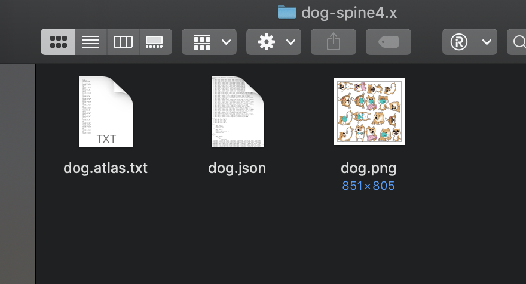
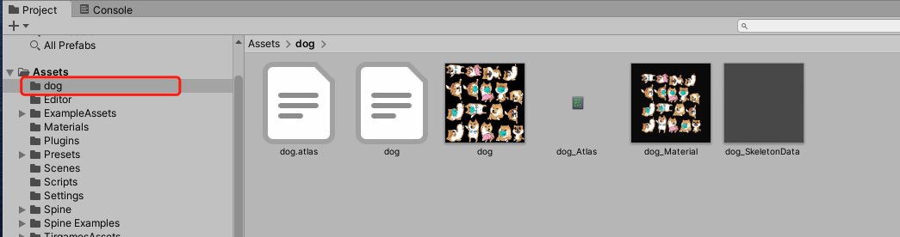
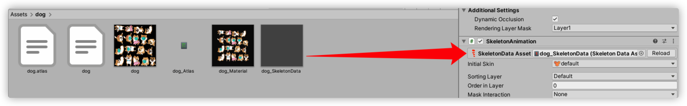

---
tag:
  - unity
  - spine
cover: /2022-05-11-09-05-37.png
tinyCover: /cover/2022-05-11-09-05-37.png
coverWidth: 563
coverHeight: 864

---

# 在Unity中使用spine

什么是spine [官网](http://zh.esotericsoftware.com/)

[spine支持的运行库](http://zh.esotericsoftware.com/spine-runtimes)

[unity运行库的github](https://github.com/EsotericSoftware/spine-runtimes/tree/4.0/spine-unity)

[unity spine下载地址](http://esotericsoftware.com/spine-unity-download/)

下载后导入Unity

Project->Packages 拖进去

spine体验资源地址 spine4.x

链接: <https://pan.baidu.com/s/1D-DUvoH_DUTqasUgkVlL7g>  密码: gr7g

直接拖入unity指定文件夹会多出三个文件

新建一个对应的游戏对象

选择游戏对象在 inspector窗口中 拖入其中

[更多使用参考](https://blog.csdn.net/linshuhe1/article/details/79792432)
