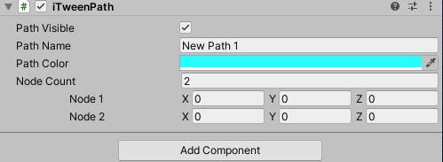

---
tag:
  - unity
  - iTween
cover: /2022-05-11-09-04-28.png
tinyCover: /cover/2022-05-11-09-04-28.png
coverWidth: 564
coverHeight: 1039
coverPrimary: b8466d
coverSecondary: 47b992

---

# iTween 入门

[官网](http://www.pixelplacement.com/itween/index.php)

## 1.简介

iTween是一个动画库,作者创建它的目的就是最小的投入实现最大的产出。让你做开发更轻松,用它可以轻松实现各种动画,晃动,旋转,移动,褪色,上色,控制音频等等。

iTween的核心是数值的插值。只需要定义开始和结束,中间过程iTween就会帮你弄好。

iTween插件包含两部分:iTween和iTweenPath

如何将iTween 加入项目：

1.在项目中建立Plugins目录， 将iTween.cs文件放到Plugins目录即可。

2.如果需要编辑路径，使用import package->custom package菜单功能加入iTweenPath.unitypackage

1\. iTween类的公共操作接口均以静态方法的形式提供。可分为三大类：

> 1.静态注册方法：提供注册动画效果的静态方法接口。如：MoveTo、CameraFadeTo等。
>
> 2.Update静态方法：提供每帧改变属性值的环境，在Update或循环环境中调用。如：MoveUpdate、AudioUpdate等。
>
> 3.外部工具方法：包括动画控制、路径绘制等。

2\. iTween类内部定义了三种枚举类型，分别为：

> 1.EaseType：缓动类型枚举
>
> 2.LoopType：动画的循环类型枚举
>
> 3.NamedValueColor：已命名颜色枚举

3\. iTween类包含12种静态注册方法，其中：

> 8种动画方法：Fade、Look、Move、Rotate、Scale、Punch、Shake、CameraFade
>
> 2种音频方法：Audio、Stab
>
> 1种颜色变化方法：Color
>
> 1种值变化方法：ValueTo

**每种动画又有一种或多种执行方式：To、From、Add、By。**

每个方法一般有两种重载方式：最小定制选项、完全定制选项。

Update类方法：提供每帧改变属性值的环境。在Update或 FixedUpdate方法或类似于循环的环境中调用。

## 2.物体移动方法

共有五种物体移动方法：

> 1.MoveTo:从原位置移动到目标位置。
>
> 2.MoveFrom:从目标位置移动到原位置。
>
> 3.MoveAdd:随时间移动游戏对象的位置，根据提供的量。
>
> 4.MoveBy:增加提供的坐标到游戏对象的位置。（与MoveAdd一样）
>
> 5.MoveUpdate:类似于MoveTo，在Update\(\)或FixedUpdate\(\)方法或循环环境中调用。提供每帧改变属性值的环境。不依赖于EaseType。

使用动画的方法一般有两种重载形式：

> 1.最小定制选项：只需提供最少必需参赛。
>
> 2.完全定制选项：可定制所有参数。

如：

> MoveTo\(GameObject target, Vector3 position, float time\)
>
> MoveTo\(GameObject target, Hashtable args\)

对于args的参数如下：

Hashtable Hash\(params object\[\] args\)：

用于构建参数的通用方法。其奇数位为参数名称，偶数位对应的参数值。

如：

> iTween.Hash\("position", new Vector3\(10,20,-30\)   ,"time", 1
>
> ,"ooptype", Tween.LoopType.pingPong
>
> ,"onstart", "FunctionName"
>
> ,"islocal", true\)\);

这个参数讲解可以看上面的介绍

以MoveTo\(\)方法为例：

> var args = new Hashtable\(\);
>
> //用于标识iTween实例的名称，可通过Stop\(“name”\)停止指定名称的iTween。
>
> args.Add\(“name”,“myMoveTo” \);
>
> //游戏对象移动到的位置，可为 Vector3 或 Transform 类型。优先于xyz参赛
>
> args.Add\(“position”, Vector3.up\);
>
> //游戏对象移动的路径，可为 Vector3\[\] 或 Transform\[\] 类型。可通过 iTweenPath编辑并获取路径。
>
> args.Add\(“path”, iTweenPath.GetPath\(“pathName”\)\);
>
> //是否移动到路径的起始位置（false:游戏对象立即处于路径的起始点，true：游戏对象将从原始位置移动到路径的起始点。）args.Add\(“movetopath”, false\);
>
> //目标位置 x 轴的值，下同
>
> args.Add\(“x”, 10\);
>
> args.Add\(“y”, 10\);
>
> args.Add\(“z”, 10\);
>
> //是否让游戏对象始终面朝路径行进的方向，拐弯的地方会自动旋转模型。（如果你发现你的游戏对象在寻路的时候始终都是一个方向那么一定要打开这个。）
>
> args.Add\("orienttopath", true\);
>
> //游戏对象移动过程中始终注视的目标点，可为 Vector3 或 Transform 类型。（当“orienttopath”为true时，该参数无效）
>
> args.Add\("looktarget", Vector3.zero\);
>
> //游戏对象看向"looktarget" 的秒数。
>
> args.Add\("looktime", 0.8\);
>
> //当包含"path"参数且"orienttopath"为true时， 该值用于计算"looktarget"的值，表示游戏物体看着前方的点的位置（百分比，默认为0.05）
>
> args.Add\("lookahead", 0.01\);
>
> //限制仅在指定的轴上旋转
>
> args.Add\("axis", "y"\);
>
> //是否使用局部坐标系（相对于父物体的坐标），默认为false。
>
> args.Add\(“islocal”, true\);
>
>
>
> //动画执行的时长
>
> args.Add\("time", 3\);
>
> //可以用来替换“time”参数，以允许动画基于速度运行。（同时提供"time"和"speed"参数，将使用"speed"参数）
>
> args.Add\("speed", 5\);
>
> //延时
>
> args.Add\("delay", 2\);
>
> //缓动类型，枚举或字符串名称。\[[demo](http://www.robertpenner.com/easing/easing_demo.html)\]
>
> args.Add\("easetype", iTween.EaseType.linear\);
>
> //循环类型
>
> args.Add\("looptype", iTween.LoopType.none\);
>
> //在动画开始时调用的方法的名称。
>
> args.Add\("onstart", "funName"\);
>
> //持有"onstart" 方法的游戏对象。
>
> args.Add\("onstarttarget", gameObject\);
>
> //发送给"onstart"方法的参数。System.Object 类型
>
> args.Add\(“onstartparams”,“动画开始执行”\);
>
>
>
> //在动画执行过程中的每帧调用。
>
> args.Add\("onupdate", "funName"\);
>
> args.Add\("onupdatetarget", gameObject\);
>
> args.Add\("onupdateparams",Time.time\);
>
> //在动画执行过程中的每帧调用。
>
> args.Add\("oncomplete", "funName"\);
>
> args.Add\("oncompletetarget", gameObject\);
>
> args.Add\("oncompleteparams","动画已执行完"\);
>
> //此参数将被赋予useRealTime静态私有变量。是否使用真实游戏时间（不被Time.timeScale影响的时间）
>
> args.Add\("ignoretimescale",false\);
>
>
>
> //注册动画到目标游戏对象
>
> iTween.MoveTo\(gameObject, args\);

## 3.物体的颜色变化

共3种颜色渐变方法：

> 1.ColorTo:从原始颜色渐变到目标颜色。
>
> 2.ColorFrom：从给定的颜色渐变回原始颜色
>
> 3.ColorUpdate:类似于ColorTo,在Update方法或类似于循环的环境中调用，提供每帧改变属性值的环境。不依赖于EaseType。

参数说明：

> 1.color:根据组件的存在与否，该值将被应用于目标对象的GUITexture组件 或 GUIText组件 或 renderer组件 或 light组件。
>
> 2.namedValueColor：当效果是应用在renderer\(渲染器\)组件上时，此参数确定具体应用到哪个已命名颜色值上。
>
> 3.includechildren：效果是否应用于子对象，默认true。
>
>

实现给定游戏对象的淡入淡出效果，共3种方法：

> 1.FadeTo：从当前透明度渐变到目标透明度。（内部调用ColorTo）。
>
> 2.FadeFrom:从给定透明度渐变都原始透明度。（内部调用ColorFrom）。
>
> 3.FadeUpdate:类似于FadeTo,在Update方法或类似于循环的环境中调用，提供每帧改变属性值的环境。不依赖于EaseType（内部调用ColorUpdate）。

参数说明：

> alpha 和 amount 参数: 均为最终透明度，amount 优先于alpha。内部实现是仅改变color.a的值，再调用对应的Color方法。

## 4.摄像机淡入淡出

7种与摄像机淡入淡出相关的方法：

> 1.CameraFadeTo:透明度从当前值渐变到指定值，取值（0\~1）0：完全透明，1:完全不透明。
>
> 2.CameraFadeFrom：从给定的透明度渐变到原始值。
>
> 3.CameraFadeAdd：创建一个用于模拟摄相机的淡入淡出的游戏对象\(如果它不存在\)。需要在在注册淡入淡出效果之前调用该方法。
>
> 4.CameraTexture：创建并返回一个全屏的 Texture2D，用于摄象机的淡入淡出。该Texture2D作为CameraFadeAdd\(\)的参数。
>
> 5.CameraFadeDepth：改变摄相机的淡入淡出深度\(CameraFadeAdd\(\)所创建的对象的z轴值）
>
> 6.CameraFadeSwap：重设淡入单纯效果所使用的纹理CameraFadeAdd所创建的对象的guiTexture.texture）。
>
> 7.CameraFadeDestroy：删除摄相机的淡入淡出效果（销毁ameraFadeAdd所创建的对象）

## 5.音频方法

音频变化方法

> 1.AudioTo:渐变AudioSource的音量和音调到目标值。
>
> 2.AudioFrom:将AudioSource的音量和音调从给定的值渐变到原始值。
>
> 3.AudioUpdate:类似于AudioTo，在Update方法或类似于循环的环境中调用，提供每帧改变属性值的环境。不依赖于EaseType。

音频播放方法

> Stab:播放AudioClip一次，不用手动加载AudioSource组件。

## 6.Look类方法

> 1.LookTo：旋转游戏对象使其面朝指定的Transform 或 Vector3
>
> 2.LookFrom：使游戏对象从提供的方向旋转回原来所面朝的方向。
>
> 3.LookUpdate:类似于LookTo，在Update方法或类似于循环的环境中调用，提供每帧改变属性值的环境。不依赖于EaseType。

说明：游戏对象的正面指的是游戏对象的z轴方向，也就是使游戏对象的z轴指向目标点。

## 7.旋转方法

> 1.RotateTo:旋转游戏物体到指定欧拉角角度。
>
> 2.RotateFrom:将游戏物体从给的欧拉角度旋转回原始角度。
>
> 3.RotateAdd:对游戏物体的旋转角度随着时间增加所提供的欧拉角（Vector3三个值解析：X,Y,Z各代表围绕哪个轴转动。其转动角度就是X，Y,Z、的值的大小。amount:欧拉角大小）
>
> 4.RotateBy:将提供的值乘以360，其余与RotateAdd一样。也就是提供的值为每个轴上旋转的周数。
>
> 5.RotateUpdate:类似于RotateTo，在Update方法或类似于循环的环境中调用，提供每帧改变属性值的环境。不依赖于EaseType。

（Look类方法是基于目标点的旋转，Rotate类方法是基于角度的旋转。）

## 8.物体大小缩放

> 1.ScaleTo:改变游戏对象的比例大小到我们提供的值。
>
> 2.ScaleFrom:将物体的大小从我们提供的值变化到原本的大小。
>
> 3.ScaleAdd:增加游戏物体的大小。
>
> 4.ScaleBy:成倍地改变物体的大小。 Amount参数为各轴上的倍数。
>
> ScaleUpdate:类似于ScaleTo，在Update方法或类似于循环的环境中调用，提供每帧改变属性值的环境。不依赖于EaseType。

## 9.晃动效果方法

> 1.PunchPosition:对物体的位置添加一个摇晃的力，使其摇晃最终归于原来的位置 其晃动大小和方向由提供的amount\(Vector3\)决定。
>
> 2.PunchRotation：对物体的旋转添加一个摇晃的力，使其旋转最终归于初始值。其旋转角度大小和方向由提供的Vector3决定，建议用单轴而不是整个Vector3，例如（0，1，0）是绕Y轴旋转，角度大小由Vector3 Y轴值大小决定。
>
> PunchScale：对物体的大小比例添加一个摇晃的力，使其大小比例变化最终归于初始值。其大小比例变化方向和大小由提供的Vector3决定。例如（0，1，0）是在Y轴方向对物体大小变化（即变化物体的高），大小由该方向的值大小决定。

衰减晃动效果方法

> 1.ShakePosition：根据提供的amount衰减其值随机摇动游戏物体的位置，其晃动大小和方向由提供的amount\(Vector3\)决定（方向根据Vector3随机，晃动大小，由各个方向的值的大小决定）。
>
> 2.ShakeRotation：根据提供的amount衰减其值随机摆动旋转游戏物体的角度 。Vector3三个值解析：X,Y,Z各代表围绕哪个轴旋转。其转动角度就是X，Y,Z、的值的大小。
>
> 3.ShakeScale：根据提供的amount衰减其值随机摆动改变游戏物体的大小。其大小比例变化方向和大小由提供的Vector3决定。例如（0，1，0）是在Y轴方向对物体大小变化（即变化物体的高），大小由该方向的值大小决定。

## 10.值方法

> 1.ValueTo：返回一个“from”和“to”之间的插值，以调用“onupdate”回调函数。“onupdate”回调是必需的，且它接收一个与“from”和“to”相同类型的参数。支持的值类型： float 、 double 、Vector3 、Vector2 、Color 、Rect 。
>
> 2.在Update\(\)中调用的值方法：FloatUpdate、Vector3Update、Vector2Update、RectUpdate。这些方法返回一个在提供的两个值之间的插值，大小变化根据提供的速度。

## 11.外部工具方法

动画控制：

> 1.Pause:暂停
>
> 2.Resume:恢复
>
> 3.Stop:停止并销毁iTween。

绘制方法：

> 1.DrawLine：绘制线条。\(使用Gizmos.DrawLine\)
>
> 2.DrawLineGizmos：与DrawLine相同。
>
> 3.DrawLineHandles：（ 使用UnityEditor.Handles.DrawLine，暂时不可用）
>
> 4.DrawPath：绘制弯曲的路径。
>
> 5.DrawPathGizmos：与DrawPath相同。
>
> 6.DrawPathHandles：（使用UnityEditor.Handles.DrawLine，暂时不可用）
>
> 注：绘制方法只能在只能在OnDrawGizmos\(\)和 OnDrawGizmosSelected\(\)中被调用，用于在Scene视图中绘制线条和路径。

其它方法：

> 1.Count:返回iTween的数量。
>
> 2.PathLength:返回路径的长度。
>
> 3.PutOnPath:根据提供的百分比将游戏物体置于所提供路径上。
>
> 4.PointOnPath:返回路径上指定百分比处的 Vector3 。

## 12.iTweenPath

iTweenPath类用于在Scene视图中编辑路径。

使用方法：

> 1.将iTweenPath脚本绑定到游戏对象上。
>
> 2.编辑Inspector视图中Node Count属性可设置节点数及节点位置，也可以在Scene视图中拖动节点来改变节点的位置。
>
> 3.GetPath方法：获取指定名称的路径。
>
> 4.GetPathReversed方法：返回指定名称的路径的反转。

