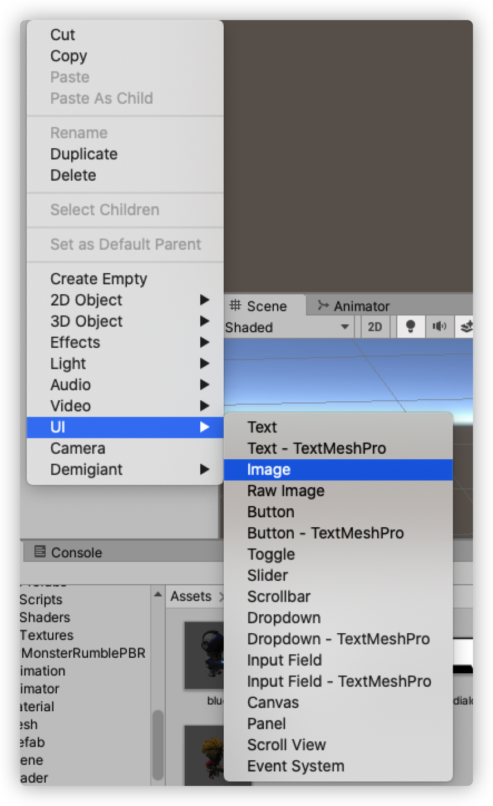
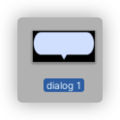
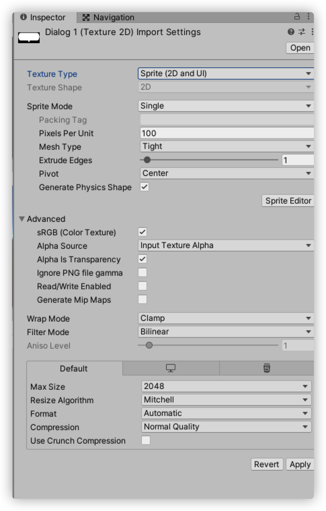
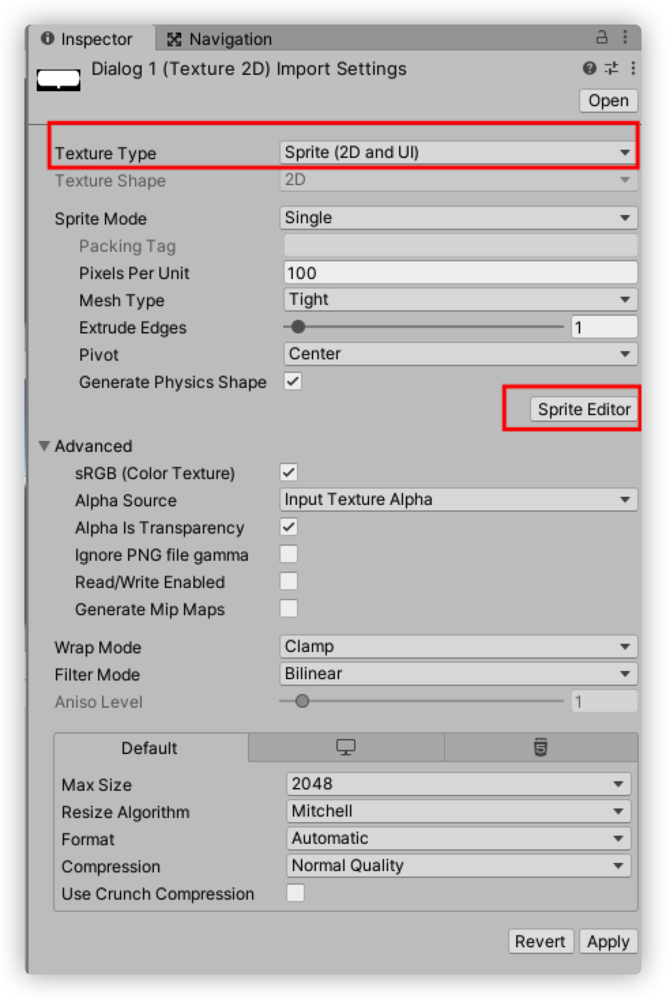
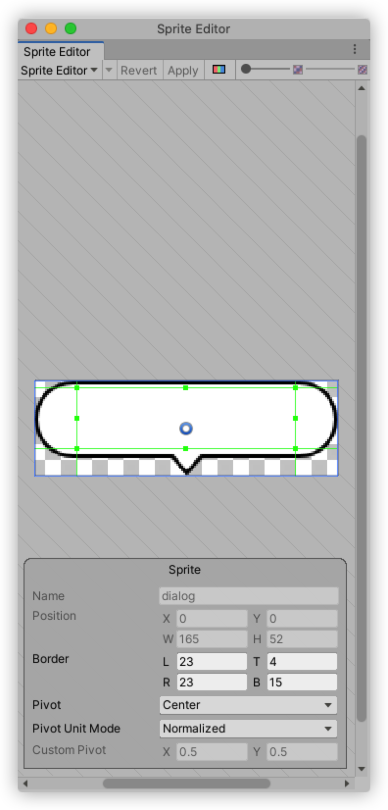
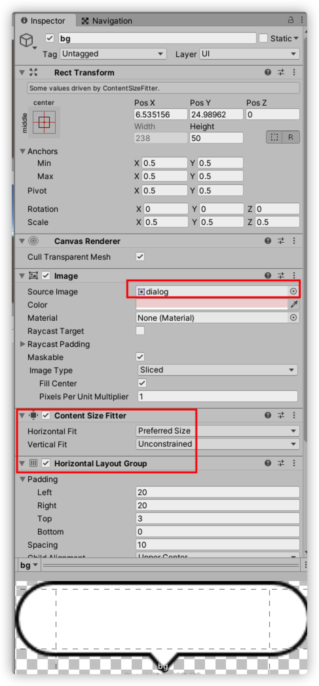
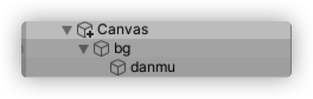
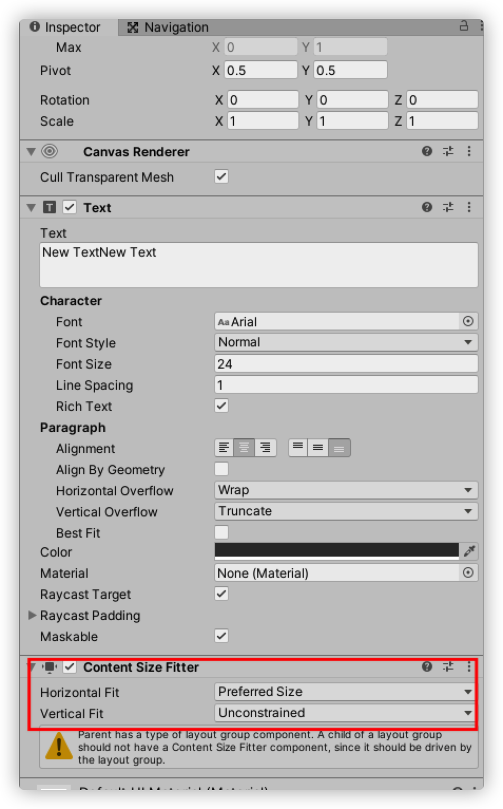

---
tag:
  - unity
cover: /2022-05-10-18-57-11.png
tinyCover: /cover/2022-05-10-18-57-11.png
coverWidth: 564
coverHeight: 1031

---

# unity 如何实现气泡聊天

新建image并改名为bg

准备素材

根据提示安装sprite编辑器 编辑并应用

将生成的素材拖入bg的sourceImage 并添加框内的两个组件

为bg添加子元素text改名为danmu

给danmu添加如下组件

完成
