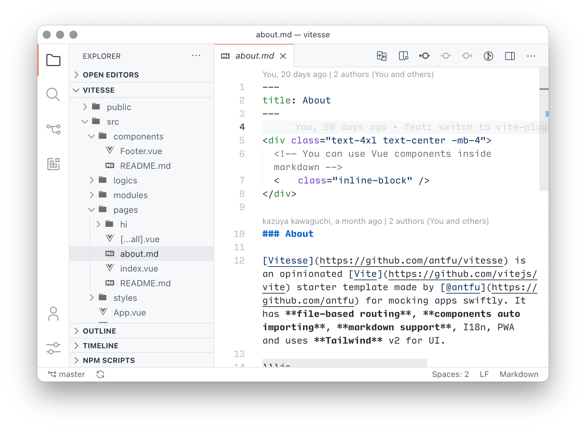
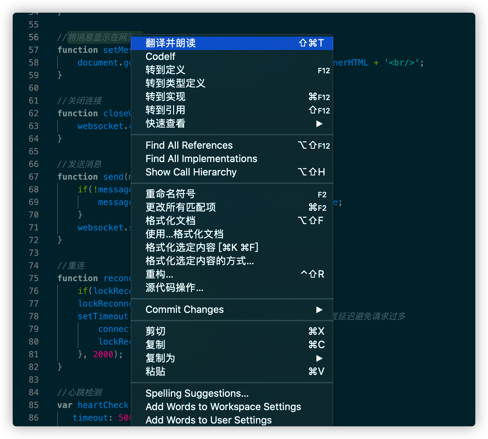
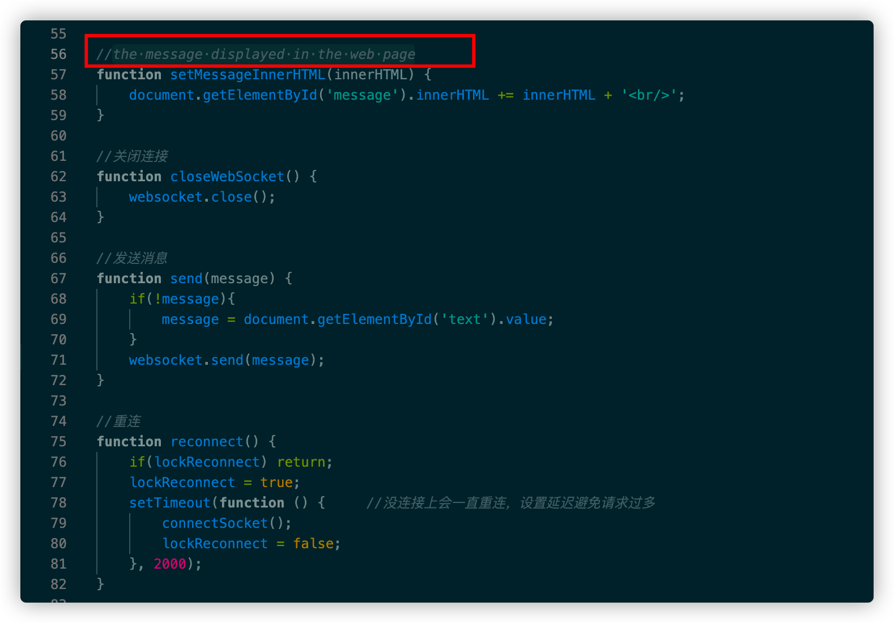

---
tag:
  - windows
  - vscode
  - macos
  - plugins
  - bookmark
cover: /2022-05-10-18-49-37.png
tinyCover: /cover/2022-05-10-18-49-37.png
coverWidth: 564
coverHeight: 1220
coverPrimary: c0bfbe
coverSecondary: 3f4041

---


# 个人装机必备软件

## 装机必备

[谷歌浏览器](https://www.google.cn/intl/zh-CN/chrome/)

[搜狗输入法](https://pinyin.sogou.com/mac/)

[Vscode](https://vscode.en.softonic.com/)

[typora](https://www.typora.net/)

[Picgo](https://github.com/Molunerfinn/PicGo)

[iShot](https://apps.apple.com/cn/app/ishot/id1485844094?ct=better365&mt=12)

[超级右键 lite](https://apps.apple.com/cn/app/id1552554632)

[Thor](https://apps.apple.com/us/app/thor-launcher/id1120999687?l=zh&mt=12)
  
[百度网盘](https://pan.baidu.com/)
  
[dev-sidecar](https://gitee.com/docmirror/dev-sidecar/releases)

## 开发环境

[nodejs](https://nodejs.org/en/)

[nvm](https://github.com/nvm-sh/nvm)

[nrm](https://github.com/Pana/nrm)

[ni](https://github.com/antfu/ni)

[vite](https://github.com/vitejs/vite)

## vscode 效率工具

 [Carbon Product Icons](https://marketplace.visualstudio.com/items?itemName=antfu.icons-carbon)



 [translate speaker 翻译朗读者 API](https://marketplace.visualstudio.com/items?itemName=pcloth.translate-speaker)





 [copilot](https://marketplace.visualstudio.com/items?itemName=GitHub.copilot)

 [image-preview](https://marketplace.visualstudio.com/items?itemName=kisstkondoros.vscode-gutter-preview)

 [markdown-preview](https://marketplace.visualstudio.com/items?itemName=shd101wyy.markdown-preview-enhanced)

 [markdownlint](https://marketplace.visualstudio.com/items?itemName=DavidAnson.vscode-markdownlint)

 [paste-image](https://marketplace.visualstudio.com/items?itemName=mushan.vscode-paste-image)

 [smart-clicks](https://marketplace.visualstudio.com/items?itemName=antfu.smart-clicks)

[Code Spell Checker](https://marketplace.visualstudio.com/items?itemName=dbaeumer.vscode-spellchecker)

[更多](https://marketplace.visualstudio.com/search?target=VSCode&category=Other&sortBy=Installs)

## 书签

```json
[
  {
    "title": "正则表达式在线调试",
    "desc": "",
    "url": "https://regex101.com/",
    "cover": "",
    "tag": ["正则", "代码"]
  },
  {
    "title": "手绘风绘图 流程图",
    "desc": "",
    "url": "https://excalidraw.com/",
    "cover": "",
    "tag": ["画图"]
  },
  {
    "title": "pinterest 图片灵感",
    "desc": "",
    "url": " https://www.pinterest.com/",
    "cover": "",
    "tag": ["图片"]
  },
  {
    "title": "随机图片网站",
    "desc": "",
    "url": "https://picsum.photos/",
    "cover": "",
    "tag": ["图片"]
  },
   {
    "title": "图片压缩",
    "desc": "",
    "url": "https://tinypng.com/",
    "cover": "",
    "tag": ["图片"]
  },
  {
    "title": "css 轻拟物风格",
    "desc": "",
    "url": "https://neumorphism.io/",
    "cover": "",
    "tag": ["css"]
  },
  {
    "title": "css 箭头生成",
    "desc": "",
    "url": "https://cssarrowplease.com/",
    "cover": "",
    "tag": ["css"]
  },
  {
    "title": "css 生成器",
    "desc": "",
    "url": "https://www.smashingmagazine.com/2021/03/css-generators/",
    "cover": "",
    "tag": ["css"]
  },
  {
    "title": "css 技巧学习",
    "desc": "",
    "url": "https://css-tricks.com/",
    "cover": "",
    "tag": ["css"]
  },
  {
    "title": "转网页字体",
    "desc": "",
    "url": "https://www.aconvert.com/cn/image/ttf-to-woff",
    "cover": "",
    "tag": ["字体"]
  },
  {
    "title": "Markdown nice 私服",
    "desc": "",
    "url": "https://md.guozh.net/",
    "cover": "",
    "tag": ["markdown"]
  },
  {
    "title": "文本生成艺术ASCII字符",
    "desc": "",
    "url": "http://patorjk.com/software/taag/",
    "cover": "",
    "tag": ["字体"]
  },
  {
    "title": "JavaScript 花园",
    "desc": "",
    "url": "http://bonsaiden.github.io/JavaScript-Garden/",
    "cover": "",
    "tag": ["JavaScript"]
  },
  {
    "title": "现代 JavaScript 教程",
    "desc": "",
    "url": "https://zh.javascript.info/",
    "cover": "",
    "tag": ["JavaScript"]
  },
   {
    "title": "免费 JavaScript 教程",
    "desc": "",
    "url": "https://www.java5cript.com/",
    "cover": "",
    "tag": ["JavaScript"]
  },
  {
    "title": "动效交互教程",
    "desc": "可以学习到P5.js等",
    "url": "https://creativecoding.in/",
    "cover": "",
    "tag": ["JavaScript"]
  },
   {
    "title": "渐进式学习react hooks",
    "desc": "",
    "url": "https://usehooks.com/",
    "cover": "",
    "tag": ["JavaScript"]
  },
   {
    "title": "免费的3D角色和动画",
    "desc": "",
    "url": "https://www.mixamo.com/#/?page=1&type=Character",
    "cover": "",
    "tag": ["游戏"]
  },
   {
    "title": "The Book of Shaders",
    "desc": "webgl 片段着色器很好的入门指南",
    "url": "https://thebookofshaders.com/?lan=ch",
    "cover": "",
    "tag": ["游戏"]
  },
   {
    "title": "three-nebula",
    "desc": "three.js的一个离子系统",
    "url": "https://three-nebula.org/",
    "cover": "",
    "tag": ["游戏"]
  },
  {
    "title": "生成个人3D形象",
    "desc": "可下载模型",
    "url": "https://readyplayer.me/",
    "cover": "",
    "tag": ["游戏"]
  },
  {
    "title": "blender 3D模型下载",
    "desc": "免费3d模型下载",
    "url": "https://blendswap.com/",
    "cover": "",
    "tag": ["游戏"]
  },
  {
    "title": "3D模型下载",
    "desc": "",
    "url": "https://sketchfab.com/3d-models?features=downloadable&sort_by=-likeCount",
    "cover": "",
    "tag": ["游戏"]
  },
   {
    "title": "通过游戏快速掌握VIM",
    "desc": "",
    "url": "https://vim-adventures.com/",
    "cover": "",
    "tag": ["游戏","VIM"]
  },
   {
    "title": "unity 资产合集",
    "desc": "",
    "url": "https://unityassetcollection.com/",
    "cover": "",
    "tag": ["游戏"]
  },
  {
    "title": "网页特效集合",
    "desc": "灵感",
    "url": "https://godly.website/",
    "cover": "",
    "tag": ["特效"]
  },
   {
    "title": "有趣的艺术实现",
    "desc": "webgl和three.js",
    "url": "https://oskarstalberg.tumblr.com/",
    "cover": "",
    "tag": ["艺术"]
  },
  {
    "title": "",
    "desc": "",
    "url": "",
    "cover": "",
    "tag": []
  },{
    
  }
]
```

