---
tag:
  - unity
  - ragdoll
cover: /2022-05-10-18-42-39.png
tinyCover: /cover/2022-05-10-18-42-39.png
coverWidth: 564
coverHeight: 1252

---

# unity ragdoll

Unity 布娃娃实现

布娃娃类似于人类一败涂地的橡胶人效果

<https://docs.unity3d.com/cn/current/Manual/wizard-RagdollWizard.html>

相关插件可以快速创建类似效果

链接: <https://pan.baidu.com/s/1Gt7viijIjg5ftyigFKTfCA?pwd=6b71> 提取码: 6b71

购买了人类一败涂地的可以直接获取里面的资源

<https://steamcommunity.com/sharedfiles/filedetails/?id=1619459875>

一个个人感觉体验更好游戏

<https://store.steampowered.com/app/1260320/Party_Animals/>

<https://store.steampowered.com/app/285900/Gang_Beasts/>

## ragdoll 插件

由于官方自带的插件只推荐用于死亡状态，所以这里推荐一个更好的插件。
链接: <https://pan.baidu.com/s/1QBku6CU9BICu5QZQjw0MIA?pwd=8v7u> 提取码: 8v7u

该插件的基本使用记录

- 选择角色配置如图 注意选择模型而不是预制体
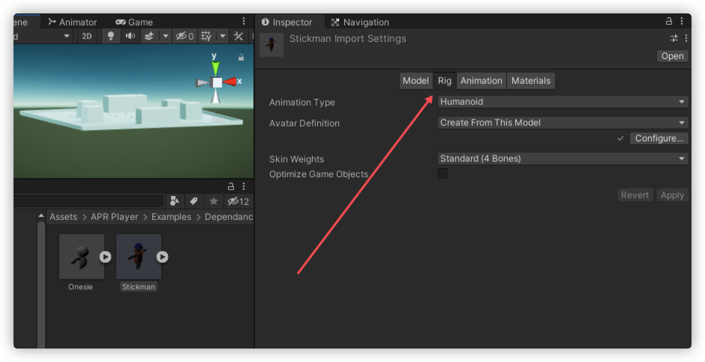
- 角色加入场景
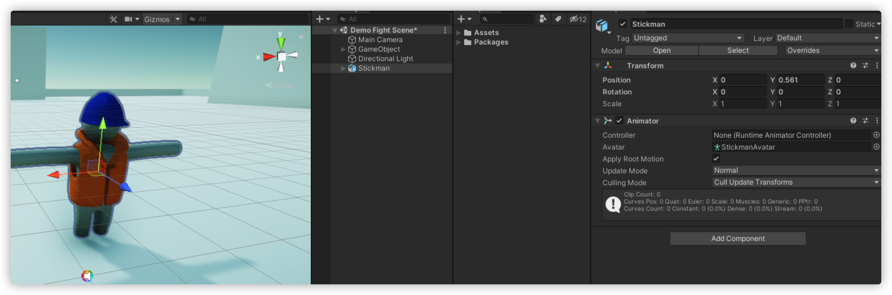

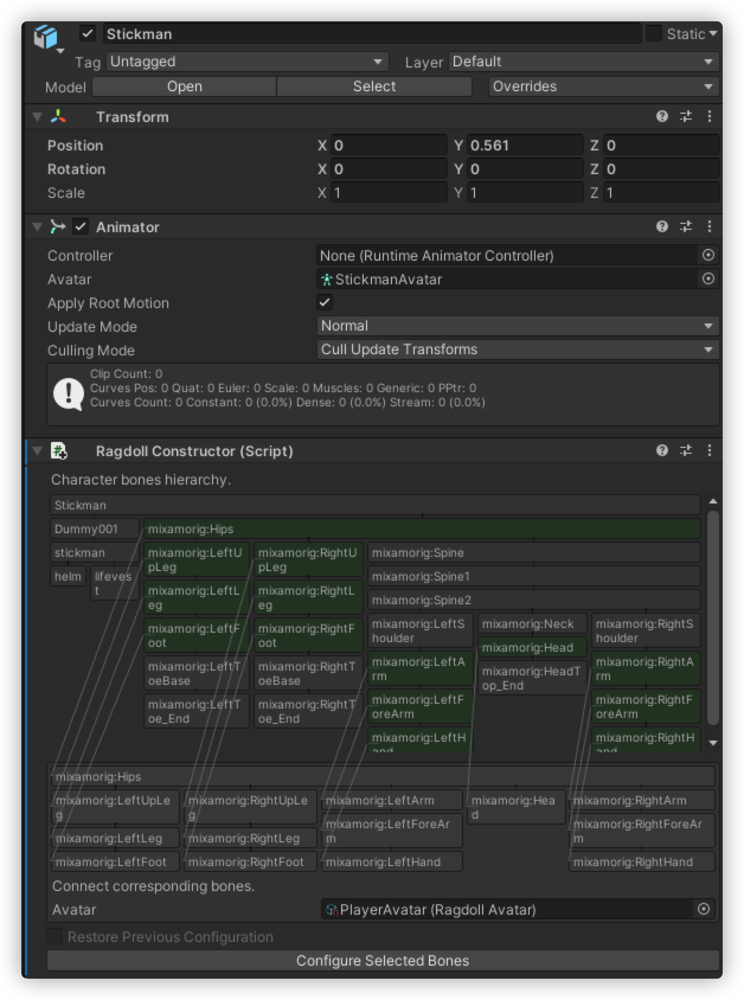

- 并不需要全部对应，只需要将`布娃娃的骨骼`匹配到角色的骨骼上就行
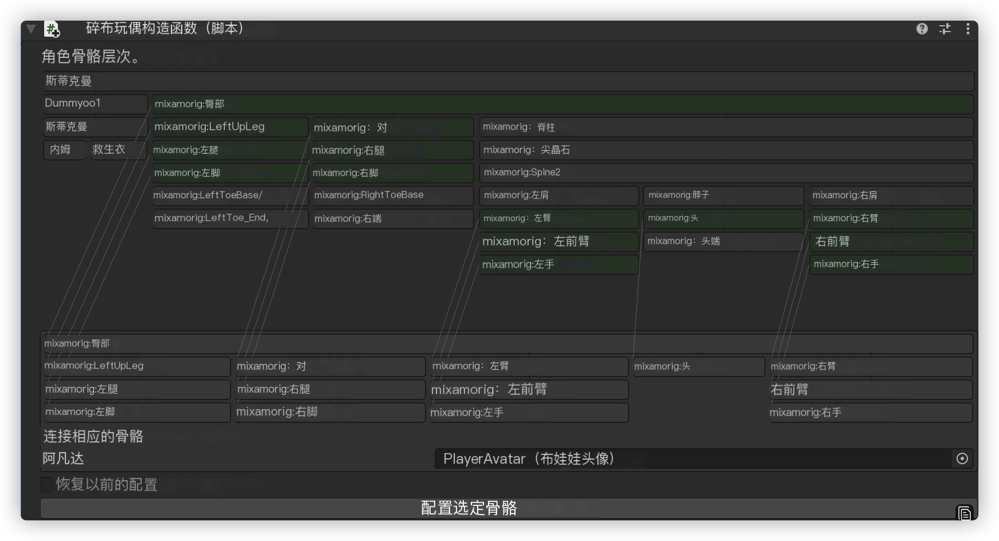
- 点击配置按钮，配置完成，点击创建布娃娃，创建完成，并自动生成如下内容
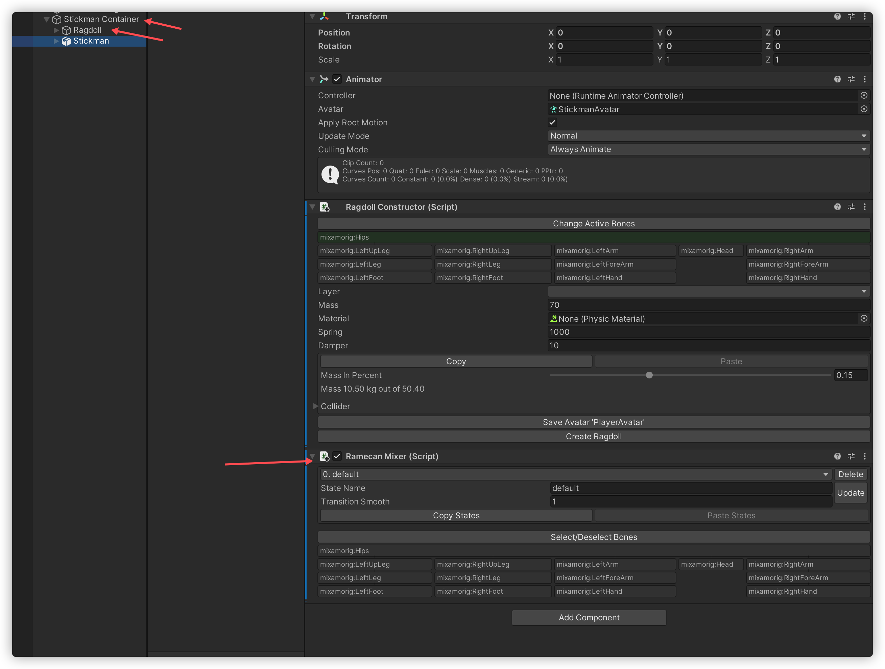

- 点击运行，角色倒地，已经具有布娃娃效果
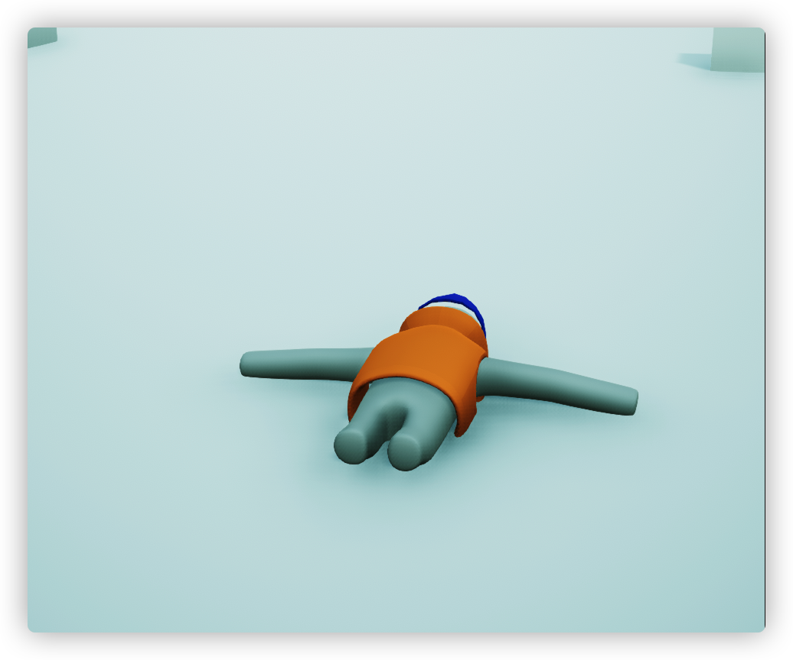

- 给角色添加 rigidbody 添加 布娃娃的碰撞体
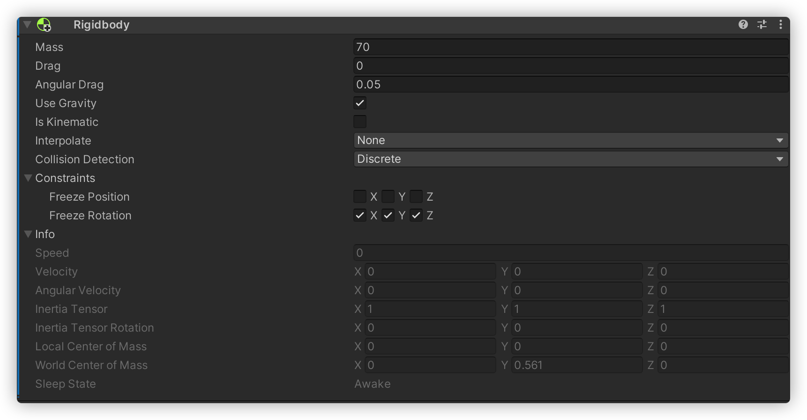

- 添加动画脚本
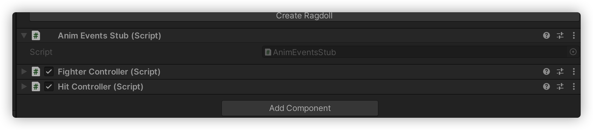
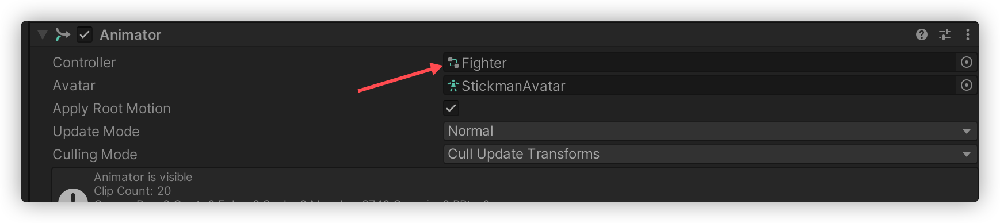
- 预览
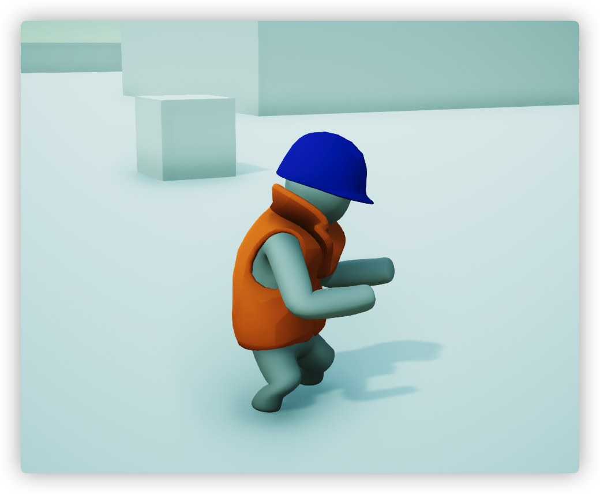

- 设置死亡动画
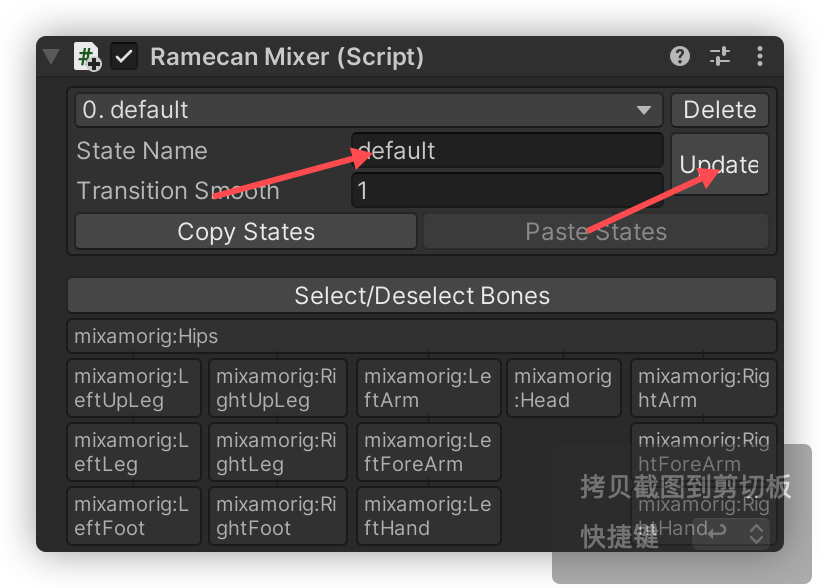
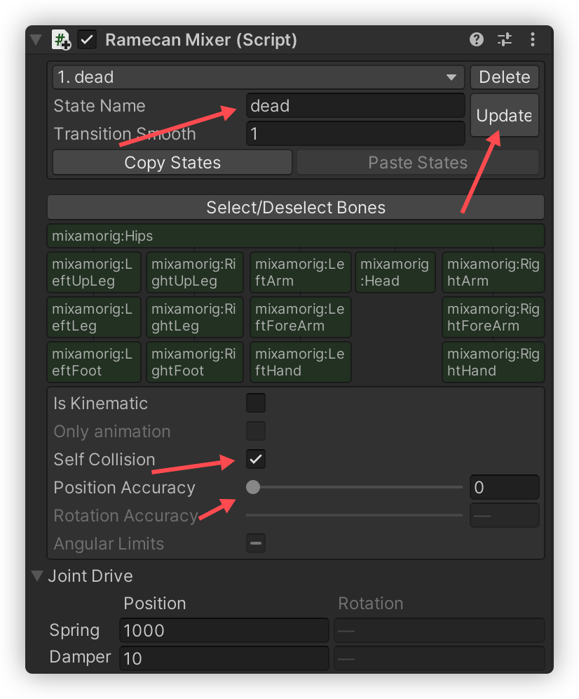
- 过度代码参考

```cs 

private RagdollMecanimMixer.RamecanMixer ramecanMixer;       
public void Die() {
            dead = true;
            deadTimer = deadTime;
            ramecanMixer.BeginStateTransition("dead");
            animator.SetBool("dead", true);
            rb.isKinematic = true;
            col.enabled = false;
            charController.Die();

            CameraOrbit co = Camera.main.GetComponent<CameraOrbit>();
            co.secondTarget = this;
            
            // co.targetTimeScale = 0.05f;

        }
```

- 注意记得在布娃娃的左右手上绑定hand脚本
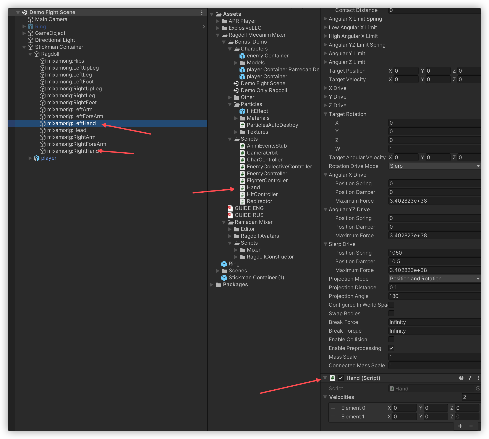

## 参考

<https://zhuanlan.zhihu.com/p/411635857>
