---
tag:
  - unity
  - puppetMaster
cover: /2022-05-10-18-40-12.png
tinyCover: /cover/2022-05-10-18-40-12.png
coverWidth: 564
coverHeight: 1222
coverPrimary: 282e2c
coverSecondary: d7d1d3

---

# 这是最基本的 PuppetMaster 角色设置

播放场景并将“Pin Weight”滑动到零以将角色释放到物理肌肉空间动画。

调整所有其他参数，展开“肌肉”以分别调整每块肌肉的重量乘数。

要从布娃娃创建 PuppetMaster 角色：

1. 将布娃娃角色拖到场景中。如果布娃娃不是使用 ConfigurableJoints 构建的，请选择它的根 GameObject 并单击 GameObject/Convert To ConfigurableJoints。您还可以使用 BipedRagdollCreator 组件来创建和修改 Biped 布娃娃。

2. 将 PuppetMaster 组件添加到布娃娃角色的根 Transform 中。

3. 分配“动画目标”。它可以设置为相同的 GameObject，在这种情况下，它将被复制并清除所有布娃娃组件。只要骨骼的位置匹配，它也可以是角色的一个实例，甚至是另一个角色。骨骼的旋转不需要相同。这使得共享布娃娃结构成为可能，并且在脚骨未与地面对齐时也最有用（如 Mixamo 角色）。在这种情况下，您可以简单地旋转布娃娃的脚来对齐，将目标的脚保持在原位。

4.点击“设置PuppetMaster”

您现在应该在动画目标中设置角色 - 布娃娃二元性，其父级为根 GameObject。

这种双重设置使您能够专注于为您的角色设置动画，而忘记由 PuppetMaster 管理的布娃娃部分。它还使您能够禁用 PuppetMaster 并停用整个布娃娃，只需在不需要时将其“模式”设置为“禁用”即可。

请注意，在技术上可以将其设置为单个布娃娃角色，但由于必须在每个更新周期中来回移动带有碰撞器的游戏对象，因此会增加性能成本。如果您必须解决这些骨骼上的一些 IK，则该价格会进一步增加。但是，通过双重设置，您可以对运动学目标角色进行所有程序运动学调整，而不会从动力学方面产生任何额外的性能成本。在 PuppetMaster 的未来版本中，将其添加到角色之间共享布娃娃的好处。 ;)

DeepL

这是最基本的PuppetMaster角色设置。

播放场景，将 "Pin Weight "滑动到零，将角色释放到物理肌肉空间动画。

玩弄所有其他参数，展开 "肌肉"，分别调整每块肌肉的重量乘数。

要从布娃娃创建PuppetMaster角色。

1. 将一个布娃娃角色拖到场景中。如果布娃娃没有使用 "可配置关节"（ConfigurableJoints），请选择它的根GameObject，然后点击GameObject/Convert To ConfigurableJoints。 你也可以使用BipedRagdollCreator组件来创建和修改双足布娃娃。

2. 将PuppetMaster组件添加到布娃娃角色的根变换中。

3. 3. 指定 "动画目标"。它可以被设置为同一个GameObject，在这种情况下，它将被复制并清理掉所有布娃娃组件。它也可以是角色的一个实例，甚至是另一个角色，只要骨骼的位置匹配。骨头的旋转不需要完全相同。这使得共享布娃娃结构成为可能，而且当脚部骨骼不与地面对齐时也是最有用的（比如Mixamo角色）。在这种情况下，你可以简单地旋转布娃娃的脚来对齐，保持目标脚的位置。

4. 点击 "设置PuppetMaster"。

你现在应该将你的角色设置为动画目标--布娃娃的二重性，并将其作为一个根GameObject的父对象。

这种双重设置使您能够专注于为角色制作动画，而忘记由 PuppetMaster 管理的布娃娃部分。它还使您能够禁用PuppetMaster，并在不需要时将其 "模式 "设置为 "禁用"，从而停用整个布娃娃。

请注意，从技术上讲，将其设置为一个单一的布娃娃角色是可能的，但由于在每个更新周期中必须来回移动带有碰撞器的GameObjects，这将使性能成本倍增。如果你不得不在这些骨头上解决一些IK问题，这个代价会进一步增加。然而，通过双重设置，你可以在运动学目标角色上做所有程序性运动学调整，而不需要从动力学方面付出任何额外的性能成本。在PuppetMaster的未来版本中，将这一点加入到角色之间共享布娃娃的好处中。）

## Unity PuppetMaster 教学

PuppetMaster 是一套支援Unity 游戏引擎的Ragdoll 布偶系统，若觉得Unity 内建的Ragdoll 工具无法制作逼真的角色动画，快试试PuppetMaster 这套功能强大的Ragdoll 工具吧！

PuppetMaster v1.0 版本更新项目

\- 新增Photon Unity Networking 展示游戏

\- 新增Ultimate Character Controller 整合资源

\- 新增Kinematic Character Controller 整合资源

\- 相容Final IK 2.0 与Unity 2017/2018/2019/2020 版本

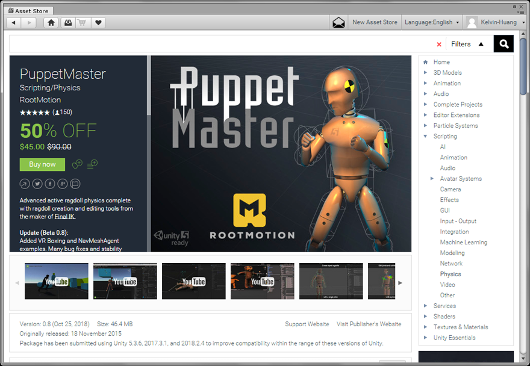

将PuppetMaster 下载到游戏专案。

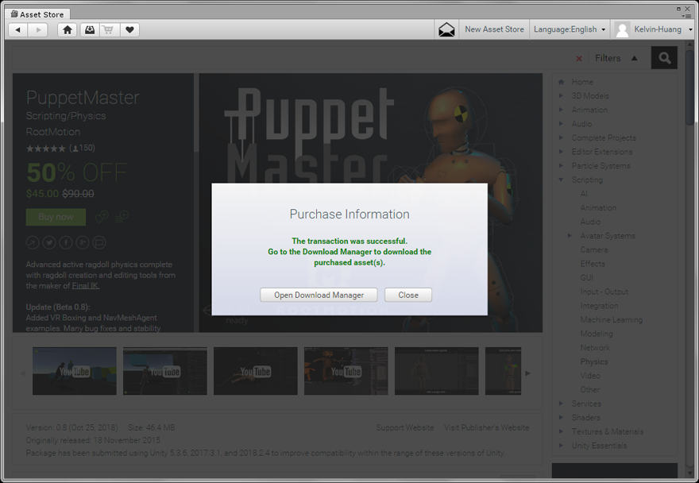

汇入PuppetMaster 资源包，稍后的教学将使用免费的Bodyguards 角色，也可以一并汇入或选择其他适当的游戏角色。

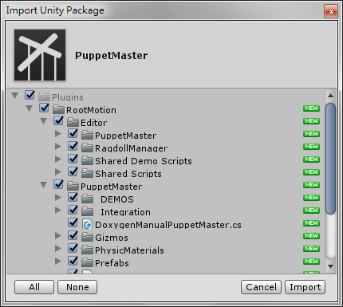

## PuppetMaster 展示场景

Basic

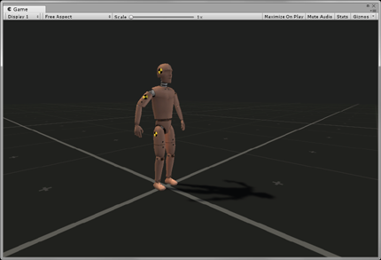 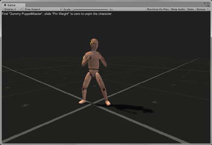

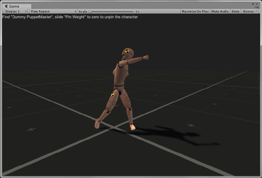 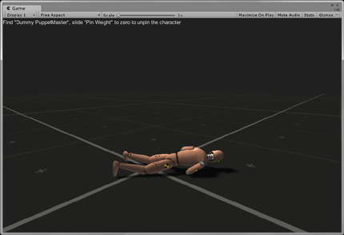

Death Procedures

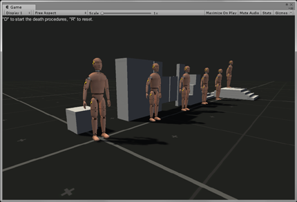
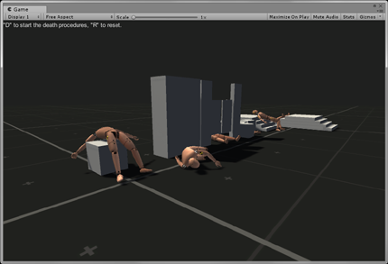

Hanging

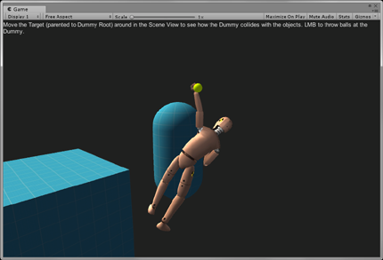
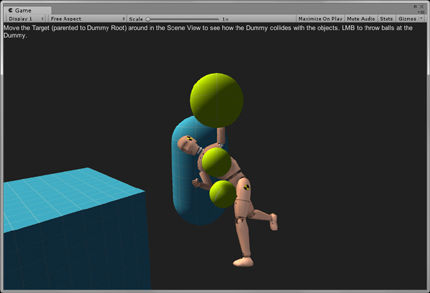

## 建立Ragdolls

PuppetMaster 包含一个超级易用的可视化ragdoll 创建工具- BipedRagdollCreator，可用于Biped 骨架或是至少四个肢体的任何角色。当游戏角色启用BipedRagdollCreator.cs元件，每次更改引用或选项（Change the references or options）时，ragdoll 元件将被销毁并重新创建，这样可以进行快速直觉的即时编辑。

将角色模型拖到场景，按下Add Component 附加BipedRagdollCreator 元件。如果选取的角色模型是人类的Biped 骨骼，元件的References 将自动填入对应的骨骼，如果不是人类角色则需要手动设定。

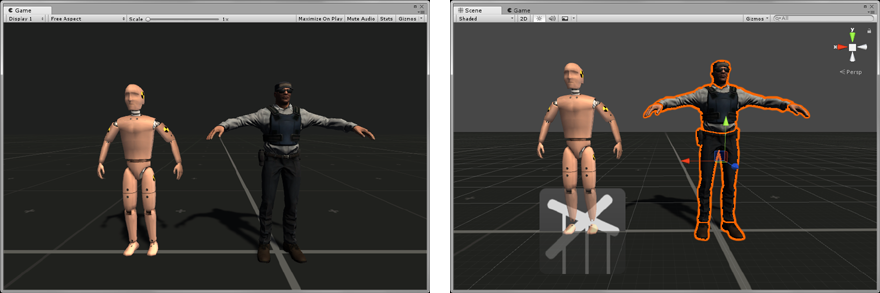

注意！若此角色有Physics 元件请先移除，按下Create a Ragdoll 按钮开始即时更新与编辑Ragdoll 布偶，游戏角色上将会出现Rigidbody 刚体元件、Collider 碰撞器、Configurable Joint 关节元件。

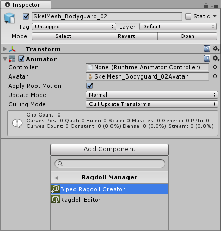
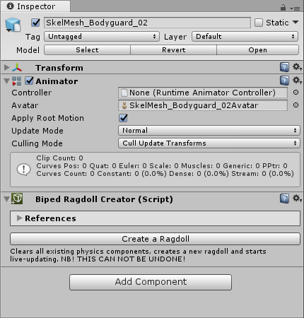

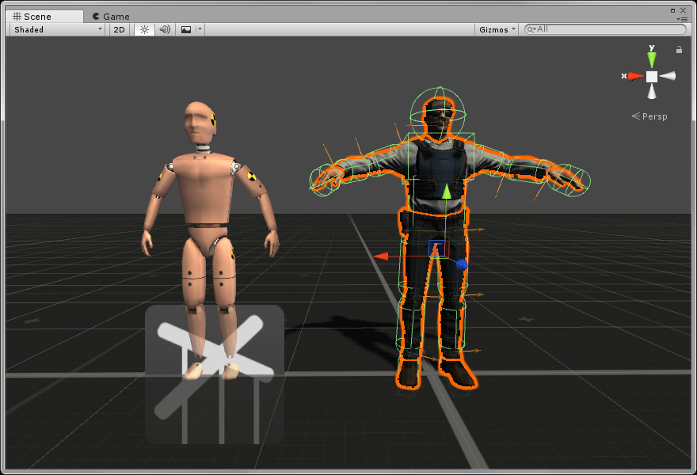

注意！透过对BipedRagdollCreator 的参数进行调整，将删除并重新创建ragdoll 元件，因此在BipedRagdollCreator 被删除之前，请勿对其进行任何引用。

目前PuppetMaster 仅支援使用ConfigurableJoints 关节，请确认Joints 设定为Configurable（预设值）。此外，每个部份的碰撞器形状可依角色外观修改，透过Scene 视窗可即时检视碰撞器的外观。当您完成Options 选项的基本设定后，可按下Start Editing Manually 开始手动编辑，以使用RagdollEditor 进行最后的调整，这将会删除BipedRagdollCreator 元件。  

按下Done 完成，此时Biped Ragdoll Creator 元件将被移除。

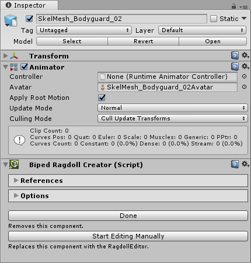
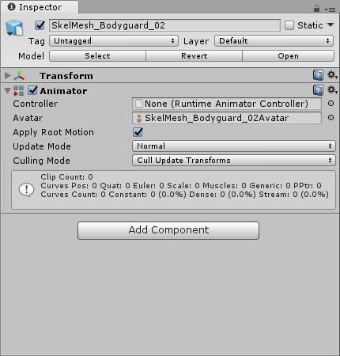

新增PuppetMaster 元件，然后按下Set Up PuppetMaster 按钮。

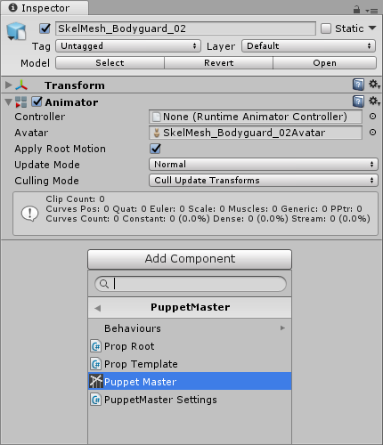

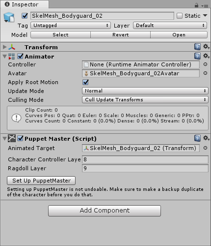

## 给角色添加道具（武器）

找到要添加道具的部位
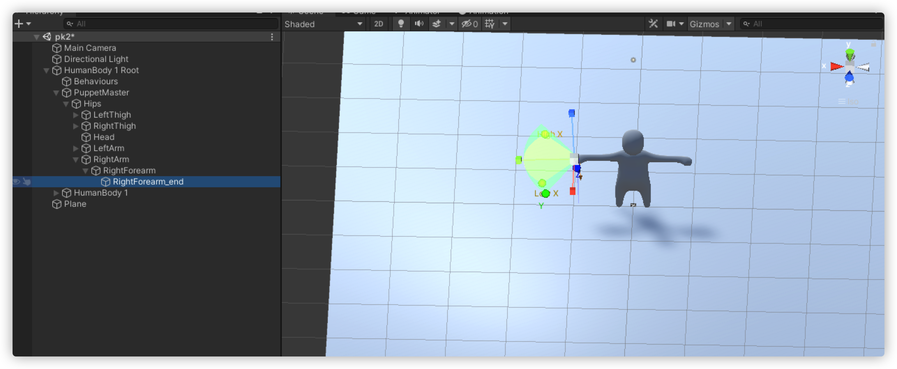
添加组件
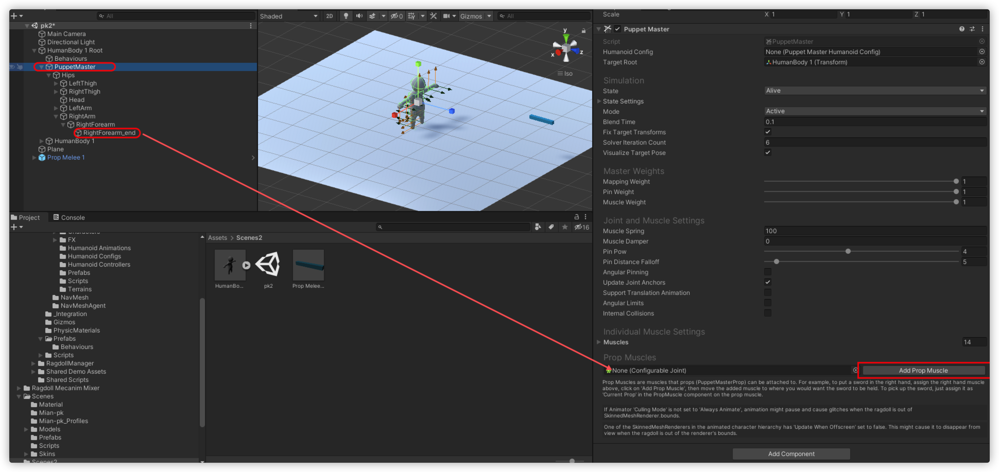
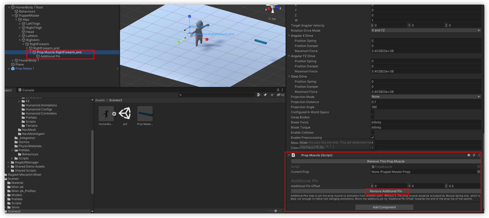
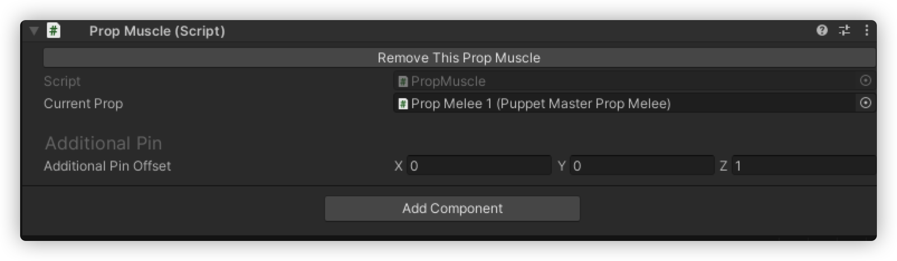

道具要把mesh和Collider分开，添加puppetMasterProp，具体可参考demo
