---
tag:
  - css
  - flex
cover: /2022-05-10-18-11-58.png
tinyCover: /cover/2022-05-10-18-11-58.png
coverWidth: 564
coverHeight: 1002

---

# CSS Flex 布局回顾

## 寻根溯源话布局

一切都始于这样一个问题：怎样通过 CSS 简单而优雅的实现水平、垂直同时居中。记得刚开始学习 CSS 的时候，看到 `float` 属性不由得感觉眼前一亮，顺理成章的联想到 Word 文档排版中用到的的左对齐、右对齐和居中对齐，然而很快就失望的发现 CSS 中并不存在 `float: center` 的写法，那么 `text-align: center`、`verticle-align: center` 是否可行呢？答案也是否定的。这两个属性只能用于行内元素，对于块级元素的布局是无效的。

在网页布局没有进入 CSS 的时代，排版几乎是通过 `table` 元素实现的，在 `table` 的单元格里可以方便的使用 `align`、`valign` 来实现水平和垂直方向的对齐，随着 Web 语义化的流行，这些写法逐渐淡出了视野，CSS 标准为我们提供了 3 种布局方式：`标准文档流`、`浮动布局`和`定位布局`。这几种方式的搭配使用可以轻松搞定 PC 端页面的常见需求，比如实现水平居中可以使用`margin: 0 auto`，实现水平垂直同时居中可以如下设置：

```css
.dad {    
  position: relative;
}
```

```css
.son {   
   position: absolute;    
   margin: auto;    
   top: 0;    
   right: 0;    
   bottom: 0;    
   left: 0;
}
```

* * *

```css
.dad {    
  position: relative;
}
```

```css
.son {    
  width: 100px;    
  height: 100px;    
  position: absolute;    
  top: 50%;    
  left: 50%;    
  margin-top: -50px;    
  margin-left: -50px;
}
```

然而，这些写法都存在一些缺陷：缺少语义并且不够灵活。我们需要的是通过 1 个属性就能优雅的实现子元素居中或均匀分布，甚至可以随着窗口缩放自动适应。在这样的需求下，CSS 的第 4 种布局方式诞生了，这就是我们今天要重点介绍的 [flex](https://so.csdn.net/so/search?q=flex&spm=1001.2101.3001.7020) 布局。

## flex 基本概念

使用 flex 布局首先要设置父容器 `display: flex`，然后再设置 `justify-content: center` 实现水平居中，最后设置 `align-items: center` 实现垂直居中。

```css
#dad {    
  display: flex;    
  justify-content: center;    
  align-items: center
}
```

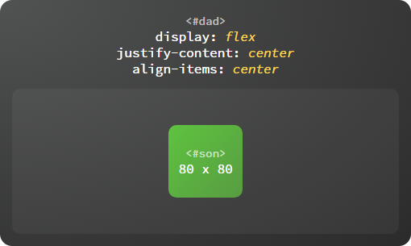

就是这么简单，大功告成。等等，好像哪里不对，`justify-content` 和 `align-items` 是啥？哪里可以看出横向、竖向的语义？是的，flex 的确没有那么简单，这就要从两个基本概念说起了。

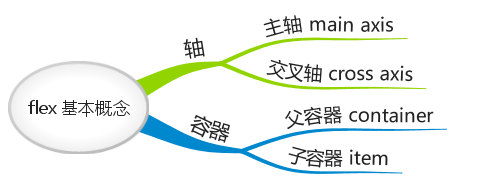

说来也不难，flex 的核心的概念就是 **容器** 和 **轴**。容器包括外层的 **父容器** 和内层的 **子容器**，轴包括 **主轴** 和 **交叉轴**，可以说 flex 布局的全部特性都构建在这两个概念上。flex 布局涉及到 12 个 CSS 属性（不含 `display: flex`），其中父容器、子容器各 6 个。不过常用的属性只有 4 个，父容器、子容器各 2 个，我们就先从常用的说起吧。

### 1\. 容器

> 容器具有这样的特点：父容器可以统一设置子容器的排列方式，子容器也可以单独设置自身的排列方式，如果两者同时设置，以子容器的设置为准。

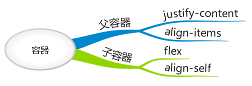

1.1 父容器

* 设置子容器沿主轴排列：**justify-content**

`justify-content` 属性用于定义如何沿着主轴方向排列子容器。

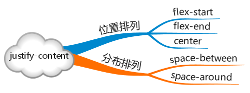

> **flex-start**：起始端对齐

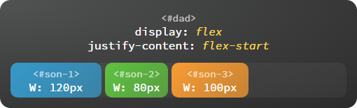

> **flex-end**：末尾段对齐

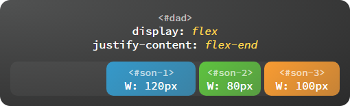

> **center**：居中对齐

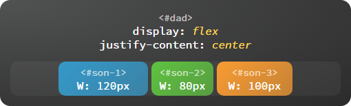

> **space-around**：子容器沿主轴均匀分布，位于首尾两端的子容器到父容器的距离是子容器间距的一半。

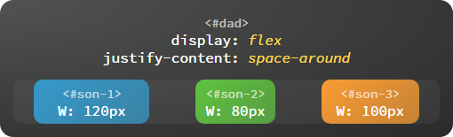

> **space-between**：子容器沿主轴均匀分布，位于首尾两端的子容器与父容器相切。

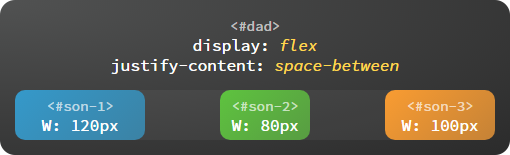

* 设置子容器如何沿交叉轴排列：**align-items**

  `align-items` 属性用于定义如何沿着交叉轴方向分配子容器的间距。

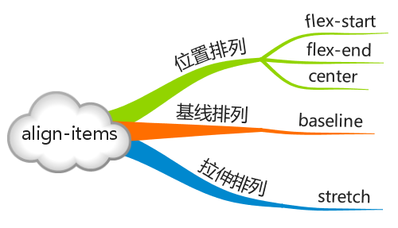

> **flex-start**：起始端对齐

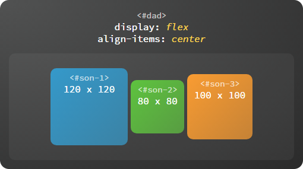

> **flex-end**：末尾段对齐

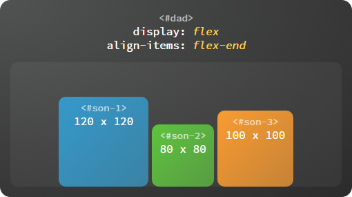

> **center**：居中对齐


> **baseline**：基线对齐，这里的 `baseline` 默认是指首行文字，即 `first baseline`，所有子容器向基线对齐，交叉轴起点到元素基线距离最大的子容器将会与交叉轴起始端相切以确定基线。

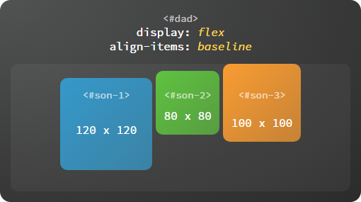

> **stretch**：子容器沿交叉轴方向的尺寸拉伸至与父容器一致。

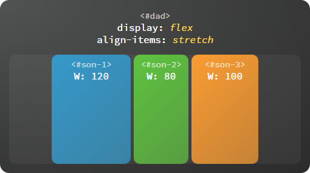

1.2 子容器

* 在主轴上如何伸缩：**flex**

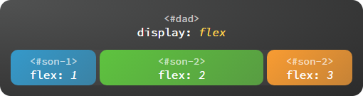

子容器是有弹性的（flex 即弹性），它们会自动填充剩余空间，子容器的伸缩比例由 `flex` 属性确定。

`flex` 的值可以是无单位数字（如：1, 2, 3），也可以是有单位数字（如：15px，30px，60px），还可以是 `none` 关键字。子容器会按照 `flex` 定义的尺寸比例自动伸缩，如果取值为`none` 则不伸缩。

虽然 `flex` 是多个属性的缩写，允许 1 \- 3 个值连用，但通常用 1 个值就可以满足需求，它的全部写法可参考下图。

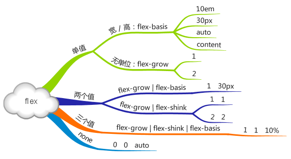

* 单独设置子容器如何沿交叉轴排列：**align-self**

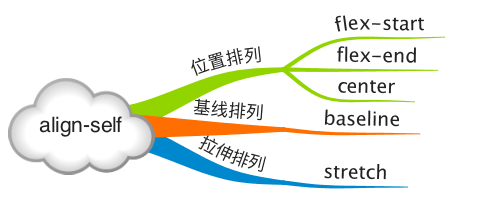

每个子容器也可以单独定义沿交叉轴排列的方式，此属性的可选值与父容器 `align-items` 属性完全一致，如果两者同时设置则以子容器的 `align-self` 属性为准。

> **flex-start**：起始端对齐

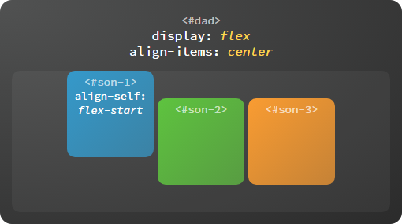

> **flex-end**：末尾段对齐

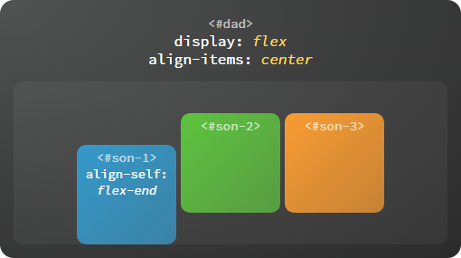

> **center**：居中对齐

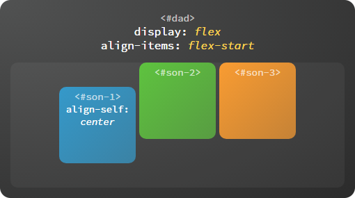

> **baseline**：基线对齐

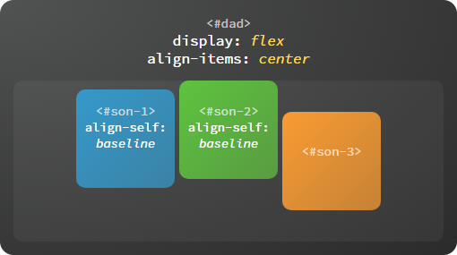

> **stretch**：拉伸对齐

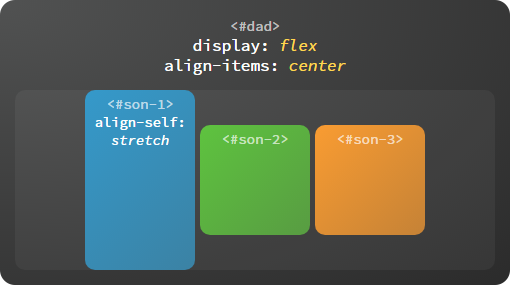

### 2\. 轴

如图所示，**轴** 包括 **主轴** 和 **交叉轴**，我们知道 `justify-content` 属性决定子容器沿主轴的排列方式，`align-items` 属性决定子容器沿着交叉轴的排列方式。那么轴本身又是怎样确定的呢？在 flex 布局中，`flex-direction` 属性决定主轴的方向，交叉轴的方向由主轴确定。

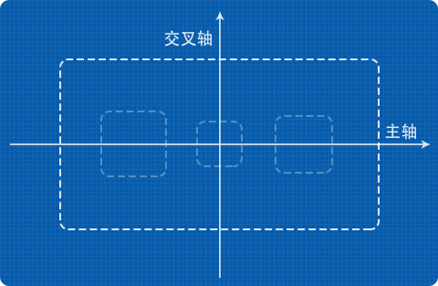

* 主轴

主轴的起始端由 `flex-start` 表示，末尾段由 `flex-end` 表示。不同的主轴方向对应的起始端、末尾段的位置也不相同。

> 向右：`flex-direction: row`

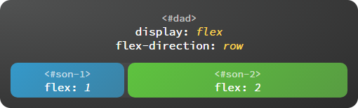

> 向下：`flex-direction: column`

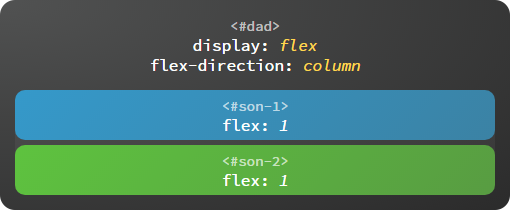

> 向左：`flex-direction: row-reverse`

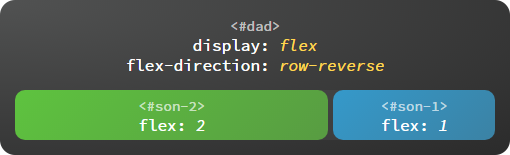

> 向上：`flex-direction: column-reverse`

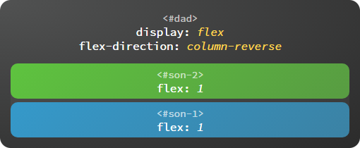

* 交叉轴

  主轴沿逆时针方向旋转 90° 就得到了交叉轴，交叉轴的起始端和末尾段也由 `flex-start` 和`flex-end` 表示。

  上面介绍的几项属性是 flex 布局中最常用到的部分，一般来说可以满足大多数需求，如果实现复杂的布局还需要深入了解更多的属性。

* * *

## flex 进阶概念

### 1\. 父容器

* 设置换行方式：**flex-wrap**

  决定子容器是否换行排列，不但可以顺序换行而且支持逆序换行。

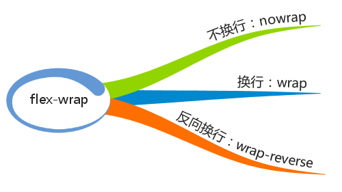

> **nowrap**：不换行

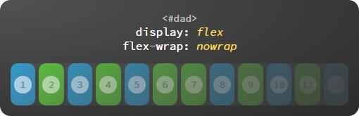

> **wrap**：换行

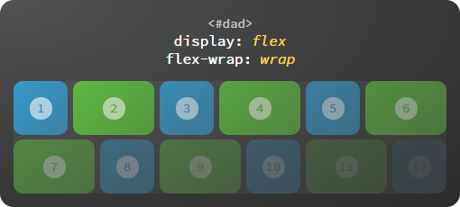

> **wrap-reverse**：逆序换行

逆序换行是指沿着交叉轴的反方向换行。

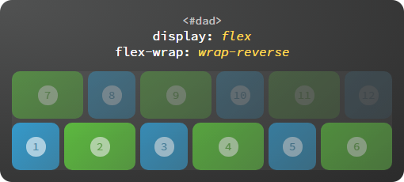

* 轴向与换行组合设置：**flex-flow**

  flow 即流向，也就是子容器沿着哪个方向流动，流动到终点是否允许换行，比如 `flex-flow: row wrap`，`flex-flow` 是一个复合属性，相当于 flex-direction 与 flex-wrap 的组合，可选的取值如下：

  * `row`、`column` 等，可单独设置主轴方向

  * `wrap`、`nowrap` 等，可单独设置换行方式

  * `row nowrap`、`column wrap` 等，也可两者同时设置

* 多行沿交叉轴对齐：**align-content**

  当子容器多行排列时，设置行与行之间的对齐方式。

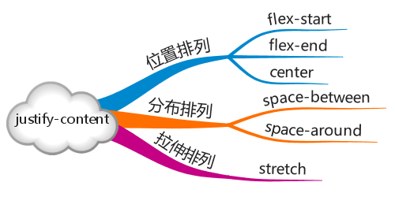

> **flex-start**：起始端对齐

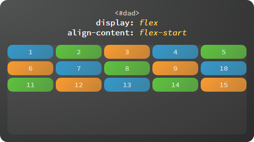

> **flex-end**：末尾段对齐

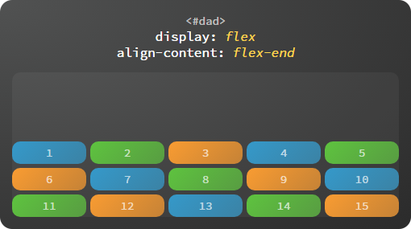

> **center**：居中对齐

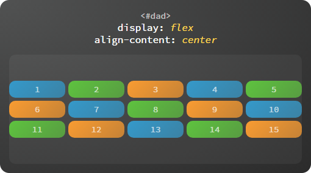

> **space-around**：等边距均匀分布

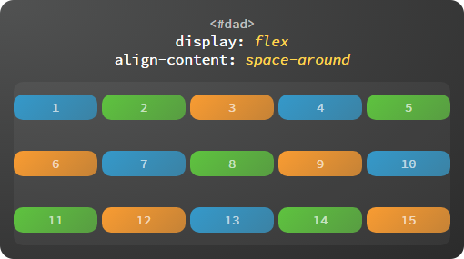

> **space-between**：等间距均匀分布

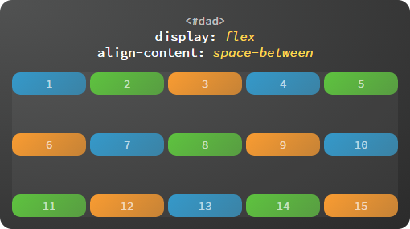

> **stretch**：拉伸对齐

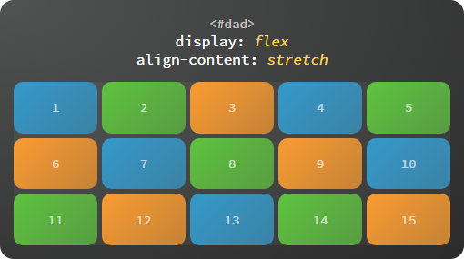

### 2\. 子容器

* 设置基准大小：**flex-basis**

  `flex-basis` 表示在不伸缩的情况下子容器的原始尺寸。主轴为横向时代表宽度，主轴为纵向时代表高度。

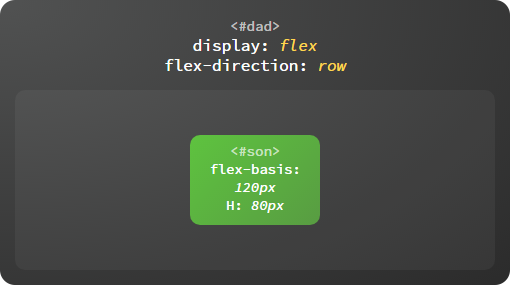

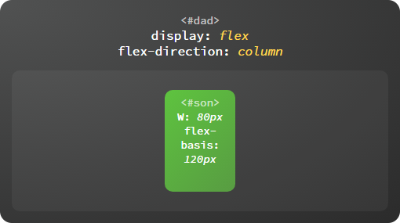

* 设置扩展比例：**flex-grow**

  子容器弹性伸展的比例。如图，剩余空间按 1:2 的比例分配给子容器。

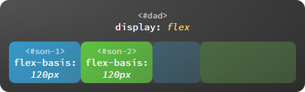

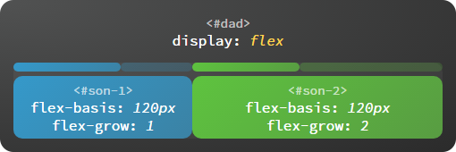

* 设置收缩比例：**flex-shrink**

  子容器弹性收缩的比例。如图，超出的部分按 1:2 的比例从给子容器中减去。


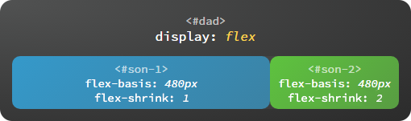

* 设置排列顺序：**order**

  改变子容器的排列顺序，覆盖 HTML 代码中的顺序，默认值为 0，可以为负值，数值越小排列越靠前。

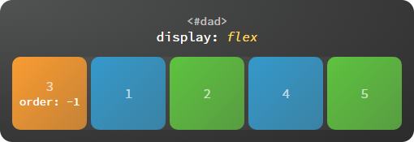

* * *

以上就是 flex 布局的全部属性，一共 12 个，父容器、子容器各 6 个，可以随时通过下图进行回顾。

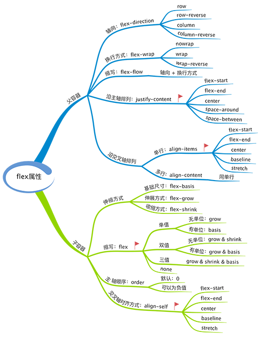

<style scoped>
img {
  width: 50%;
  border-radius: 20px;
  background-color: #f5f5f5;
  overflow: hidden;
  border: 1px solid #ccc;
}
</style>
