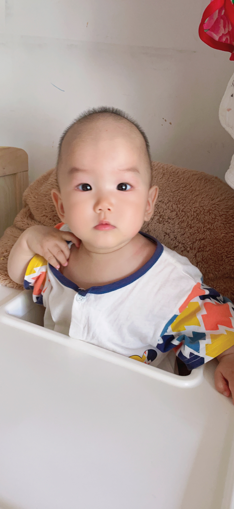
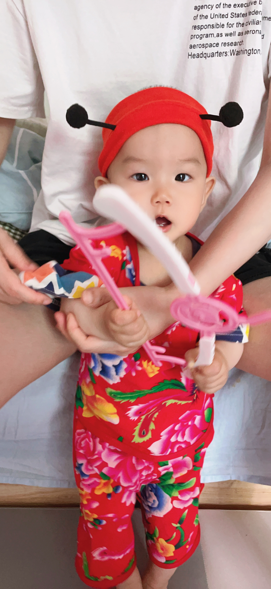
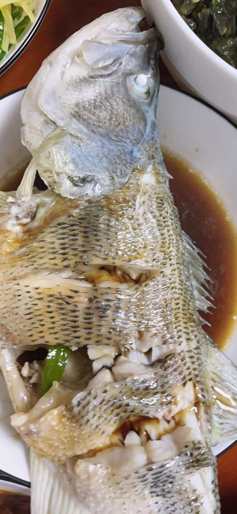
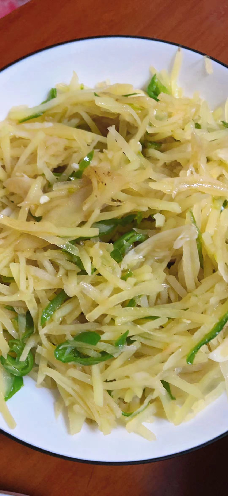
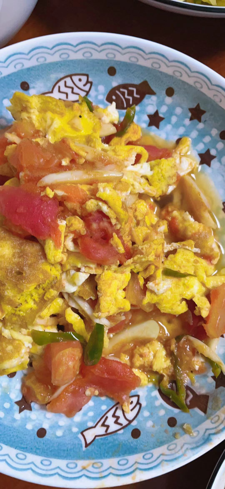
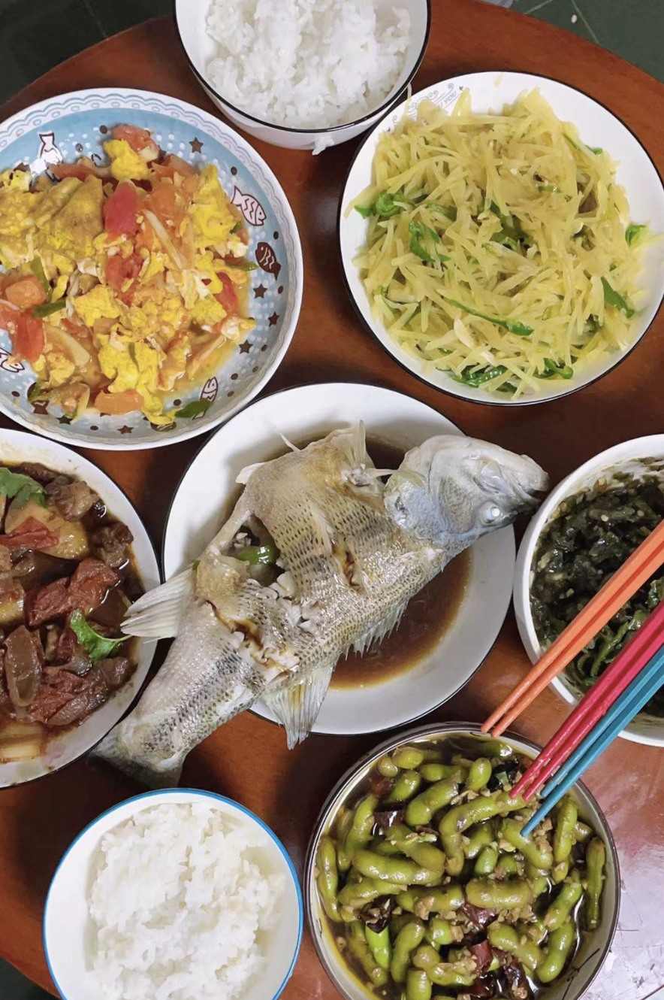

# 2022年05月08日

## 今日天气

阴 微风凉爽 母亲节 周末

## 今日活动

- 喂宝宝辅食
- 扫地拖地
- 洗地毯
- 做核酸
- 带娃
- 做饭
- 更新博客

## 今日药物

- 谷维素+维生素B1

## 今日可爱

## 今日食谱

- 雪糕
- 包子
- 可乐
- 米饭 番茄牛腩 凉拌黄瓜皮蛋 毛豆 南瓜汤
- 哈密瓜
- 清蒸鲈鱼 酸辣土豆丝 番茄炒蛋 青椒皮蛋

## 今日词句

吾尝终日而思矣，不如须臾之所学也；吾尝跂而望矣，不如登高之博见也。登高而招，臂非加长也，而见者远；顺风而呼，声非加疾也，而闻者彰。假舆马者，非利足也，而致千里；假舟楫者，非能水也，而绝江河。君子生非异也，善假于物也。

## 今日快递

- 宝宝周岁纪念礼物
- 墨镜

## 今日购物

- 买菜 34元
- 宝宝米粉 80元

## 今日厨艺

- 清蒸鲈鱼
- 酸辣土豆丝
- 番茄炒蛋

