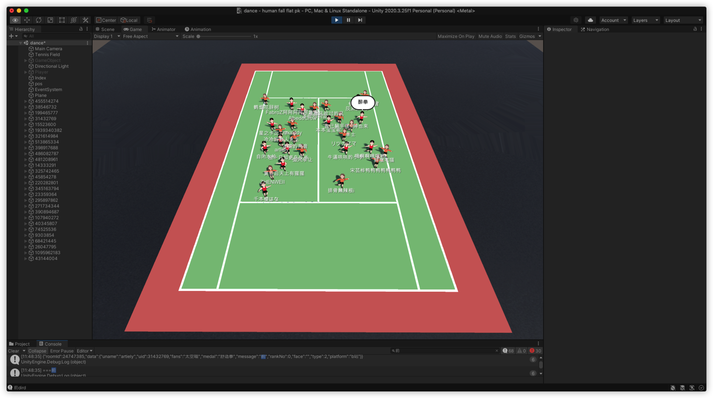

## 今日词句

## 今日状态

## 今日食谱

## 今日事迹

## 今日歌曲

## 今日可爱

## 今日感想

## 今日药物

## 今日计划

## 今日购物

## 今日快递

## 今日厨艺

## 今日推荐

今日的蚊虫更甚,它们比以往任何时候都多，而且更加疯狂和凶猛,他们似乎更加聪明狡诈，对电蚊拍无动于衷，甚至整晚都没有听到电蚊拍的噼啪声，而我就像一盘香喷喷的美食，饥渴难耐的他们急切地想要享用我，要不是他们个头小，我估计他们已经将我大卸八块，抑或将我抬回他们的老巢分而食之。他们像神风敢死队一样，一个个的嗡嗡作响，向我的脸砸来，他们似乎也有一种视死如归的感觉。谁要在我的脸上站稳了脚，我便会狠狠的给自己一个大嘴巴子，当我的手感受到了湿漉而黏稠的血液时，我的心底产生窃喜，当然也有失手的时候。我可不会因为它们体内流淌着我的血液而怜惜你们，我更想至你们于死地。它们比我更有耐心而且干劲十足。被惹恼的我干脆起床给蚊子们洗了个菜---冲了凉水澡，一看时间已是3点多，困意来袭的我索性光溜的全身让他们去吸，只是想拜托他们老老实实的吸血，不要嗡嗡作响的扰我。他们似乎在像我发出挑衅，又似乎是发出的喜悦的长鸣，像是我在请他们吃饭，它们还敲着碗盆一样,在吃饭的时候还往饭菜里吐口水，这种卑劣的行径让我无法忍受。今晚窗外的猫叫声显得格外的温柔，
