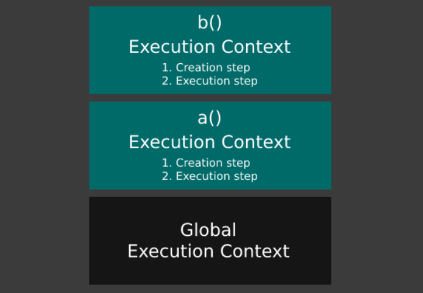
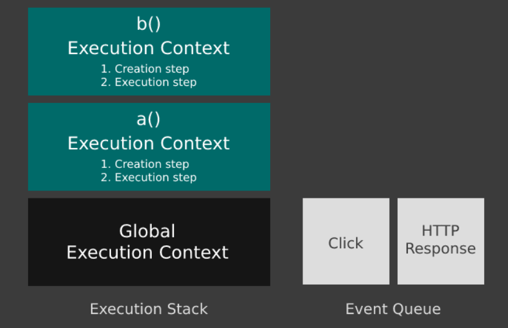
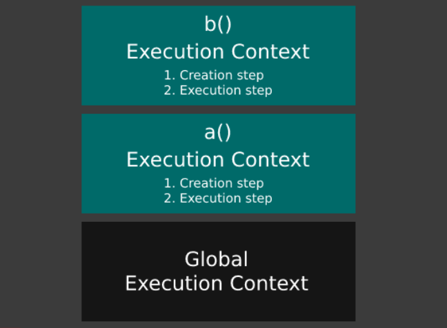

2020年注定是个特殊的年份，随着新年的到来，新型冠状病毒也加快了蔓延的脚步。时至今日我们依然在家闭关。既然是闭关，那我也得修炼点什么啊。
他来了！JavaScript！[或简写js] 其实本来想做出个什么高大上的产品出来的，计划是做一个桌面应用程序，大致包含博客的书写和自动发布，后面越想越不着边际不知从何下手。于是 决定重温一遍JavaScript。有夯实的基础就不怕铸造琼楼玉宇。

在学习JavaScript的过程中晦涩难懂的概念似乎很多，一些名词听起来就让人望而却步。其实不然的，只要你了解了基础原理你就可以进阶更高级的主题。
了解JavaScript的工作方式能让你阅读和编写代码更容易和省力。并且使您可以专注于应用程序的逻辑，而不必与语言的语法作斗争。

## JavaScript 是如何工作的？

计算机不了解JavaScript，而浏览器则了解。
除了处理网络请求，监听鼠标单击以及解析HTML和CSS以在屏幕上绘制像素外，该浏览器还内置了JavaScript引擎。
JavaScript引擎是用C ++编写的程序，它逐字符地遍历所有JavaScript代码，并将其“转换”为计算机CPU可以理解和执行的东西- 机器代码。
> 机器代码:计算机直接使用的程序语言，其语句就是机器指令码，机器指令码是用于指挥计算机应做的操作和操作数地址的一组二进制数。
这是同步发生的，意味着一次一行且有序。

之所以这样做，是因为机器代码人为编码很困难，并且因为各个CPU制造商的机器代码指令不同。

因此，他们将所有这些麻烦从JavaScript开发人员那里抽象出来，否则，Web开发将变得更加困难，普及程度降低，而且我们将不会遇到如此琳琅满目的网页。

JavaScript引擎可以一遍又一遍地遍历JavaScript的每一行（请参阅解释器），或者可以变得更聪明并检测诸如经常调用的函数之类的事物，并始终产生相同的结果。

> 解释器（英语：Interpreter），又译为直译器，是一种电脑程序，能够把高级编程语言一行一行直接转译运行。解释器不会一次把整个程序转译出来，只像一位“中间人”，每次运行程序时都要先转成另一种语言再作运行，因此解释器的程序运行速度比较缓慢。它每转译一行程序叙述就立刻运行，然后再转译下一行，再运行，如此不停地进行下去。

然后，它可以一次将它们编译为机器代码，以便下次遇到该代码时，它将运行已编译的代码，这要快得多（请参阅即时编译）。

> 即时编译器（JIT compiler）随虚拟机一起供给的，并可选使用。它把字节码编译成可立即执行的指定平台的可执行代码。

或者，它可以将整个事情预先编译为机器代码并执行（参见Compiler）。

> 简单讲，编译器就是将“一种语言（通常为高级语言）”翻译为“另一种语言（通常为低级语言）”的程序。

V8是这样的JavaScript引擎，于2008年Google开源。2009年，一个叫Ryan Dahl的人想到了使用V8创建Node.js的想法，Node.js是浏览器外部JavaScript的运行时环境，这意味着该语言可以也可用于服务器端应用程序。

## 功能执行上下文

与任何其他语言一样，JavaScript对于函数，变量，数据类型以及这些数据类型可以存储的确切值，在代码中可访问的位置以及在代码中不可访问的位置等都有自己的规则。

这些规则由名为Ecma International的标准组织定义，并一起构成语言规范文档（您可以在[此处](https://www.ecma-international.org/publications/standards/Ecma-262.htm)找到最新版本）。

因此，当引擎将JavaScript代码转换为机器代码时，它需要考虑规格。

如果代码包含非法分配或试图访问变量（根据语言规范，该变量不能从代码的特定部分访问），该怎么办？

每次调用一个函数时，都需要弄清楚所有这些事情。它通过创建一个称为执行上下文的包装器来实现此目的。

为了更具体，避免将来出现混乱，我将这个函数执行上下文称为，因为每次调用一个函数时都会创建一个。不要被这个术语吓到，也不要现在考虑太多，稍后将详细介绍。

只需记住它决定了事情，例如：“在该特定函数中可以访问哪些变量this，其中的值是什么，其中声明了哪些变量和函数？”

## 全局执行上下文

但是，并非所有JavaScript代码都位于函数内部（即使大多数都包含在其中）。

在全局级别，任何函数之外也可能存在代码，因此JavaScript引擎要做的第一件事就是创建全局执行上下文。

这就像一个函数执行上下文，并且在全局级别上具有相同的目的，但是它具有一些特殊性。

例如，只有一个全局执行上下文是在执行开始时创建的，所有JavaScript代码都在其中运行。

即使没有代码要执行，全局执行上下文也会创建两个特定于它的东西：

全局对象。此对象是window,JavaScript在浏览器中运行时的对象。当它在Node.js之外运行时，就像一样global。为了简单起见，我将在本文中使用window。

一个特殊的变量称为`this`。

在全局执行上下文中，并且仅在那里，`this`实际上等于全局对象`window`。基本上是对`window`的引用。

```js
this === window // logs true
```

全局执行上下文和函数执行上下文之间的另一个细微差别是，在全局级别（任何函数之外）声明的任何变量或函数都将作为属性自动附加到`window`对象，并隐式附加到特殊变量`this`。

即使函数也具有特殊变量`this`，在函数执行上下文中也不会发生这种情况。

因此，如果我们foo在全局级别声明了一个全局变量，则以下三个语句实际上都指向该变量。同样适用于函数。

```js
foo // 'bar'
window.foo // 'bar'
this.foo; // 'bar'
(window.foo === foo && this.foo === foo && window.foo === this.foo) // true
```

所有的JavaScript内置的变量和函数连接到全局window对象：`setTimeout()`，`localStorage`，`scrollTo()`，`Math`，`fetch()`，等等。这就是为什么他们是在代码访问的任何地方。

## 执行栈

我们知道每次调用一个函数都会创建一个函数执行上下文。

由于即使最简单的JavaScript程序也有很多函数调用，因此所有这些函数执行上下文都需要以某种方式进行管理。

看下面的例子：

```js
function a() {
  // some code
}

function b() {
  // some code
}

a()
b()
```

`a()`遇到函数调用时，将如上所述创建函数执行上下文，并执行函数内部的代码。

当代码执行完成时（到达`return`语句或`}`函数的包围），该函数的函数执行上下文将`a()`被破坏。
然后，`b()`遇到的调用，并且对function重复相同的过程`b()`。

但是，即使在非常简单的JavaScript程序中，也是如此。大多数时候，会有一些在其他函数内部调用的函数：

```js
function a() {
  // some code
  b()
  // some more code
}

function b() {
  // some code
}

a()
```

在这种情况下，`a()`创建了一个函数执行上下文，但是恰好在`a()`执行的中间，`b()`遇到了调用。

为创建了一个全新的函数执行上下文`b()`，但没有销毁`a()`的执行上下文，因为其代码未完全执行。

这意味着同时存在许多函数执行上下文。但是，在任何给定时间实际上只有一个正在运行。

为了跟踪当前正在运行的堆栈，使用了一个堆栈，其中当前正在运行的函数执行上下文位于堆栈的顶部。

一旦完成执行，它将从堆栈中弹出，将继续执行下一个执行上下文，依此类推，直到执行堆栈为空。

该堆栈称为执行堆栈，如下图所示。


当执行堆栈为空时，我们之前讨论过且永不破坏的全局执行上下文将成为当前正在运行的执行上下文。

## 事件队列

还记得我说过JavaScript引擎只是浏览器的一个组件，还有渲染引擎或网络层吗？

这些组件具有内置的Hooks，引擎可以使用它们与之通信以发起网络请求，在屏幕上绘制像素或监听鼠标单击。

当您fetch在JavaScript中使用类似方法进行HTTP请求时，引擎实际上会将其传达给网络层。每当请求的响应到达时，网络层就会将其传递回JavaScript引擎。

但这可能要花几秒钟，在请求进行过程中，JavaScript引擎会做什么？

只是停止执行任何代码，直到响应到来为止？继续执行其余的代码，每当响应到来时，停止一切并执行其回调？当回调完成后，无论中断在哪里，都可以继续执行？

以上都不是，即使第一个可以通过使用wait来实现。

在多线程语言中，可以通过一个线程在当前运行的执行上下文中执行代码，而另一个线程执行事件的回调来处理此问题。但这对于JavaScript是不可能的，因为它是单线程的。

要了解它是如何工作的，让我们考虑之前看过的`a()`和`b()`函数，但是添加一个单击处理程序和一个HTTP请求处理程序。

```js
function a() {
  // some code
  b()
  // some more code
}

function b() {
  // some code
}

function httpHandler() {
  // some code here
}

function clickHandler() {
  // some more code here
}

a()
```

JavaScript引擎从浏览器的其他组件接收到的任何事件，例如单击鼠标或网络响应，都不会立即处理。
此时，JavaScript引擎可能正在忙于执行代码，因此它将把事件放在队列中称为`事件队列的`。


我们已经讨论了执行栈，以及一旦相应函数中的代码完成执行后如何从栈中弹出当前正在运行的函数执行上下文。

然后，下一个执行上下文继续执行直到完成，依此类推，直到堆栈为空，并且全局执行上下文成为当前正在运行的执行上下文。

尽管有代码要在执行堆栈上执行，但由于引擎正忙于在堆栈上执行代码，因此事件队列中的事件将被忽略。

仅当它完成并且执行堆栈为空时，JavaScript Engine才会处理事件队列中的下一个事件（当然，如果有一个事件），并将调用其处理程序。

由于该处理器是一个JavaScript函数，它就像被处理`a()`，并`b()`进行了处理，这意味着一个函数执行上下文被创建并推入执行堆栈。

如果该处理程序又调用了另一个函数，则将创建另一个函数执行上下文并将其压入堆栈顶部，依此类推。

仅当执行堆栈再次为空时，JavaScript引擎才会再次检查事件队列中是否有新事件。

键盘和鼠标事件也是如此。当单击鼠标时，JavaScript引擎将获得click事件，将其放置在事件队列中，并且仅在执行堆栈为空时才执行其处理程序。
通过将以下代码复制粘贴到浏览器控制台中，您可以轻松地看到这一点：

```js
function documentClickHandler() {
  console.log('CLICK!!!')
}

document.addEventListener('click', documentClickHandler)

function a() {
  const fiveSecondsLater = new Date().getTime() + 5000
  while (new Date().getTime() < fiveSecondsLater) {}
}

a()
```

该`while`循环只是保持引擎繁忙五秒钟，不用太担心了。在这五秒钟内开始单击文档上的任何位置，您将看不到任何内容记录到控制台。
当五秒钟过去并且执行堆栈为空时，将调用第一次单击的处理程序。
由于这是一个函数，因此将创建函数执行上下文，将其推入堆栈，执行并从堆栈中弹出。然后，调用第二次单击的处理程序，依此类推。
实际上，`setTimeout()`（和`setInterval()`）也会发生相同的情况。您提供的处理程序`setTimeout()`实际上位于事件队列中。
这意味着，如果将超时设置为`0`但是在执行堆栈上有要执行的代码，`setTimeout()`则仅在堆栈为空时（可能会在几毫秒后）调用的处理程序。
这其中的原因之一`setTimeout()`，并`setInterval()`没有真正精确。如果您不相信我的话，请将下一个要点复制并粘贴到浏览器控制台中。

```js
setTimeout(() => {
  console.log('TIMEOUT HANDLER!!!')
}, 0)

const fiveSecondsLater = new Date().getTime() + 5000
while (new Date().getTime() < fiveSecondsLater) {}
```

:::tip
注意：放入事件队列的代码称为异步。这是否一个好名词是一个不同的话题，但这就是人们所说的，所以我想您必须习惯它。
:::

## 函数执行上下文步骤

既然我们已经熟悉了JavaScript程序的执行生命周期，那么让我们进一步深入研究如何准确地创建函数执行上下文。

它分为两个步骤：创建步骤和执行步骤。

创建步骤“设置东西”，以便可以执行代码，而执行步骤实际执行它。
在创建步骤中发生两件非常重要的事情：

- 确定作用域。
- `this`确定的值（我假设您已经熟悉`this`JavaScript中的关键字）。

接下来的两个相应部分将详细介绍这些功能。

## 作用域与作用域链

作用域由在给定函数中可访问的变量和函数组成，即使它们未在函数本身中声明也是如此。

JavaScript具有词法作用域，这意味着该作用域是根据代码中声明函数的位置确定的。

```js
function a() {
  function b() {
    console.log(foo) // logs 'bar'
  }

  var foo = 'bar'
  b()
}

a()
```

到达时`console.log(foo)`以上时，JavaScript引擎将首先检查是否有一个变量`foo`中`b()`的执行上下文的作用域。

由于没有声明，它会转到“父”执行上下文（即`a()`的执行上下文），这仅仅是因为`b()`声明在`a()`内部。在此执行上下文的作用域内，它找到`foo`并打印其值。

如果我们`b()`在外面提取`a()`，像这样：

```js
function a() {
  const foo = 'bar'
  b()
}

function b() {
  console.log(foo) // throws ReferenceError: foo is not defined
}

a()
```

引发`ReferenceError`(引用错误)，导致两者之间的唯一区别是`b()`的声明位置。

`b()`的“父”作用域现在是全局执行上下文的作用域，因为它是在任何函数之外的全局级别声明的，并且那里没有变量`foo`。

我可以看到为什么这会造成混淆，因为如果您查看执行堆栈，它看起来像这样：



因此，很容易假设“父级”执行上下文是堆栈中的下一个上下文，在当前上下文之下。但是，事实并非如此。

在第一个示例中，`a()`执行上下文确实`b()`是“父”执行上下文。并不是因为`a()`恰好是执行堆栈中的下一个项目，就在下面`b()`，而是因为它`b()`是在内部声明的`a()`。

在第二个示例中，执行堆栈看起来相同，但是这次`b()`的“父”执行上下文是全局执行上下文，因为它`b()`是在全局级别上声明的。

只需记住：在何处调用函数无关紧要，重要的是在哪声明它。

但是，如果在“父”执行上下文的范围内也找不到该变量，会发生什么呢？

在这种情况下，它将尝试以完全相同的方式在下一个“父”执行上下文的作用域中找到它。

如果不存在，它将尝试下一个，依此类推，直到最终到达全局执行上下文的范围。如果在该处也找不到它，则会抛出一个`ReferenceError`。
这称为`作用域链`，这正是在以下示例中发生的情况：

```js
function a() {
  function b() {
    function c() {
      console.log(foo)
    }

    c()
  }

  var foo = 'bar'
  b()
}

a()
```

它首先尝试在`c()`的执行上下文范围内查找`foo`，然后在`b()`的范围内查找，然后最终在`a()`的范围内找到它。

:::tip
注意：请记住，它仅从`c()`到`b()`再到`a()`，因为它们是在另一个内部声明的，而不是因为它们的相应执行上下文在执行堆栈中位于另一个之上。
:::
如果它们不会在另一个内部声明，则如上所述，“父”执行上下文将不同。

然而，如果有另外一个变量`foo`里面`c()`或者`b()`，它的价值将被记录到控制台上，由于引擎停止为“父”执行上下文只要它找到的变量“寻找”。

但是，如果`c()`或`b()`内还有另一个变量`foo`，则其值将被记录到控制台，因为一旦找到变量，引擎就会停止“寻找”“父”执行上下文。

同样的功能不仅适用于变量，还适用于函数，适用于全局变量，例如上面的`console`本身。

它将在作用域链中下降（或上升，具体取决于您的方式），寻找一个名为`console`的变量，最终它将在附加到window对象的全局执行上下文中找到它。

:::tip
注意：尽管我仅在上面的示例中使用了函数声明语法，但作用域和作用域链的工作原理与箭头函数完全相同，这是ES2015中引入的（也称为ES6）。
:::

## 闭包

闭包提供从内部函数访问外部函数的作用域。

但是，这并不是什么新鲜事物，我在上面刚刚描述了如何通过作用域链实现这一目标。

闭包的特别之处在于，即使外部函数的代码已执行，其执行上下文从执行堆栈中弹出并销毁，内部函数仍将引用外部函数的作用域。

```js
function a() {
  const name = 'John Doe'

  function b() {
    return name
  }

  return b
}

const c = a()

c()
```

这正是上面示例中发生的情况。 `b()`在`a()`内部声明，因此它可以通过作用域链从`a()`的作用域访问`name`变量。

但是它不仅可以访问它，而且还创建了一个`闭包`，这意味着即使父函数`a()`返回后，它也可以访问它。 变量`c`只是对内部函数`b()`的引用，因此代码的最后一行实际上调用了内部函数`b()`。

即使在返回`b()`的外部函数`a()`之后很长一段时间，内部函数`b()`仍然可以访问父函数的作用域。

## this

在执行上下文的创建步骤中确定的下一件事是`this`的值。

恐怕这不像作用域那样简单，因为函数内部`this`的值取决于函数的调用方式。

并且，为了使其更复杂，可以“覆盖”默认行为。

我将尽力使说明简单明了，您可以在MDN上找到有关此主题的更详细的文章。

首先，这取决于是否使用函数声明来声明函数：

```js
function a() {
  // ...
}
```

或箭头功能：

```js
const a = () => {
  // ...
}
```

如上所述，两者的作用域确定为完全相同，但`this`不同。

### 箭头函数

我将从简单的一开始。对于箭头函数，`this`的值是词法，因此其确定方式与确定作用域的方式类似。

“父”执行上下文的确定与“ 作用域和作用域链”部分中所述的完全相同，具体取决于声明箭头函数的位置。

`this`的值将与父执行上下文中的`this`值相同，在此情况下，将按照本节中的说明进行确定。

我们可以在下面的两个示例中看到这一点。

第一个将记录日志`true`，而第二个将记录日志`false`，即使`myArrowFunction`在两种情况下都是在同一位置调用的。两者之间的唯一区别是在哪里`myArrowFunction`声明了箭头功能。

```js
const myArrowFunction = () => {
  console.log(this === window)
}

class MyClass {
  constructor() {
    myArrowFunction()
  }
}

const myClassInstance = new MyClass()
```

```js
class MyClass {
  constructor() {
    const myArrowFunction = () => {
      console.log(this === window)
    }
    myArrowFunction()
  }
}

const myClassInstance = new MyClass()
```

因为`this`的值在`myArrowFunction`词法的，所以它将`window`在第一个示例中出现，因为它是在任何函数或类之外的全局级别声明的。

在第二示例中，的值this内myArrowFunction将是任何的值this，函数内部的包裹它。
在本节的后面，我将深入探讨确切的值，但window就象第一个示例一样，现在足以注意到它不是。
切记：对于箭头函数，的值this是根据箭头函数的声明位置而不是其调用位置或方式确定的。

由于`myArrowFunction`内部的`this`的值取决于词法环境，因此在第一个示例中它将是`window`，因为它是在任何函数或类之外的全局级别声明的。

在第二个示例中，`myArrowFunction`内部的`this`值将是包装它的函数内部的`this`值。

切记：对于箭头函数，此值是根据声明箭头函数的位置（而不是在何处或如何调用）确定的。

### 函数声明

在这种情况下，事情并不是那么简单，这恰恰是在ES2015中引入箭头功能的原因（或其中至少一个原因），但请耐心等待，在后面的几段中都说得通。

除了箭头函数（`const a = () => { … }`）和函数声明（`function a() { … }`）在语法上的区别外，`this`每个内部的值是两者之间的主要区别。

与箭头函数不同，`this`内部函数声明的值不是根据声明函数的位置的词法来确定的。

它是根据函数的调用方式确定的。有几种方法可以调用一个函数：

- 简单调用： `myFunction()`
- 对象方法调用： `myObject.myFunction()`
- 构造函数调用： `new myFunction()`
- DOM事件处理程序调用： `document.addEventListener('click', myFunction)`

对于每种类型的调用，`myFunction()`内部的`this`的值是不同的，而与`myFunction()`的声明位置无关，因此让我们逐一检查它们的工作方式。

### 简单调用

```js
function myFunction() {
  return this === window // true
}

myFunction()
```

简单调用就是像上面的示例中那样简单地调用一个函数：单独的函数名称，不带任何前面的字符，后跟`()`（当然，内部带有任何可选参数）。

在简单调用的情况下，`this`函数内部的值始终是`global this`，而后者又指向全局`window`对象，如上一节中所述。

而已！但是请记住，这仅适用于简单的调用。函数名称，后跟`()`。没有前面的字符。
:::tip
注意：因为`this`简单函数调用中的值实际上是对全局`window`对象的引用，所以使用本`this`应由简单调用来调用的内部函数被认为是不好的做法。
:::
这是因为附加到`this`函数内部的任何属性实际上都附加到`window`对象并成为全局变量，这是一种不好的做法。

这就是为什么在严格模式下，`this`简单调用所调用的任何函数中的值均为`undefined`，并且上面的示例将输出的原因`false`。

### 对象方法调用

```js
const myObject = {
  myMethod() {
    return this === myObject // true
  },
}

myObject.myMethod()
```

当对象的属性具有函数作为其值时，它被视为该对象的方法，因此称为方法调用。

当使用这种类型的调用时，`this`函数内部的值将仅指向在上面示例中调用了该方法的对象`myObject`。
:::tip
注意：如果将使用箭头函数语法，而不是上面示例中的函数声明，则`this`该箭头函数内部的值将是全局`window`对象。
:::
这是因为其父执行上下文将是全局执行上下文。它在对象内部声明的事实不会改变任何东西。

### 构造函数调用

可以调用函数的另一种方法是在调用之前添加`new`关键字，如下例所示。

以这种方式调用时，该函数将返回一个新对象（即使它没有`return`语句），并且`this`函数内部的值将指向该新创建的对象。

解释有点简化（有关[MDN](https://developer.mozilla.org/zh-CN/docs/Web/JavaScript/Reference/Operators/new)的更多信息），但要点是它将创建（或构造，因此构造函数）并返回`this`将指向函数内部的对象。

```js
function MyConstructorFunction() {
  this.a = 1
}

const myObject = new MyConstructorFunction() // a new object is created

// inside MyConstructorFunction(), "this" points to the newly created onject,
// so it should have a property  "a".
myObject.a // 1
```

:::tip
注意：在上使用`new`关键字时，也是如此，因为类实际上是特殊函数，只有很小的区别。
注意：箭头函数不能用作构造函数。
:::

### DOM事件处理程序调用

```js
document.addEventListener('click', DOMElementHandler)

function DOMElementHandler() {
  console.log(this === document) // true
}
```

当作为DOM事件处理程序调用时，函数`this`内部的值将是放置事件的DOM元素。

但是，对于事件处理程序，我们不这样做，我们仅将引用传递给处理程序函数。JavaScript引擎调用该函数，我们无法控制它将如何执行。

### 使用自定义值调用this

可以使用`Function.prototype`中的`bind()`，`call()`或`apply()`调用函数内部的`this`的值，将其显式设置为自定义值。

```js
const obj = {}

function a(param1, param2) {
  return [this === window, this === obj, param1, param2]
}

a.call(obj, 1, 2) // [false, true, 1, 2]
a.apply(obj, [3, 4]) // [false, true, 3, 4]
a.bind(obj)(5, 6) // [false, true, 5, 6]
a(7, 8) // [true, false, 7, 8]
```

上面的示例显示了这些功能的工作方式。
`call()`并且`apply()`非常相似，唯一的不同是`apply()`函数的参数作为数组传递。

尽管`call()`和`apply()`实际上以该设置的值作为您作为第一个参数传入的值来调用该函数，但`bind()`不会调用该函数。

它改为返回一个新函数，该函数与使用`bind()`的函数完全相同，但是`this`的值设置为`bind()`参数传递的值。

这就是为什么您在`a.bind(obj)`之后看到`(5，6)`实际调用`bind()`返回的函数的原因。

对于`bind()`，`this`返回函数内部的值将永久绑定到您作为`this`值传递的任何内容（因此名为 `bind()`）。

无论使用哪种类型的调用，`this`返回函数内部的值始终是作为参数提供的值。它只能通过`call()`，`bind()`或`apply()`再次修改。

上一段几乎是完全正确的。当然，该规则必须有一个例外，该例外是构造函数的调用。

当以这种方式调用一个函数时，通过将`new`关键字放在调用之前，该函数内的`this`值将始终是调用返回的对象，即使使用`bind()`将新函数赋予了另一个关键字也是如此。

您可以在以下示例中进行检查：

```js
function a() {
  this.three = 'three'
  console.log(this)
}

const customThisOne = { one: 'one' }
const customThisTwo = { two: 'two' }

const bound = a.bind(customThisOne) // 返回一个新函数，该函数的值绑定到customThisOne
bound() // 打印 customThisOne
bound.call(customThisTwo) // 打印 customThisOne, 即使传递customThisTwo
bound.apply(customThisTwo) // 同上
new bound() // 打印新调用返回的对象，并绕过.bind（customThisOne）
```

这是一个示例，说明了如何使用`bind()`来为我们前面讨论的点击事件处理程序控制`this`：

```js
const myCustomThis = {}
document.addEventListener('click', DOMElementHandler.bind(myCustomThis))

function DOMElementHandler() {
  console.log(this === document) // false (used to be true before bind() was used)
  console.log(this === myCustomThis) // true
}
```

:::tip
注意：`bind()`，`call()`和`apply()`不能用于将自定义`this`值传递给箭头函数。
:::

## 注意箭头函数

现在，您可以了解这些函数声明规则，尽管相当简单，但由于所有特殊情况，它们如何引起混乱，并成为bug的来源。

对如何调用函数的微小更改将更改其内部的`this`。 这可能会引起整个连锁反应，这就是为什么了解这些规则以及它们如何影响您的代码很重要。

这就是编写JavaScript规范的人提出箭头函数的原因，其中箭头的`this`始终是词法环境，并且每次都被确定为完全相同，而不管它们如何被调用。

## 声明提升

我之前提到过，当调用一个函数时，JavaScript引擎将首先遍历代码，找出的`作用域`和`this`，并标识在函数主体中声明的变量和函数。

在第一步（创建步骤）中，这些变量将获得一个特殊值`undefined`，而不管代码中为其分配了什么实际值。

仅在第二步（执行步骤）中为它们分配实际值，并且仅在到达分配行时才会发生。

这就是为什么以下JavaScript代码将记录的原因`undefined`：

```js
console.log(a) // undefined

var a = 1
```

然后，在执行步骤中，到达将`a`记录到控制台的行。 记录`undefined`，因为这是在上一步中设置为`a`的值。

到达分配了`a`的值`1`的行时，`a`的值将更改为`1`，但`undefined`的值已记录到控制台。

这种效果称为`声明提升`，就像所有变量声明都提升到代码顶部一样。

如您所见，这并不是真的发生的事情，但这是用来描述它的术语。
:::tip
注意：箭头函数不会也会发生这种情况，但函数声明会发生这种情况。
:::
在创建步骤中，不会为函数分配未定义的特殊值，而是将整个函数放入内存中。 这就是为什么在声明函数之前就可以调用它的原因，例如下面的示例，它可以正常工作。

```js
a()

function a() {
  alert('It\'s me!')
}
```

:::tip
注意：当尝试访问一个尚未定义的变量时，将引发`ReferenceError: x is not defined`。
:::
因此，“undefined”和“not defined”之间存在差异，这可能会造成混淆。

## 结论

我记得读过有关声明提升，作用域，闭合等的文章，当我阅读它们时，它们都是有意义的，但是那时，我总是会遇到一些我无法解释的怪异JavaScript行为。

问题是我总是每次都单独阅读每个概念。

因此，我尝试了解大局，例如JavaScript引擎本身。如何创建执行上下文并将其推送到执行堆栈，事件队列如何工作，如何确定`this`作用域和作用域链等。

在那之后，其他一切都变得有意义。我开始更早地发现潜在的问题，更快地确定了错误的来源，并且对我的编码总体上更加自信。

希望本文对您有帮助！
