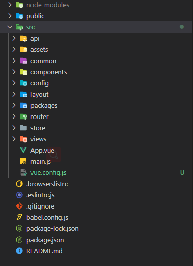

一个好的目录结构能让人迅速了解项目的层次和更易维护

## 当前的项目结构

```shell
├──public     
│ ├──favicon.i
│ └──index.htm
├──src        
│ ├──assets   
│ │ └──logo.pn
│ ├──component
│ │ └──HelloWo
│ ├──router   
│ │ └──index.j
│ ├──store    
│ │ └──index.j
│ ├──views    
│ │ ├──About.v
│ │ └──Home.vu
│ ├──App.vue  
│ └──main.js  
├──.browsersli
├──.eslintrc.j
├──.gitignore 
├──babel.confi
├──package-loc
├──package.jso
└──README.md  
```

:::tip
在此推荐一个我个人写的生成项目结构的小工具，treeplus

```shell
# 安装
npm i -g treeplus
# 使用
tp -i node_mdules .history
# -i 可以排除指定的文件并生成结构树
# 更多使用方法请关注 https://github.com/artiely/treeplus
```

:::

### 我们添加一些必须得文件夹

```shell
├──public             # 静态资源（无需编译）
│ ├──static           # 第三方编译好的库如tinymce富文本等
│ ├──favicon.ico
│ └──index.html
├──src
│ ├──api              # 接口管理
│ ├──assets           # 静态资源（需编译）
│ │ ├──style          # 样式表
│ │ │ ├──cover.less   # 用于全局覆盖的样式
│ │ │ ├──index.less   # 样式入口
│ │ │ ├──layout.less  # 全局布局样式
│ │ │ └──var.less     # 全局样式变量(全局有效，再次定义任何地方可直接用)
│ │ ├──img            # 图片资源
│ │ ├──fonts          # 字体和字体图标
│ │ └──logo.png
│ ├──common           # 公共文件
│ │ ├──directive      # 公共指令
│ │ ├──filters        # 公共过滤器
│ │ ├──utils          # 公共函数
│ ├──components       # 公共组件(业务高重用)
│ │ └──HelloWorld.vue
│ ├──config           # 全局配置
│ ├──layout           # 布局组件
│ ├──packages         # 公共组件(非业务高重用)
│ ├──router           # 路由
│ │ └──index.js
│ ├──store            # 数据管理
│ │ └──index.js
│ ├──views            # 视图
│ │ ├──auth           # 业务相关文件（鉴权模块，包含登录注册找回密码等）
│ │ │ ├──template     # 当前业务下的页面公用组件
│ │ │ └──Login.vue    # 页面
│ │ └──Home.vue
│ ├──App.vue          # 视图入口
│ └──main.js          # 逻辑入口
├──.browserslistrc
├──.eslintrc.js
├──.gitignore
├──babel.config.js
├──package-lock.json
├──package.json
└──README.md
└──vue.confog.js      # 项目配置
```

### 最终效果



第二步！
