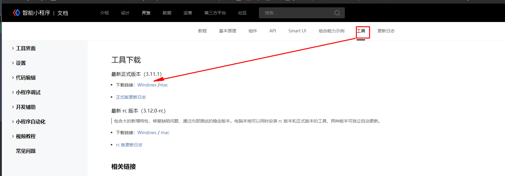

# taro 踩坑初体验

因为接到多端的小程序需求并且工期端，之前一直在关注taro，今天就来先入个门实践一下，希望可以站着走出来
[官方文档](https://taro-docs.jd.com/taro/docs/GETTING-STARTED)

## 安装

按照文档走流程没遇到啥问题，不赘述

## 百度小程序工具下载

[下载地址](https://smartprogram.baidu.com/docs/develop/devtools/history/)

有点小隐蔽

运行百度小程序

```shell
yarn dev:swan
```

报错大致意思是node-sass没有安装成功需要重新构建
回到文档的最初提示

```shell
npm install -g mirror-config-china
npm i node-sass
```

如果还是不行就删除node_modules

```shell
yarn 
yarn dev:swan
```

启动成功！
