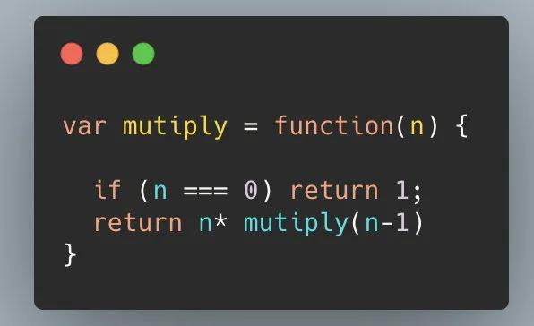
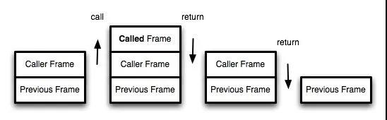
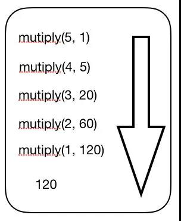
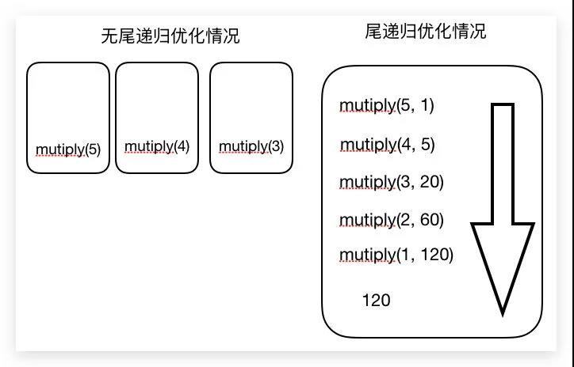
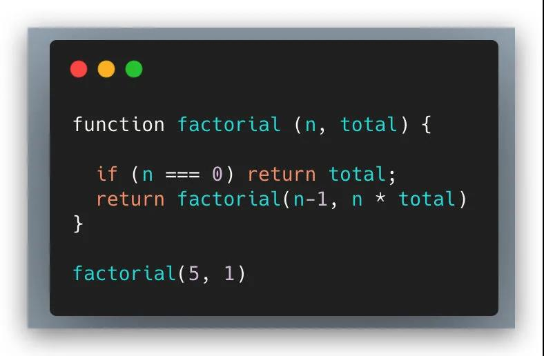
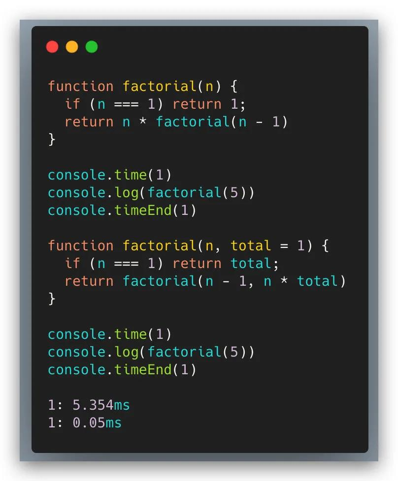

---
tag:
  - javaScript
cover: /2022-05-13-13-28-45.png
base64: 1b1b20
author: artiely
date: 2020-9-7
tinyCover: /cover/2022-05-13-13-28-45.png
coverWidth: 564
coverHeight: 790
coverPrimary: bbb7a5
coverSecondary: 44485a

---


# 说一说递归如何优化-尾递归优化

> 本文旨在帮助大家掌握递归的性能优化方案——尾递归优化，以及如何对下列函数用尾递归进行优化？

参考摘录：阮一峰-尾调用优化



## 一、什么尾调用？

尾调用的概念非常简单，一句话就能说清楚，就是指`某个函数的最后一步是调用另一个函数`。

```js
function f(x) {
  return g(x)
}
```

上面代码中，`函数f`的最后一步是调用`函数g`，这就叫尾调用。

以下这两种情况，均不属于尾调用。

```js
// 情况一
function f(x) {
  const y = g(x)
  return y
}

// 情况二
function f(x) {
  return g(x) + 1
}
```

上面代码中，情况一是调用函数g之后，还有别的操作，所以不属于尾调用，即使语义完全一样。情况二也属于调用后还有操作，即使写在一行内。
> 尾调用不一定出现在函数尾部，只要是最后一步操作即可。

```js
function f(x) {
  if (x > 0)
    return m(x)

  return n(x)
}
```

上面代码中，函数m和n都属于尾调用，因为它们都是函数`f的最后一步操作`。

## 二、尾调用优化

尾调用之所以与其他调用不同，就在于它的特殊的调用位置.
> 调用记录：可以理解为函数在哪个点执行的

我们知道，函数调用会在内存形成一个`"调用记录"`，又称`"调用帧"`（call frame），保存`调用位置`和`内部变量`等信息。如果在函数A的内部调用函数B，那么在A的调用记录上方，还会形成一个B的调用记录。等到B运行结束，将结果返回到A，B的调用记录才会消失。如果函数B内部还调用函数C，那就还有一个C的调用记录栈，以此类推。所有的调用记录，就形成一个`"调用栈"`（call stack）。

在下面这个图中，最外层的`函数A`可以理解为`Previous Frame`，函数A里面的`函数B`可以理解为`Caller Frame`。同理`函数C`也是一样，等到里面的函数依次执行完毕，它们的`调用记录`才会消失。


`尾调用`由于是函数的`最后一步操作`，所以`不需要保留外层函数的调用记录`，因为调用位置、内部变量等信息都不会再用到了，只要直接用内层函数的调用记录，取代外层函数的调用记录就可以了。

```js
function f() {
  const m = 1
  const n = 2
  return g(m + n)
}
f()

// 等同于
function f() {
  return g(3)
}
f()

// 等同于
g(3)
```

上面代码中，如果`函数g`不是尾调用，`函数f`就`需要保存`内部变量`m`和`n`的值、`g`的调用位置等信息。但由于调用`g`之后，`函数f`就结束了，所以执行到最后一步，完全可以`删除 f() 的调用记录，只保留 g(3) 的调用记录`。

这就叫做`"尾调用优化"`，即只保留内层函数的调用记录。如果所有函数都是尾调用，那么完全可以做到每次执行时，调用记录只有一项，这将大大节省内存。这就是"尾调用优化"的意义。

## 三、尾递归

函数调用自身，称为递归。如果尾调用自身，就称为尾递归。

递归非常`耗费内存`，因为需要同时保存成千上百个调用记录，很容易发生`"栈溢出"`错误。但对于尾递归来说，由于`只存在一个调用记录`，所以永远不会发生"栈溢出"错误。

```js
var mutiply = function(n) {

  if (n === 0) return 1
  return n * mutiply(n - 1)
}

mutiply(5)
```

我们可以看出来这是一道`求10的阶乘`计算题，是一个阶乘函数，计算n的阶乘，最多需要保存n个调用记录，复杂度 O(n) 。

如果改写成尾递归，只保留一个调用记录，复杂度 O(1) 。

```js
var mutiply = function(n, total) {

  if (n === 0) return total
  return mutiply(n - 1, n * total)
}

mutiply(5, 1) // 120
```



由此可见，"尾调用优化"对递归操作意义重大，所以一些`函数式编程`语言将其写入了语言规格。ES6也是如此，第一次明确规定，所有 `ECMAScript` 的实现，都必须部署`"尾调用优化"`。这就是说，在 `ES6` 中，只要使用`尾递归`，就`不会发生栈溢出`，相对节省内存。

如果按照阮一峰老师讲解完，大家还是没有太理解的话，我把我`个人的理解`说一下：

假如使用了`尾递归优化`，在执行到最后一行的时候，其实就可以看成，就是这一个函数`mutiply(n-1, n * total)`在执行，每次要进行阶乘递归操作的话，就只有最后一个函数的函数执行上下文，不会造成`栈溢出`，意思就是把10的阶乘，分开`10`个函数来执行，分别`创建10个函数执行上下文`。

无尾递归优化：

```js
var mutiply = function(n) {
  if (n === 0) return 1
  return n * mutiply(n - 1)
}
```

如果我们`不做尾递归优化`的话，就相当于，第一次`mutiply`函数的时候，创建了一个函数执行上下文，要在一个上下文里做`10`的阶乘，这样就形成`闭包`了，内部的函数`mutiply(n-1)`每次都会用到其外部的变量`n`，所以很容易出现`爆栈`情况。

一图解千愁：



## 四、递归函数的改写


尾递归的实现，往往需要改写递归函数，确保最后一步只调用自身。做到这一点的方法，就是把`所有用到的内部变量改写成函数的参数`。比如上面的例子，阶乘函数 `factorial` 需要用到一个中间变量 `total` ，那就把这个中间变量改写成函数的参数。这样做的缺点就是不太直观，第一眼很难看出来，为什么计算5的阶乘，需要传入两个参数5和1？

两个方法可以解决这个问题

### 方法一：是在尾递归函数之外，再提供一个正常形式的函数

```js
function tailFactorial(n, total) {
  if (n === 1) return total
  return tailFactorial(n - 1, n * total)
}

function factorial(n) {
  return tailFactorial(n, 1)
}

factorial(5) // 120
```

上面代码通过一个正常形式的阶乘函数 `factoria`l ，调用尾递归函数 `tailFactorial` ，看起来就正常多了。

函数式编程有一个概念，叫做`柯里化`（currying），意思是将`多参数的函数`转换成`单参数`的形式。这里也可以使用`柯里化`函数思想。

```js
function currying(fn, n) {
  return function(m) {
    return fn.call(this, m, n)
  }
}

function tailFactorial(n, total) {
  if (n === 1) return total
  return tailFactorial(n - 1, n * total)
}

const factorial = currying(tailFactorial, 1)

factorial(5) // 120
```

上面代码通过柯里化，将尾递归函数 `tailFactorial` 变为只接受1个参数的 `factorial`。

### 方法二：采用ES6的函数默认值

```js
function factorial(n, total = 1) {
  if (n === 1) return total
  return factorial(n - 1, n * total)
}

factorial(5) // 120
```

上面代码中，参数 total 有默认值1，所以调用时不用提供这个值。

总结一下，递归本质上是一种循环操作。纯粹的`函数式编程语言`没有循环操作命令，所有的`循环`都用`递归`实现，这就是为什么尾递归对这些语言极其重要。对于其他支持"尾调用优化"的语言（比如Lua，ES6），只需要知道循环可以用递归代替，而一旦使用递归，就最好使用尾递归。

## 五、尾递归优化的魅力

从下图中，我们就可以看出，单单是求5的阶乘，就提升了5ms之快，可以说厉害的惊人了！


## 六、使用条件 - 严格模

ES6的尾调用优化只在严格模式下开启，正常模式是无效的。

这是因为在正常模式下，函数内部有两个变量，可以跟踪函数的调用

```shell
arguments：返回调用时函数的参数。

func.caller：返回调用当前函数的那个函数。
```

>尾调用优化发生时，函数的调用栈会改写，因此上面两个变量就会失真。严格模式禁用这两个变量，所以尾调用模式仅在严格模式下生效。

[原文](https://mp.weixin.qq.com/s/I-QIsLhykupreVKBHNmbwg)
