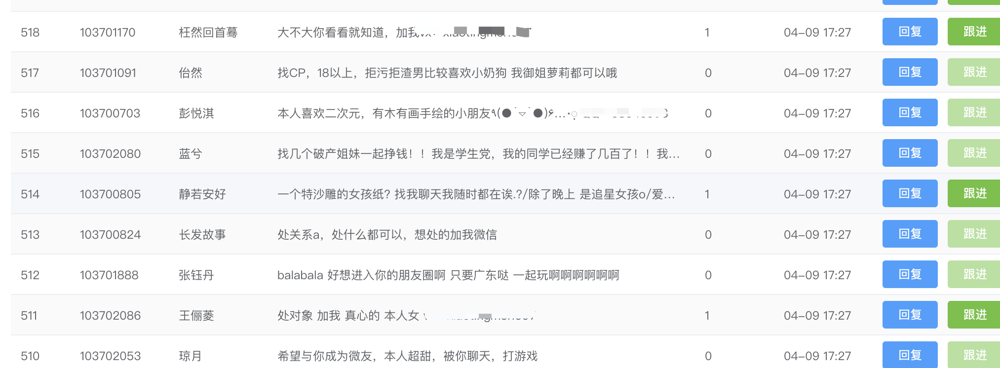
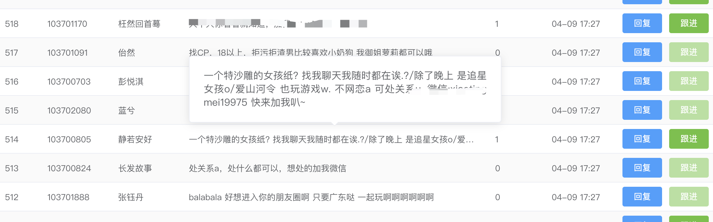

```js
const a = document.getElementById('a')

const obverser = new ResizeObserver((entries) => {
  for (const entry of entries)
    console.log(entry.contentRect.width)

})
obverser.observe(a)
```

例如表格里的元素很长的，在宽度够的情况下自然展示，当屏幕小宽度不够的时候折叠展示

## 效果




