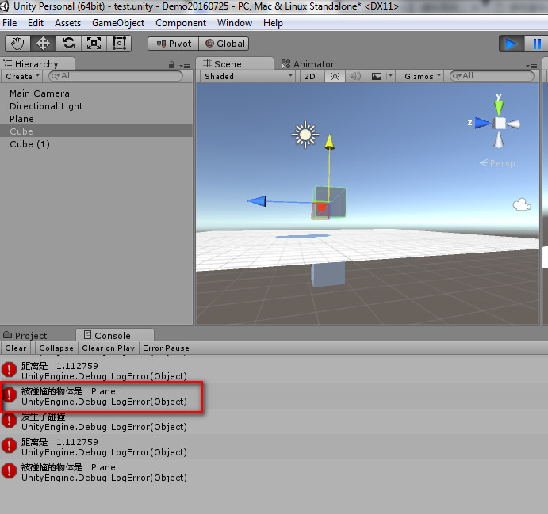
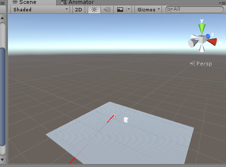
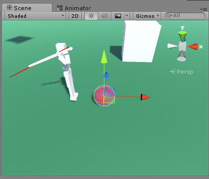

---
tag:
  - unity
  - ray
cover: /2022-05-10-18-54-44.png
tinyCover: /cover/2022-05-10-18-54-44.png
coverWidth: 564
coverHeight: 1002

---

# Unity3D 之射线检测

这里来记录下射线检测的相关内容：

射线检测故名就是通过射线去检测是否和碰撞器产生了交集，和碰撞器与碰撞器发生交集一样，会返回一个真。

射线的用法很多：比如检测是否跳跃，通过向地面投射射线控制在地面时候可以跳起。

射击游戏中可以通过定长射线去判断目标物体是否被击中，等

主要用到的工具类是：

## Physics

## RaycastHit 光线投射碰撞

## Ray 射线

**第一种**是：Physics.Linecast 线性投射

从开始位置到结束位置做一个光线投射，如果与碰撞体交互，返回真。

```cs 
 Debug.DrawLine(transform.position, Line_floor.position, Color.red, 1f);
        bool grounded  = Physics.Linecast(transform.position, Line_floor.position, 1 << LayerMask.NameToLayer("Ground"));

if (grounded)
        {
            Debug.LogError("发生了碰撞");   
  
        }
        else {
            Debug.LogError("碰撞结束");
        }

```

第二种：

在场景中投下可与所有碰撞器碰撞的一条光线。可控制投射方向和投射长度

```cs 
Vector3 fwd = transform.TransformDirection(-Vector3.up);
  bool grounded =  Physics.Raycast(transform.position,fwd, 10 );
    if (grounded)
        {
            Debug.LogError("发生了碰撞");   
  
        }
        else {
            Debug.LogError("碰撞结束");
        }
```

 第三种：

在场景中投下可与所有碰撞器碰撞的一条光线，并返回碰撞的细节信息。

```cs 
RaycastHit hit;
         bool grounded = Physics.Raycast(transform.position, -Vector3.up, out hit);
         // 可控制投射距离bool grounded = Physics.Raycast(transform.position, -Vector3.up, out hit,100.0);
        if (grounded)
        {
            Debug.LogError("发生了碰撞");
            Debug.LogError("距离是：" + hit.distance);
            Debug.LogError("被碰撞的物体是：" + hit.collider.gameObject.name);
  
        }
        else {
            Debug.LogError("碰撞结束");
        }
```

注意，这里返回的碰撞器的信息是依次的，先返回第一个碰撞的，第一个碰撞结束后才返回第二个。



第四种

# [Physics](http://docs.manew.com/Script/Physics.html).RaycastAll 所有光线投射

投射一条光线并返回所有碰撞，也就是投射光线并返回一个[RaycastHit](http://docs.manew.com/RaycastHit/RaycastHit.html)\[\]结构体。

```cs 
   RaycastHit[] hits;
        hits = Physics.RaycastAll(transform.position, -Vector3.up, 100.0F);
        int i = 0;

        while (i < hits.Length)
        {
            Debug.LogError("发生了碰撞");
            RaycastHit hit = hits[i];
            Debug.LogError("被碰撞的物体是：" + hit.collider.gameObject.name);
            i++;
        }
```

 第五种：

控制碰撞的层，可以设置射线的长度，并且用debug查看射线的长度。

**使用层的时候，要注意，要给别的对象也附上层的名字，不能用缺省，会出问题。**

```cs 
 RaycastHit hit;
         // Debug.DrawLine()
          bool grounded = Physics.Raycast(transform.position, transform.up, out hit, 10000f, 1 << LayerMask.NameToLayer("Diren"));
          Debug.DrawRay(transform.position, transform.up * 10000f, Color.red);
          if (grounded)
         {
             Debug.LogError("发生了碰撞");
             Debug.LogError("距离是：" + hit.distance);
             Debug.LogError("被碰撞的物体是：" + hit.collider.gameObject.name);
  
         }
         else {
             Debug.LogError("碰撞结束");
         } 
```



第六种：

# [Physics](http://docs.manew.com/Script/Physics.html).OverlapSphere 相交球

返回球型半径之内（包括半径）的所有碰撞体 [collider](http://docs.manew.com/Script/Collider.html)\[\]。可用于拾取物品用。

```cs 
Collider[] col =  Physics.OverlapSphere(transform.position,1f, 1 << LayerMask.NameToLayer("zhuangbei"));
        if (col.Length > 0)
        {
            foreach (Collider zhuangbei in col)
            {
                zhuangbei.gameObject.GetComponent<Renderer>().material.color = Color.red;
            }
        }
```

 
